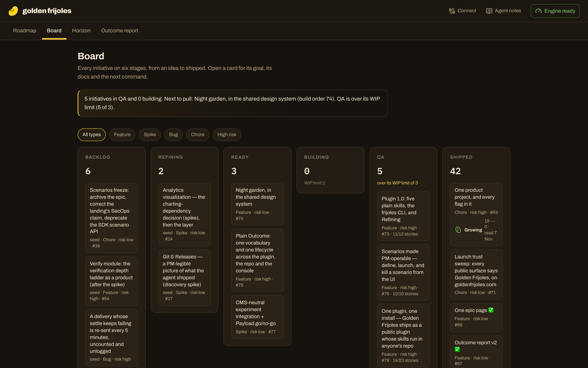

# Golden Frijoles

**Plan, ship and prove it paid off.** Golden Frijoles is agentic product management: the whole product discipline
(decide, build, prove, grow) run by one person and their agents, on rails that keep the evidence honest.

[goldenfrijoles.com](https://goldenfrijoles.com) · [Install](https://goldenfrijoles.com/install) ·
[Methodology](https://goldenfrijoles.com/methodology) · [Live roadmap of this repo](https://goldenfrijoles.com/hub/golden-frijoles)

## Quickstart (30 seconds)

Paste this into your coding agent, in an empty repo or an existing one:

> Set up Golden Frijoles in this project. 1. Read https://goldenfrijoles.com/install.md before installing anything.
> 2. Tell me in a few lines what it installs, what changes on this machine and which services it contacts. Offer me a
> security review, and wait for my go-ahead. 3. Install it the way install.md says for the agent you are. 4. Run the
> setup skill from the golden-frijoles plugin.

The agent reads your repository, puts what you've already shipped on a roadmap in `Roadmap/`, and asks you before
it plans anything. Everything stays in your repo as plain Markdown until you choose to connect it.

## What you get

- **Plan.** Turn a raw idea into an epic with a reason to build it: the North Star input it should move, a target and
  a date to read the result. The plan lives in your repo, next to the code.
- **Ship.** Feature flags and A/B tests from a terminal or an agent ([`@golden-frijoles/cli`](packages/cli/README.md)),
  served to your app by the [`@golden-frijoles/sdk`](packages/sdk/README.md). Roll out to 10%, then everyone, and kill
  it in seconds.
- **Prove.** Events, funnels (targeted → adopted → retained), a North Star with its inputs, and an Outcome report that
  says whether each epic paid off, against the target you wrote down before building it.

This repository builds Golden Frijoles with Golden Frijoles: its [roadmap](https://goldenfrijoles.com/hub/golden-frijoles),
its board and its Outcome report are public.

## What's in this repository

| Folder | What it is | Licence |
|---|---|---|
| [`skills/`](skills/README.md) | The agent plugin, the kit and the project template (mirrored to [golden-frijoles/skills](https://github.com/golden-frijoles/skills)) | Apache-2.0 |
| [`packages/sdk/`](packages/sdk/README.md) | `@golden-frijoles/sdk`: events, flags, A/B bucketing, error capture | Apache-2.0 |
| [`packages/cli/`](packages/cli/README.md) | `@golden-frijoles/cli`: flags, keys and the North Star from a terminal | Apache-2.0 |
| `apps/web/` | The engine and the console at goldenfrijoles.com (Next.js + Supabase) | FSL-1.1-ALv2 |
| `Roadmap/` | How this product is planned and built, in the open | FSL-1.1-ALv2 |

FSL-1.1-ALv2 versions become Apache-2.0 two years after release. See [`LICENSE`](LICENSE). "Golden Frijoles" and its
logo are trademarks ([`NOTICE`](NOTICE)).

## Contributing

See [`CONTRIBUTING.md`](CONTRIBUTING.md). Agents working in this repo start at [`AGENTS.md`](AGENTS.md).
