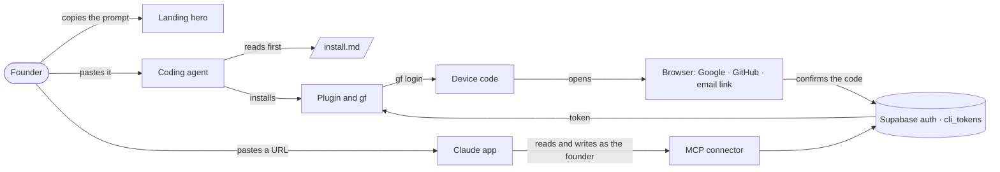
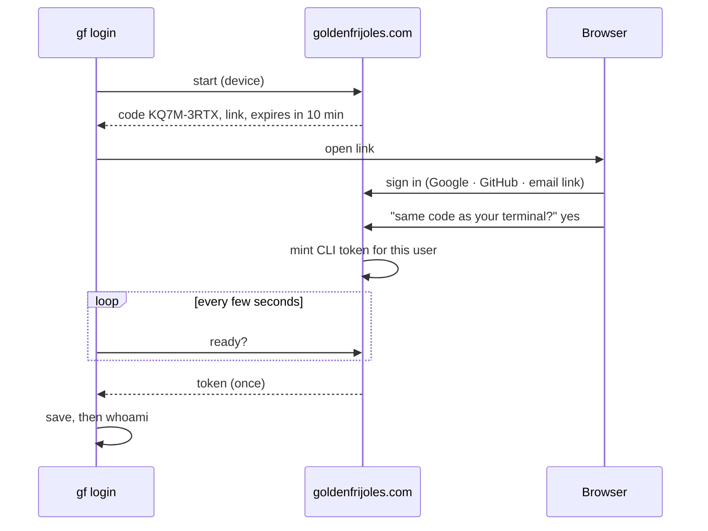

# Pitch — Account from the terminal

Moves: proving_workspaces · Tests: Value proposition — the landing's one line is the first place a founder either
recognises their own job or leaves (launch epic 2 of [`audits/ux-ui-audit-2026-10.md`](../audits/ux-ui-audit-2026-10.md)).

## The ask, as given

Reconstructed from the dogfood findings Daniel raised in the 2026-10-05 UX audit session
([`audits/dogfood-launch-2026-10.md`](../audits/dogfood-launch-2026-10.md)), not his words verbatim:

> F38 · the Claude app connector can only read. F39 · the install prompt installs before anything is read. F40 · no
> browser sign-in for `gf login`, and no Google sign-in.

Scope answers, 2026-10-05: the connector writes through a secret URL tied to the person (OAuth after launch); the
landing changes in the hero only; one flag for the new sign-in, born on (a kill switch, not a dark launch); the Setup page's "How epics ship" waits for after launch.

### Claims
1. One prompt on the landing that has the agent read what it will install, and say so, before installing anything.
2. `gf login` signs in through the browser, no token to copy.
3. Sign in with Google or GitHub (and an email link), not only a password.
4. The Claude app can change things in the project, not only read them.
5. The landing says what the product does in one line.

**Teach-back:** yes — "A new founder copies one prompt from the landing; their agent reads what it's about to install
before installing; `gf login` opens the browser once (Google, GitHub or an email link) and they're back in the
terminal, signed in; and the Claude app can change things, not just read them. Right?"

## Problem
The front door has three blockers and a trust gap. The install prompt tells an agent to install straight away, so a
careful founder (or their agent) has nothing to read first. `gf login` asks the founder to open the console, mint a
token and paste it, the step where most terminal-first people stop. Sign-in is email and password only. And the
Claude app connector can read a project but not change it, because its URL belongs to the project, not to a person,
and the write tools need a person. Launch is a stranger arriving from the landing; each of these loses them.

## Appetite
**L**, one wave: an architect session, builder fan-out across three sprints, review rounds. If it runs out, cut
sprint 3 (connector writes) to the next wave before cutting anything in sprints 1–2.
quote: $67–144 (L, n=3, p25–p75)

## Outcome & signal
A stranger goes from the landing to a signed-in terminal without pasting a token: copy the prompt, the agent
summarises `install.md` and waits, it installs, setup asks "sign in now?", the browser opens once, they pick Google,
the code matches, the terminal says who they are. Then they paste one URL into the Claude app and ask it to turn a
flag off, and it does, as them.
**Test:** Daniel runs that path on a clean machine with a fresh Google account, end to end, on production.

## Stage-2.5 bucket
**Light enhancement, with one genuinely new piece.** Sign-in is Supabase, which does Google, GitHub and email links
natively; `/auth/callback` already exchanges the code and provisions the account. CLI tokens are already minted per
user (`mintCliToken`). The connector already has the write tools; it lacks only a credential tied to a person. The
setup skill already asks "account now or later" (Q4). The browser sign-in for `gf login` (a code shown in the
terminal and matched in the browser) is the new part.

## Bill of materials (What / Why)

| What | Why |
|---|---|
| `/install.md`: what it installs, changes and contacts, per agent | Something to read before trusting us with a machine |
| The prompt, rewritten: read `install.md`, summarise, offer a security review, wait, then install | The agent asks before it acts |
| The landing hero: "Plan, ship and prove it paid off." plus the prompt | The one line a stranger judges us by |
| Google, GitHub and email-link buttons on `/login` and `/signup` | Nobody wants another password |
| Browser sign-in for `gf login`: a code in the terminal, the same code in the browser, a CLI token minted on confirm | No token to copy and paste |
| The setup skill's account question, as the Account screen | Says what an account adds before asking |
| Connector URLs tied to the person who made them; writes act as that person | The Claude app can change things |
| Setup › Connections: who and what is connected, disconnect, a new URL | See it, and stop it, in one place |
| One flag, `auth.terminal_sign_in_enabled`, born on | Sign-in can be switched off without a revert |

## Scope
**In v1:** `install.md` and the new prompt everywhere the prompt appears (landing, `/install`, onboarding, the
skills repo transcriptions); the landing hero; Google, GitHub and email-link sign-in; browser sign-in for `gf login`
(`--token` and stdin keep working); the setup skill's account question reworded; connector URLs tied to a person,
with writes as that person; Setup › Connections "Who and what is connected"; the flag.

**Out of v1 (no-gos):**
- OAuth sign-in through Claude's connector flow (Supabase OAuth 2.1 server, a consent page): after launch. The secret
  URL ships first.
- Any landing section below the hero: loop, ops, authority, FinOps, methodology, pricing and the closing CTA stay as
  they are. Nothing retired.
- Setup's "How epics ship" (project flag policy, merging, auto-off; F46): after launch, with the flags work.
- Removing password sign-in or the token-paste login: both stay.
- Listing in Claude's connector directory.
- Digest channels (Slack, Telegram) shown on the Setup design.
- Any night garden styling work: epic 1 owns the look; this epic uses it.

## Rabbit holes
- **The prompt is a constant today, on purpose.** `INSTALL_PROMPT` names only github.com URLs, so it skips
  `getSiteUrl()` (AGENTS rule #5). Pointing it at `goldenfrijoles.com/install.md` changes that: it becomes a function
  of the site URL here, while the skills repo transcriptions (`golden-onboarding.mjs`, the README, the umbrella
  SKILL.md, checked by `check-onboarding-parity.mjs`) carry the production URL. Decide the parity rule at the lock;
  don't let a preview URL leak into the public repo.
- **`install.md` must stay true.** It lists what installs, what changes and what is contacted. Generate it from the
  same constants `cli-install.ts` and `install-prompt.ts` already export, never a hand-typed copy that drifts.
- **Device codes are a credential.** Short (10 minutes), single use, rate-limited per IP and per code, shown on both
  sides; the browser page says "Didn't start this from your terminal? Close this page." A code confirmed by someone
  else mints a token for them, not for the founder, so the confirm step is what matters.
- **Google needs setup outside the code.** A Google Cloud OAuth client, a consent screen (brand verification can take
  days), and the redirect URLs in Supabase for preview and production. Start it on day one; it's owed by Daniel.
- **Account linking.** A founder who signed up with a password and then picks Google with the same email: Supabase
  links verified identities by email. Confirm the behaviour on preview before the flag goes on.
- **A secret URL that writes.** It's a password in a URL. Keep it in the path (never a query string), revocable in one
  click, rate-limited (60/min today), and every write recorded as the person. Existing project-only URLs stay
  read-only; nothing upgrades silently.
- **Migrations.** Two additive ones (device codes; the person on a connector URL). Expand-only, applied separately
  from deploy (AGENTS rule #4).
- **The skills repo.** The setup skill lives in `skills/`, published to `golden-frijoles/skills`; its release flow
  (`RELEASING.md`) decides when founders see the new question.

## What already exists (reuse, don't rebuild)
- `apps/web/lib/install-prompt.ts` (`INSTALL_PROMPT`, the one prompt) and `lib/cli-install.ts` (package, bin, install
  commands); `/install`, `components/landing/MakerHero.tsx` and `MakerClosingCta.tsx`,
  `app/app/onboarding/[projectSlug]`; `skills/scripts/check-onboarding-parity.mjs`.
- `app/llms.txt/route.ts`: the pattern for a plain-text route built with `getSiteUrl()`; `install.md` follows it.
- `app/login/login-form.tsx`, `app/signup/signup-form.tsx` (Supabase password sign-in), `app/auth/callback/route.ts`
  (code exchange, `provisionTenantForUser`, idempotent), `lib/safe-redirect.ts`, `lib/flags.ts` (`isSignupEnabled`).
- `lib/cli-tokens.ts` (`mintCliToken`, `resolveCliToken`, `revokeCliToken`, `listCliTokens`), `app/app/setup/cli`
  (the token manager), `packages/cli/src/commands/auth.ts` (`gf login`, stdin and `--token`), `credentials.ts`.
- `lib/connector-tokens.ts` and `connector_tokens` (project-scoped today), `app/app/setup/connect` (the connector
  manager), `app/api/v1/public/mcp/c/[token]/route.ts` (write tools, `authorizeAgentWrite`, `resolveFlagWriteActor`,
  the flags `isConnectorWritesEnabled` and `isCliWriteApiEnabled`), `lib/rate-limit.ts`.
- `skills/plugins/golden-frijoles/skills/golden-frijoles/SKILL.md` setup Q4 (`project.account`: later · now).
- Design source: the private canvas, Landing, SignIn, Account and Setup-Connections frames.

## Visuals





```surface
state: cli-connect-idle
route: /cli/connect
- head "Connect your agent"
- note "Your coding agent on this computer asked to connect. New here? This creates your account."
- field "Same code as your terminal?" value "KQ7M-3RTX"
- action "Continue with Google"
- action "Continue with GitHub"
- action "Email me a sign-in link"
- note "Didn't start this from your terminal? Close this page. Nothing happens."
```

```surface
state: setup-connections-idle
route: /app/setup/connect/[projectSlug]
- head "Who and what is connected"
- row "Your coding agent and gf · Sam's MacBook" meta "active 4 minutes ago" action "Disconnect"
- row "Claude app" meta "Not added yet" steps "Copy your connector URL · Open Claude settings · Paste, click Add"
- note "It can read and change Ledgerly as you. Treat it like a password." action "Get a new URL"
- row "Another coding agent" action "Copy setup prompt"
```

## UX heuristics & rails check
- **CI guards covering this surface:** `install-prompt.test.ts`, `check-onboarding-parity.mjs`, `site-url-callers.test.ts`
  (rule #5), `landing.browser.spec.ts`, `app-auth.spec.ts`, `cli-access.authed.spec.ts`, `cli-api.spec.ts`, the
  connector specs, the visual gate.
- **Audits-lens findings that apply:** dogfood F38, F39, F40 (this epic); F45 (walls of text: the Account screen is
  four lines, not a page); `ux-ui-audit-2026-10.md` decision 1 (plain words).
- **Design-language debt:** none new; the screens use epic 1's night garden pieces.

## Kill-switch / runtime gate (risk:high only — Stage 6b)
**Yes, one flag** (Daniel, 2026-10-05). Per `references/kill-switch.md`:
1. **Flag:** `auth.terminal_sign_in_enabled`.
2. **Polarity:** kill switch (Daniel, 2026-10-05: "it must be on"). Default `true`, created ENABLED in every env
   (`gf flags create auth.terminal_sign_in_enabled --kill-switch --all-envs`); turning it off is the deliberate kill.
3. **Seam:** one resolver in `lib/flags.ts`, `isTerminalSignInEnabled()`, read by the Google, GitHub and email-link
   buttons, the `/cli/connect` page and the device start endpoint. Killed: the buttons don't render, `/cli/connect` and
   the device endpoints answer 404, and `gf login` falls back to the paste prompt. Password sign-in and token paste are
   untouched.
4. **Activation:** `gf flags get auth.terminal_sign_in_enabled` must not print `—` in PRODUCTION.
5. **Runtime placement:** server-side only. The lock confirms the web app can read its own Golden Frijoles flag on
   the server; if it can't without a circular dependency on its own sign-in, it uses the env gate `lib/flags.ts`
   already uses for `SIGNUP_ENABLED`, and says so out loud.
Connector writes already sit behind their own switch (`isConnectorWritesEnabled`); no second flag.

## Slices (stories, risk, QA)

**Sprint 1 · Read before installing.**
- **S1.1 · low.** As a careful founder, I want a page my agent reads before installing anything, so that I know what it
  installs, changes and contacts. `/install.md`, generated from `cli-install.ts` and `install-prompt.ts`.
  *QA:* a pure-logic spec on the generated text (every install command, every service named); `GET /install.md` 200.
- **S1.2 · low.** As a founder, I want the prompt to have my agent read `install.md`, summarise it, offer a security
  review and wait for my go-ahead, so that nothing installs before I agree. Same prompt on the landing, `/install` and
  onboarding; transcriptions in `skills/` updated. *QA:* `install-prompt.test.ts`, `check-onboarding-parity.mjs`.
- **S1.3 · low.** As a visitor, I want the landing to say what it does in one line with the prompt right there, so
  that I know in five seconds whether it's for me. The hero only. *QA:* `landing.browser.spec.ts`; the visual gate.

**Sprint 2 · Sign in from the terminal.**
- **S2.1 · high.** As a founder, I want to sign in with Google, GitHub or an email link, so that I don't make another
  password. Includes the flag and its seam. *QA:* an auth spec for the callback with each provider's shape; the flag
  killed hides every new button. *Owed:* Daniel sets up the Google and GitHub OAuth apps and the Supabase providers.
- **S2.2 · high.** As a founder in my terminal, I want `gf login` to open my browser, show a code and sign me in when
  I confirm it, so that I never copy a token. A device-code table (additive migration), start and poll endpoints,
  `/cli/connect`, the CLI change. *QA:* pure-logic specs on code expiry, single use and the poll states; an api spec
  on start → confirm → poll; `cli.test.ts` for the fallback when the flag is killed.
- **S2.3 · low.** As a founder running setup, I want to hear what an account adds before I'm asked, so that I can
  choose. The setup skill's Q4 as the Account screen: four lines, "Sign in now (recommended)" runs `gf login` and
  `gf init`; "Later" keeps working without one. *QA:* the skill's own checks.

**Sprint 3 · The Claude app can change things.**
- **S3.1 · high.** As a founder, I want the connector URL I make to act as me, so that the Claude app can change
  things in my project. The person on `connector_tokens` (additive migration); writes allowed only while that person
  can write in the project; older URLs stay read-only. *QA:* api specs: a person-bound URL writes, a project-only URL
  can't, a revoked URL and a removed member both get the read-only tool list.
- **S3.2 · low.** As a founder, I want one place that shows who and what is connected, so that I can see it and stop
  it. Setup › Connections: the coding agent and gf (device, last active, Disconnect), the Claude app (three steps,
  green on first use, Get a new URL), another coding agent (copy the prompt). Built on the existing connect and CLI
  managers. *QA:* an authed spec on disconnect and new URL; the visual gate.

**Smoke walkthroughs:** each sprint file carries one. Sign-in and the connector are owed by Daniel by name.

## Acceptance criteria
- `goldenfrijoles.com/install.md` lists what installs (per agent), what changes on the machine and every service
  contacted; it's generated, not hand-typed.
- The landing, `/install` and onboarding show the same prompt, which reads `install.md` first and waits for a go-ahead;
  the skills repo carries it verbatim and the parity check is green.
- The landing hero says "Plan, ship and prove it paid off." with the prompt; nothing below the hero changed.
- Google, GitHub and email-link sign-in work on `/login` and `/signup` (the flag is on), and a new account is set up
  as today. With the flag killed, none of it shows, and password sign-in works as before.
- `gf login` with no token opens the browser, shows a code that matches the terminal, and on confirm the terminal
  prints `whoami`; codes expire in 10 minutes and work once. `gf login --token` and stdin still work.
- Setup asks about an account in four lines and works either way.
- A connector URL made from Setup can turn a flag off in the Claude app, recorded as that person; an older URL can't;
  "Get a new URL" stops the old one at once.
- Setup › Connections shows the coding agent with last activity, can disconnect it, and shows the Claude app's state.
- `gf flags get auth.terminal_sign_in_enabled` shows `on` in every env, PRODUCTION included.

## Open risks / research
- Claude's hosted apps accept a connector with no auth step (the URL alone) and also support OAuth with DCR or CIMD
  and PKCE; tokens must never travel in a query string ([Authentication for connectors](https://claude.com/docs/connectors/building/authentication),
  read 2026-10-05). The path token keeps working; OAuth is the after-launch upgrade.
- Supabase Auth now acts as an OAuth 2.1 server with dynamic client registration and PKCE, with an app-provided
  consent page ([OAuth 2.1 Server](https://supabase.com/docs/guides/auth/oauth-server), read 2026-10-05): the base for
  that upgrade, and possibly for `gf login` later. Not used in v1.
- Google OAuth consent-screen verification can take days for a new brand: the longest lead time in the epic.
