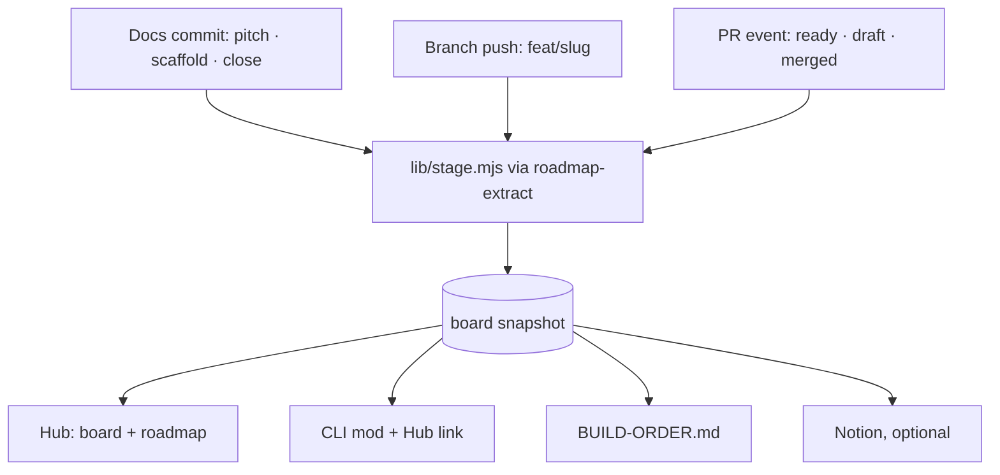
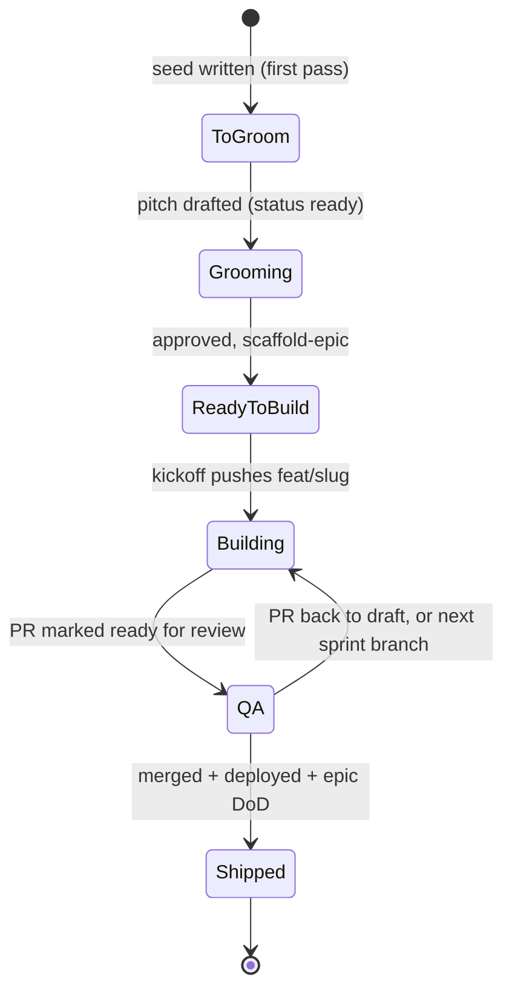
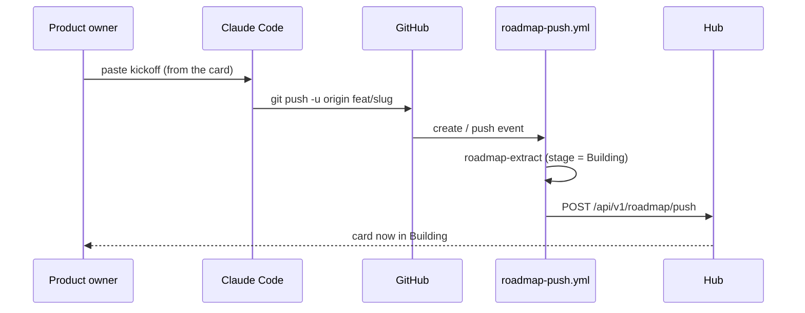

# Pitch — One stage, every client: a six-stage board on the Hub, the CLI mod and every sink, from one resolver

Seed 8 of the unification audit (§6, decision **D4**: the Claude mod locally + the Roadmap Hub hosted, with
Notion and SmallDocs as sinks). Deep-groomed 2026-10-01 alongside [`workspaces`](workspaces.md), which its S4
depends on. Home repo: **golden-frijoles**. The first-pass sketch (sink interface + a scrumban view with
"Ready · Bet · Locking · Building · Verifying · Shipped") was reviewed visually and **rejected on its stage
names**. This pitch is the redesign that came out of that review.

## The ask, as given

> both are right, on the board ux/ui specifically, im not sold on the columns names or text descriptions we are using. For example it is confusing to have ready as the first column. ready for what? does it mean ready for the betting table? are initiatives in ready already scaffolded? are they seeds? Lets simplify and come up with a different view. Lets think what do we want to see and why from user persona pov. We are having now a portfolio view right? so that portfolio view would have the board showing initiatives from all projects and their statuses, then we could filter by project. Regardless, i think the states are mostly whats throwing me off, lets design think this through. Heres what id like to see: i usually start any project whether new or existing with a raw ask, or general idea, the first pass would usually flesh out my overall raw ask, break it down by seeds ready to be groomed. Do we have a column to show all the seeds? and what do we call it? all of them are ready to be groomed right? so next stage from there is grooming, after which the output is the epics scaffolded, correct? once they are scaffolded it means they are ready to be built, this is a change in state as well, what do we call it? this column would have to be ordered by build order (each must contain their mechanical kickoff prompt). Once i take that initiative to claude code and ask to build it changes to building (is that what we call that state? it makes sense to me), then after building we yet dont have it but we should establish a qa step, not sure if its what you are calling currently Verifying. These state changes must happen mechanically proactively before the fact. For example, right now is a bit hit and miss to catch all statuses for example in the cli visualisation tool and id assume it will be the same for this board view. So lets polish that as well, how are we getting those statuses from and how do we deterministically enforce these changes without overloading the agent or slowing down everything?. I also want to see, are those cards clickable or carry any more info? whats important is to have quick access to product prose like epic goal, stories, kickoff prompt, routes to the referenced docs and handy commands for common actions in our project, like generating kickoff prompts for example and others as per historical usage. So the idea is to come up with pur opinionated version based in our methodology and the new Golden-frijoles and product engineering paradigm we are trying to push through golden-frijoles. Review historicals, the essence of this project etc so that we come up with something beautiful. Finally, as per the diagram, besides the hub for visualisation, we must be able to show part of it in the cli as users are working, see the visualisation tool we built and are currently using, it shows some version of these data points on build time. In my mind the visualisation tool (the claude mod) is just another client right? so lets streamline our data flow in this regard to whichever client it is we have. (the visualisation tool in the cli also suffers from the hit and miss, sometimes shows the correct statuses sometimes it doesnt as t depends on things that may not always be the exact same, so lets evaluate, one key thing at least to add to the cli visualisation tool would be a link to the hub). BTW, i think i didnt mention this but what issue type are we showing on the hub board? or do we allow to filter by type? like epic or story level?. Ok now for real final: what would be the high level roadmap view? is it the seeds per functional area or is it the scaffolded initiatives also per area?

Earlier the same session: "Board v1 shape: Lean — Sinks: terminal + hub + notion. WIP per project in
golden-frijoles.config.json. Kickoff warns (doesn't block) when a column is over WIP" · stages "Yes, lock them" ·
appetite "L, four sprints" · roadmap tab "Replace with area view".

### Claims
1. A board whose stages follow how the product owner works: raw ask → seeds to groom → grooming → scaffolded,
   ready to build (ordered by build order, each with its kickoff prompt) → building → a QA step → shipped.
2. Stage changes happen mechanically and before the fact, without loading the agent or slowing the work.
3. The CLI mod stops being hit and miss: it's just another client of the same data flow, and it links to the Hub.
4. Cards open to product prose: the epic goal, stories, the kickoff prompt, links to the referenced docs, and handy
   commands from historical usage.
5. Cards are initiatives, filterable by type, and by project once there's a portfolio across projects.
6. A high-level roadmap view that answers "seeds per area or scaffolded per area?"
7. One roadmap projection feeds every sink (terminal, Hub, Notion), opinionated to the Golden Frijoles method.

**Teach-back:** yes — "You want one roadmap projection to feed every board through a single sink interface, with a scrumban board on the Hub as the hosted default, so a PM can see and pull work without a new service. Right?" (answered "both are right", then the stage redesign above)

## Intent match
Could not look: there is no `TYPESAFE_API_KEY` in the 2026-10-01 planning session, so there's no score (advisory, never a gate). Re-run `node scripts/intent-match.mjs Roadmap/00-ideas/seeds/board-sinks-and-scrumban.md --write` at the architecture lock. The teach-back was answered **yes** and the visuals were reviewed live, which is the signal this session does have.

## Problem
**Stage is written in five places, in two vocabularies, mostly by hand.** Measured 2026-10-01:
- seed `status:` (raw · ready · queued · scaffolded · shipped · archived)
- epic `status:` (scaffolded · in-progress · shipped)
- epic and sprint `phase:` (Shaping · Locking architecture · Building · Verifying · In review · Shipped),
  written by agents at cadence events
- a free-text `**Status:**` line per sprint, with 40+ spellings of "shipped"
- inference from commits and PRs, which the CLI mod skips because it runs `--offline`

So the clients disagree. On 2026-10-01, `build-state.mjs` showed *Scenarios PM-operable · Building* with all
10 stories done, and *One plugin, one install · Verifying* at 14 of 23. The Hub has no board at all. Its stage
words (Ready, Verifying) don't say *ready for what*. Each sink calls the extractor its own way, and the kit
doesn't ship the Hub push, so a stranger can't feed the Hub.

## Appetite
**L, four sprints** (product owner, 2026-10-01). It grew from the audit's M when the redesign added the
resolver, the card drawer, the CLI mod and the roadmap-by-area view. Re-bet per wave. S4 waits on the
`workspaces` epic.

## Outcome & signal
After this ships, every client says the same stage for the same initiative, within one CI run of the event
that moved it. The product owner opens `/hub/golden-frijoles/board`, sees the six columns, clicks a Ready to
build card, copies its kickoff into Claude Code, and watches the card move to **Building** when the kickoff
pushes its branch. The CLI mod shows the same word plus a link back to the card.
**How the product owner tests it:** the smoke walkthroughs per sprint. Also the "stage agreement" spec: for
every initiative, the Hub artifact, `build-state --json` and BUILD-ORDER.md report one identical stage.

## Stage-2.5 bucket
**Light enhancement on top of existing parts, plus one genuinely new surface.** The extractor, the Hub push
rail, the CLI mod and the Notion sink all exist. What's new: the stage resolver, the board tab and card
drawer, and the area roadmap view.

## The six stages (locked 2026-10-01)

| Stage | Enters when | Recorded by (never typed by a person or agent) |
|---|---|---|
| **To groom** | a seed exists (the first pass broke a raw ask down) and has no pitch yet | the seed file: `epic: null`, `status: raw` |
| **Grooming** | a pitch is drafted and waiting at the product owner's approval gate | groom Stage 7.1 writes `status: ready` |
| **Ready to build** | approved, so epic + sprints are scaffolded and the card carries the kickoff prompt; ordered by `build_order`; a "bet" badge when `underwritten_by` is set | `scaffold-epic.mjs` writes epic `status: scaffolded` |
| **Building** | the kickoff's first step pushes `feat/<slug>` | git: the branch exists on origin |
| **QA** | a PR for the epic is open and **not draft**: the routed review, the smoke walkthrough, the deploy check | GitHub: PR state |
| **Shipped** | merged, deployed, and the epic DoD passes | `epic-dod.mjs` close writes `status: shipped` |

Archived work leaves the board. A fixed-scope seed (`status: queued`, no epic) sits in **Ready to build** with
the "Build: \<seed\>" command instead of an epic kickoff. `phase:` and the sprint prose `Status:` line stop being
read for stage. The build view keeps `phase:` only as a detail line (e.g. "Locking architecture") until a
later sweep retires it.

## Bill of materials (What / Why)

| What | Why |
|---|---|
| `lib/stage.mjs`: a pure `resolveStage(row, gitFacts, prFacts)` + the six-word enum | one function decides stage; every client imports it, so they can't disagree |
| `roadmap-extract.mjs` emits `stage`, `stage_source`, `goal`, `sprints[]` (title, done/total), `links`, `pr` | the projection already feeds every sink, so the new fields reach all of them at once |
| Git + GitHub facts gathered once per run (`git ls-remote` branches, one `gh pr list --json`) | Building and QA are facts git and GitHub already hold; nobody writes them |
| `.golden-frijoles/board.json` snapshot (gitignored), stamped with `generated_at` + source | the offline fallback a client reads when it can't reach GitHub, and says how old it is |
| `roadmap-push.yml` triggers on `push`, `pull_request` (opened · ready_for_review · converted_to_draft · closed) and `create` | "before the fact": the Hub re-renders on the event that moved the card, not on the next docs commit |
| `emit-epic-kickoff.mjs`: first step = create + push `feat/<slug>` | the act of starting is the trigger; no status write for the agent to remember |
| Push envelope gains optional `board` (WIP limits) + per-card `kickoff` text | the Hub can show the kickoff and the limits without reading the repo (it never reads git, by design) |
| `/hub/[projectSlug]/board` + card drawer (goal, sprints, kickoff, docs, stage commands) | the board you asked for, on the approved hub frame |
| Stage commands from `SESSION-KICKOFFS.md` verbs (Groom, Build epic, Resume, Wrap, Review PR, Close epic) | "handy commands as per historical usage": the verbs are already the house vocabulary |
| `build-state.mjs` reads `resolveStage` (online) or the snapshot (offline) + prints the Hub card link | the CLI mod becomes a client; the hit-and-miss came from it inferring on its own |
| `roadmap-extract --sink terminal\|hub\|notion` in the kit; `roadmap-push.mjs` ships in the kit | one projector, many sinks, and strangers can feed the Hub |
| WIP limits in `golden-frijoles.config.json → board.wip` (Building, QA) + a kickoff warning when over | scrumban's pull: the limit is visible, and the next pull is advised, never blocked |
| Roadmap tab → areas × Shipped · Now · Next · Later | the high-level view: both seeds and scaffolded initiatives, per area |
| `/hub/w/[workspaceSlug]/board` with a project filter (S4) | the portfolio-of-work you described; legal only after `workspaces` |

## Scope
**In v1:** the four sprints below.

**Out of v1 (no-gos):**
- **GitHub Projects and SmallDocs sinks.** Later seeds. SmallDocs stays off the critical path (D4, 2026-07-15).
- **Writing from the board.** The board is a view: no drag-and-drop, no edits. Docs and git stay the SSOT.
- **Story-grain cards.** Stories live inside the card drawer. The type filter is feature · spike · bug · chore.
- **Running commands from the Hub.** It shows copyable prompts and commands; it never executes anything (no
  LLM, no repo access in the engine, per AGENTS).
- **A blocking WIP gate.** Over-limit is a warning in the kickoff and an answer line on the board.
- **Retiring `phase:` from every doc.** It stops driving stage here; the sweep is a follow-up chore.
- **The metrics portfolio** (North Star, TARS per product): seed `portfolio-view`.

## Rabbit holes
- **Branch naming.** Building = "a branch for this slug exists on origin". `build-state.mjs` already has the
  longest-leading-run slug resolver (`feat|fix|chore|spike|bug|docs/<slug>[-s<N>][-words]`). **Reuse it; don't
  write a second parser.** A stale branch from an abandoned build would keep a card in Building forever, so
  "merged or deleted" must clear it. The lock decides: does a merged branch's last PR win?
- **Stacked PRs.** An epic with `-s2`/`-s3` PRs is in QA when *any* sprint PR is non-draft, and back in Building
  when a later sprint branch has commits but no PR. The lock writes the exact rule with a fixture per case.
- **CI permissions.** `roadmap-push.yml` needs `pull-requests: read` and a project API key secret
  (`SELF_PROJECT_API_KEY` today). A PR from a fork gets no secrets, so it must skip cleanly (exit 0, the existing
  contract).
- **Payload size.** Kickoff text per Ready card (~6 KB each). Cap the kickoff field to Ready-to-build cards, and
  keep items ≤ 5000 (the schema limit).
- **Schema version.** All new fields are additive under `.passthrough()`; the envelope's optional `board` is
  additive too. **No `ROADMAP_SCHEMA_VERSION` bump.** The lock confirms the envelope schema doesn't `.strict()`.
- **The approved-design contract.** The Hub frame is an approved design. The board and drawer get `surface`
  blocks (below) that the product owner approves as the picture, and the design-drift guard maps them
  (WAYS-OF-WORKING: an approved design IS the contract).
- **Hub tab count.** `HubTab` is a closed union of three, and the hub frame deliberately isn't a fifth console
  section (DD2). Adding `board` is a fourth *hub* tab, not a console section, so DD2 holds. Say so in the PR.
- **Offline honesty.** The CLI mod must label a snapshot-derived stage with its age ("stage from snapshot,
  3h ago"), never present it as live.

## What already exists (reuse, don't rebuild)
- `skills/template/scripts/roadmap-extract.mjs` (the SSOT extractor, 410 lines) + this repo's
  `scripts/roadmap-extract.mjs` → `roadmap-to-notion.mjs --extract`.
- `scripts/lib/roadmap-status-buckets.mjs`: the shared bucket definitions; the six stages replace its buckets
  in one place.
- `scripts/lib/roadmap-contract.mjs`: the frontmatter contract (stories, sprints) that feeds the drawer's
  sprint progress.
- `scripts/build-state.mjs` + `skills/plugins/golden-frijoles/hooks/build-view.mjs`: the CLI mod (the
  branch → epic resolver, worktree scan, journal).
- `scripts/roadmap-push.mjs` + `.github/workflows/roadmap-push.yml` + `apps/web/app/api/v1/roadmap/push/route.ts`
  + `lib/roadmap-artifact-schema.ts` + `report_artifacts`: the Hub sink, end to end.
- `apps/web/app/hub/*` (`hub-frame.tsx`, the journey, horizon and report pages), `lib/hub-query.ts`,
  `lib/hub-freshness.ts`, `lib/report-shares.ts` (share links reach the board for free).
- `skills/template/optional/notion/roadmap-to-notion.mjs`: the Notion sink.
- `scripts/build-order.mjs`: the terminal/markdown sink (BUILD-ORDER.md).
- `skills/plugins/golden-frijoles/skills/groom/emit-epic-kickoff.mjs`: the kickoff text the card carries.
- `Roadmap/SESSION-KICKOFFS.md` → *Command shorthands*: the verbs the drawer offers.
- `scripts/epic-dod.mjs`: already writes Shipped at close.
- `golden-frijoles.config.json` + `scripts/lib/config.mjs` (+ `config-registry.mjs`): where `board.wip` lives.

## Visuals

System context: one resolver, one snapshot, every client.



State machine: the six stages.



Sequence: what happens when you paste a kickoff.



Data sample: three snapshot rows.

| slug | grain | stage | stage_source | build_order | pr | kickoff |
|---|---|---|---|---|---|---|
| `cms-integration-spike` | Epic | Ready to build | docs: status scaffolded | 18 | — | "Orchestrate the whole epic…" |
| `golden-frijoles-plugin` | Epic | Building | git: feat/golden-frijoles-plugin-s3 | 34 | #2xx (draft, illustrative) | — |
| `scenarios-freeze` | Seed | To groom | docs: seed raw | 36 | — | — |

The board, as approved in the 2026-10-01 visual review:

```surface
state: hub-board
route: /hub/golden-frijoles/board
- tabs "Roadmap | Board | Horizon | Report"
- head "Board"
- answer "2 initiatives in QA and 1 building. Next to pull: CMS integration (build order 18)."
- toolbar "All types | Feature | Spike | Bug | Chore | High risk"
- tiles "To groom | Grooming | Ready to build | Building | QA | Shipped" count 6
- note "Generated from each initiative's frontmatter, git and GitHub. A view, never ticked by hand."
```

```surface
state: hub-board-card
route: /hub/golden-frijoles/board?card=golden-frijoles-plugin
- head "One plugin, one install" action "Copy kickoff prompt"
- answer "So that a stranger installs Golden Frijoles once and every skill runs in their own repo."
- summary "Stage | Area | Build order | Type | Risk | Appetite | Bet" count 7
- steps "Sprints" count 5
- list "Docs" columns "Doc | Link"
- list "Commands for this stage" columns "Command | Copy"
```

```surface
state: hub-board-empty
route: /hub/golden-frijoles/board
- tabs "Roadmap | Board | Horizon | Report"
- head "Board"
- empty "Nothing on the board yet. Push your roadmap with: npx -y @golden-frijoles/kit roadmap-extract --sink hub"
```

```surface
state: hub-roadmap-areas
route: /hub/golden-frijoles
- tabs "Roadmap | Board | Horizon | Report"
- head "Roadmap"
- answer "42 of 46 epics have shipped. Now: One plugin (Building), Public monorepo (QA)."
- list "Areas" columns "Area | Shipped | Now | Next | Later"
- note "Now is Building and QA. Next is Ready to build. Later is To groom and Grooming. Each row runs in build order."
```

```surface
state: hub-workspace-board
route: /hub/w/daniels-products/board
- head "Board" action "Open a project's board"
- toolbar "All projects | All types | High risk"
- tiles "To groom | Grooming | Ready to build | Building | QA | Shipped" count 6
- note "Every project in this workspace that you belong to. Filter by project."
```

```surface
state: hub-workspace-board-unbuilt
route: /hub/w/daniels-products/board
- head "Board"
- empty "Workspace boards arrive with workspaces. Until then, each project has its own board."
```

The CLI mod (a terminal, not a route), as the product owner reviewed it:

```
● One plugin, one install · Building · S3 The front door · story S3.4
  14/23 stories · risk high · PR draft · stage from GitHub, 40s ago
  Elsewhere: QA 2 · Ready to build 2 · next to pull: CMS integration (#18)
  Board ↗ goldenfrijoles.com/hub/golden-frijoles/board?card=golden-frijoles-plugin
```


**Visual review (approved picture):** https://claude.ai/artifact/A7qv2qeBsmewdCkHXnf2UW — decisions, the stages, the data flow and the `sketch-render.mjs` wireframes of the surface blocks below (private to the product owner; share from the page).

## UX heuristics & rails check
- **CI guards covering this surface:** `design-drift-guard.yml` + the state contract (the new hub states must be
  registered), `build-order-guard.yml` (BUILD-ORDER.md regenerates from the same projection),
  `scripts-guard.yml`, `skills-ci.yml` (kit + plugin), and the Playwright `api` gate (`hub.spec.ts`).
- **Audits-lens findings that apply:** `audits/app-ux-audit-2026-08-01.md` (a status must be a word, never colour
  alone, which the hub's horizon page already follows: DD4), and `audits/single-product-and-grooming-2026-09-28.md`
  §0.3 (the kit ships no `build-state.mjs` and no Hub push; this epic closes the second).
- **Design-language debt:** the hub frame lacks the console's switcher and ⌘K (a recorded deviation in
  `hub-frame.tsx`). Out of scope; the workspace board's project filter is a toolbar, not the switcher.

## Kill-switch / runtime gate (risk:high only — Stage 6b)
**No flag (the default; the product owner did not ask for one).** Carve-out: the high-risk part is S4's
cross-project read, and it goes only through `getWorkspaceProjects()` from the `workspaces` epic, which owns
that boundary and its denial specs. The board itself is an additive, read-only, membership-gated hub tab with
no new write path.

## Acceptance criteria
- For every initiative in this repo, `roadmap-extract` JSON, `build-state --json`, BUILD-ORDER.md and the Hub
  artifact report the same `stage` (one spec over a fixture repo with one initiative per stage, plus the live
  run).
- Pasting a Ready-to-build kickoff into Claude Code pushes `feat/<slug>` as its first step, and the Hub card shows
  **Building** within one CI run, with nobody editing a doc.
- Marking the epic's PR ready for review moves the card to **QA**. Converting it back to draft moves it back.
  Closing the epic with `epic-dod` moves it to **Shipped**.
- `/hub/golden-frijoles/board` renders six columns in this order with these exact words: To groom · Grooming ·
  Ready to build · Building · QA · Shipped. Ready to build runs in `build_order`. Shipped shows the last 30 days.
- Clicking a card opens the drawer with goal, sprint progress, docs links, the kickoff (Ready to build only) and the
  commands for its stage; each copy button copies the exact text.
- The type and risk filters change the visible cards; the URL carries them (shareable).
- The CLI mod prints the stage word, its source and age, and a link to the card; offline, it says "from snapshot,
  \<age\>".
- `npx -y @golden-frijoles/kit roadmap-extract --sink hub` pushes from a stranger's repo with their API key.
- Building over its WIP limit makes `emit-epic-kickoff` print one warning line naming the limit (and still emit).
- The Roadmap tab shows areas × Shipped · Now · Next · Later.
- (S4) `/hub/w/<workspace>/board` shows only projects in that workspace the viewer belongs to; a slug from another
  workspace in the filter 404s.

## Open risks / research
- GitHub Actions: `pull_request` events from forks run without secrets, which is why the push skips cleanly
  (current behaviour). `ready_for_review` and `converted_to_draft` are first-class `pull_request` activity types.
  The lock confirms against the live workflow syntax.
- The GitHub Actions minutes budget (audit 2026-09-28 §1) goes up by one short job per PR event. Measure it after
  S1 and cap with `paths:`/concurrency if needed.

---
_Budget line at the gate (2026-10-01):_ `2 asks open · 0 questions waiting · 1 gate passed · context: not measured here → keep going`
