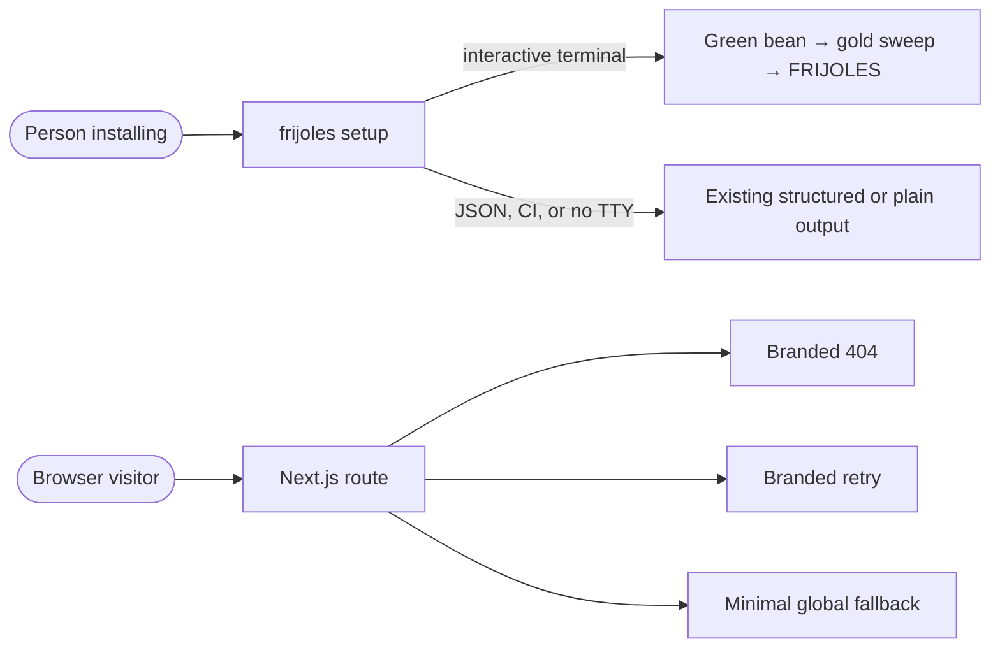

# Pitch — A golden welcome and recovery pages

Moves · Tests: not grounded — no strategy input or numeric target was chosen for this design improvement.

## The ask, as given

> the asscci letters that say SKILLS when installing the plugin cli, i mean they look great but it should say our name or even better an ascci animation of beans from green to golden. I really love the styling of the letters skills, lets keep up the quality work to ensure branding is right and fun.
>
> Please show me the letters so i can review we are talking about the same thing and show me a suggested design proposal.
>
> custom 404 pages and any other error pages, full coverage - also show me a proposal.
>
> Both are design focused tasks id like you to show me first please.
>
> show me here the animation proposal here please, the one where the sweep reveals frijoles. The 404 pages et all design is ok, lets keep it on brand always and as you suggest so its playful also. aftr i review and approve you can carry on as per process
>
> saw it, nice one, approved

### Claims

1. Give the Golden Frijoles setup a playful bean-to-gold terminal reveal with block letters spelling FRIJOLES.
2. Brand all browser recovery pages, including unknown URLs, thrown page errors, and root failures.
3. Preserve the existing status, authorization, and shared-link privacy behavior.

**Teach-back:** yes — the product owner approved the rendered terminal reveal and the proposed error-page family.

## Problem

The `npx skills` installer opens with its vendor's SKILLS art, while our own `frijoles setup` has no branded welcome. The app has a designed share-link 404 and one scoped portfolio error, but lacks root 404, root error, and global error designs. A visitor can therefore meet framework fallbacks at the exact moment they need a clear route back.

## Appetite

M. Two focused slices: one CLI reveal and one browser recovery family. The budget covers behavior-preserving status checks and a rendered smoke, not a new installer or a redesign of existing product pages.

quote: $15–32 (M, n=20, p25–p75)

## Outcome & signal

An interactive `frijoles setup` shows the approved bean ripening, a left-to-right gold sweep across FRIJOLES, and a stable final frame. Non-interactive and JSON paths retain their present output contract. Browser routes show a helpful branded 404 or retry state, and HTTP status and credential boundaries remain intact. The product owner can replay the terminal reveal and visit the listed recovery routes in a browser walkthrough.

## Stage-2.5 bucket

Light enhancement. `frijoles setup`, the design tokens, `Frame`, the share-link 404, and the CLI writer already exist. The third-party `npx skills` banner is outside our plugin's control, so the approved reveal belongs to our own setup command.

## Bill of materials (What / Why)

| What | Why |
|---|---|
| Terminal reveal in `frijoles setup` | The first owned CLI interaction carries the approved Golden Frijoles identity. |
| TTY, JSON, no-motion, and narrow-terminal behavior | The reveal stays useful to a person and inert for an agent or script. |
| Root not-found, error, and global-error UI | Every browser failure has a branded, useful next action. |
| Existing share and portfolio states aligned visually | The family feels coherent without changing what those states disclose. |
| Status and rendered checks | Visual work is verified as seen and 404 does not become 200. |

## Scope

**In v1:** `frijoles setup` human-terminal reveal; 404 for unmatched and explicit missing pages; page-error retry; global fatal fallback; scoped share/portfolio visual alignment only where needed; responsive, accessible copy and controls; status and JSON preservation checks.

**Out of v1 (no-gos):** replacing the banner owned by `vercel-labs/skills`; executing code as an install hook; animations in `--json` or CI; new API error envelopes; changing any auth/flag gate or share-link response distinctions; new data reads, flags, migrations, or analytics.

## Rabbit holes

- `npx skills` owns its six-line banner. Our plugin cannot alter it; do not fork or hide its output.
- A parent layout can start streaming before `notFound()` and produce a 200 with 404 content. Preserve page guards and assert critical HTTP statuses.
- The global error boundary replaces the root layout. Its minimal styling must stand alone and not depend on a shell that may have failed.
- A 404 cannot distinguish an absent foreign project, dark route, or expired versus unknown share token.
- The CLI's JSON stdout is one document, and interactive questions already write to stderr. The reveal must not pollute either contract.

## What already exists (reuse, don't rebuild)

- `packages/cli/src/commands/config.ts` — existing `frijoles setup` and TTY chooser.
- `packages/cli/src/output.ts` — human versus JSON writer contract.
- `apps/web/design-system/Frame.tsx`, `apps/web/design-system/system.css`, `apps/web/brand/tokens.css` — approved brand frame and tokens.
- `apps/web/app/s/[token]/not-found.tsx` — scoped shared-link privacy message.
- `apps/web/app/app/portfolio/error.tsx` — scoped retry state.
- `apps/web/e2e/mobile-heuristics.browser.spec.ts` and `apps/web/design-system/route-manifest.ts` — existing visual and route-coverage rails.

## Visuals



```surface
state: public-not-found-error
route: /missing-page
- head "Golden Frijoles" action "Sign in"
- callout "404 · Page not found" body "This page wandered off."
- action "Back to home" action "Install guide"
```

```surface
state: public-load-error
route: /install
- head "Golden Frijoles"
- callout "We couldn't load this page" body "Try again."
- action "Try again" action "Back to home"
```

## UX heuristics & rails check

- **CI guards covering this surface:** CLI golden help and JSON tests, route-manifest test, API and browser status tests.
- **Audits-lens findings that apply:** no directly applicable audit finding found; status/streaming and shared-link disclosure findings are recorded in existing design-system docs.
- **Design-language debt:** root recovery states currently fall back to framework output; use the existing Frame and tokens.

## Kill-switch / runtime gate

No flag: the reveal is limited to an interactive TTY and can be skipped with non-interactive setup. A fallback page cannot depend on a runtime gate or database read during an outage.

## Acceptance criteria

1. In a wide interactive terminal, `frijoles setup` shows a bean changing green to gold, then reveals FRIJOLES from left to right in gold; the final frame is legible and the ordinary questions follow.
2. `--json`, `--yes`, CI, non-TTY, no-color, and narrow terminals retain usable output without escape-sequence clutter or broken parsing; reduced-motion control shows the final frame.
3. Unknown browser URLs and `notFound()` page results show the approved 404 family with working home and install actions while retaining 404 where required.
4. Thrown page errors show a branded retry state; root-layout errors show a minimal branded fallback that can recover.
5. Dead share links remain indistinguishable by cause. Signed-out, foreign-project, and dark-route behavior remain as before. API errors remain API responses.
6. Desktop and mobile rendered checks show the design, and status checks cover the paths that previously risked 200-with-404-content.

## Open risks / research

- Next.js `not-found` and `global-error` conventions are verified against the current App Router documentation; streaming can change a not-found response's status, so route-level status tests are required.
- `forbidden`/`unauthorized` file conventions remain experimental in Next.js; do not add them without a real browser route requiring those pages.
- The current `npx skills` CLI source owns the SKILLS art; no Golden Frijoles file controls it.
