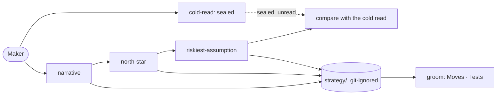

# Pitch — Coaches v2

Moves: grounded_bets_share · Tests: Value proposition

## The ask, as given

> This is why Id like to start with the coaches work, which along the way will have to be rebranded and resinthesized
> based on this work to ensure an overall cohesive experience (the coaches and skills they use are using generic names
> that i just made up from summaries, not really following a brand direction).
>
> We'll see if and how we could make blind runs like this SOP for the product as well in a way thats easy for users to
> follow along.
>
> from the work we did which i believe was really good we could extract and produce a few more specific artifacts:
> a value proposition canvas, a bmc, a user persona poster. idea is that they can be used as standalone easily for
> quick consultation. Furthermore, id like to update the use cases or even encourage agents facilitating to look up
> online or give them a few options to choose from to make it more interactive and fun. We should show a progress
> status like step 1 out x

### Claims
1. The coaches are resynthesized from what the dogfood run found, so they work as one cohesive sequence.
2. A blind run (cold read) becomes a standard first step users can follow.
3. The coaches follow the brand direction (names come from bet A; persona and sources from the brand platform).
4. From the agreed work, the coaches produce standalone one-pagers for quick consultation: a value proposition sheet,
   a business model canvas and a user persona poster.
5. Facilitation is interactive and fun: the coach looks things up online and offers a few options to choose from, with
   current use cases rather than only the classic ones.
6. Every coach message shows its progress ("Step 2 of 7").

**Teach-back:** yes — "You want the coaches resynthesized from what this run found, plus a cold read as a standard first
step, so a maker gets a cohesive strategy sequence without the problems we hit. Right?" (2026-10-04, with claims 4–6
added by the PO at the gate.)

## Problem

Running the three coaches on this product (2026-10-04, ~3 hours) worked: the narrative, North Star and riskiest
assumption were agreed. It also surfaced 15 findings in `audits/dogfood-launch-2026-10.md` that a stranger would hit:
strategy written to a public repo with no question (F2); nothing saved until the last step (F8); a rich answer never
narrowed to one insight (F7); the problem asked before the customer (F9); claims never checked against the product
that exists (F11); no mode for a step the founder delegates (F13, F17); `north-star` re-asking what the narrative says
(F14) and `risk-validation` not reading the North Star (F19); a stale CLI pin (F15); duplicates on claude.ai (F3); an
outside brand in the persona (F4). The blind run that preceded them changed a decision and added a channel and a
segment for no PO time (F5, F22), but nothing in the product offers it.

## Appetite

**M**: one wave.
quote: $22–34 (M, n=8, p25–p75)

## Outcome & signal

A maker runs `cold-read` → `narrative` → `north-star` → `riskiest-assumption` and gets: a sealed independent read; each
coach opening with what the previous agreed file says; a draft saved after every step; an options brief whenever they
hand a step over; benefits and moats marked "true today" or "aspirational" against their repo; strategy kept out of git
unless they opt in; and a compare at the end. **The PO tests it** by re-running the sequence on a sibling repo and
seeing none of the 15 findings. **Signal:** `grounded_bets_share` rises once groom reads agreed strategy for every bet.

## Stage-2.5 bucket

**Light enhancement** to three skills, plus one **genuinely new** skill (`cold-read`) built from a procedure this run
already proved.

## Bill of materials (What / Why)

| What | Why |
|---|---|
| `cold-read` skill: separate agent (another model family when available), exclusion list, reading log, sha256 seal, compare template | The blind run, as a step anyone can run (F5, F22) |
| A shared coach reference every coach reads: play back agreed files; save a draft after each step; park early answers; options brief when delegated; "true today / aspirational" against the repo | One behaviour, three coaches (F8, F11, F13, F14, F17, F19) |
| Strategy folder git-ignored by default, opt-in to commit | Strategy stays private on public repos (F2) |
| `narrative`: a distil-and-test step; pick one person before the problem | F7, F9 |
| `narrative`: a ladder-up step (example → need → evidence, confirmed by the founder) before anything becomes a dimension or persona line | F34: anecdotes became the persona's frustrations |
| `north-star`: run candidates against 4–5 customer scenarios | Caught two leaks in this run (F17) |
| `riskiest-assumption`: reads the North Star too; carries forward risks from earlier coaches | F19 |
| CLI version in the send command comes from the kit version, not a literal | F15 |
| Persona and sources rewritten to the brand platform; claude.ai duplicates retired | F3, F4 |
| "Step N of X" on every coach message, X fixed per coach | The maker always knows where they are |
| Options to choose from at each step (2–4), researched online when the step leans on the present (competitors, analogs, current case studies); the classic cases kept as fallbacks | Interactive, current, faster than a blank page |
| One-pagers as standard outputs: each coach regenerates the business model canvas, value proposition sheet and persona poster it feeds when its file is agreed (`gf-kit one-pagers` on demand); the narrative template gains a structured persona block | Quick consultation that never drifts from the agreed strategy (PO, 2026-10-05: part of the process, not a one-off) |

## Scope

**In v1:** every row above. **Cut line if the appetite runs short:** the one-pagers ship as Markdown only (the HTML
render waits), never the other way round.

**Out of v1 (no-gos):** renaming skills and files (bet A, slice 2, which this bet builds on); the verdict record (F16);
new coaches; a console UI for strategy.

## Rabbit holes

- **Canvas licensing (researched 2026-10-04).** The Business Model Canvas is Creative Commons: usable in software with
  "Strategyzer.com" clearly visible under every canvas. The **Value Proposition Canvas** is reserved: including it or
  an adaptation in software needs Strategyzer AG's express permission. So v1 ships our own **value proposition sheet**,
  built from the narrative's own structure (outcome · motivation · gaps ↔ benefits), not the VPC layout or name; the
  VPC itself only if the PO gets permission (a one-line ask to Strategyzer, owed to the PO).
- **Online lookups need egress.** Where search isn't available (a sandboxed host), the coach says so and falls back to
  the bundled cases, never invents current facts.

- **The cold read's independence.** It must not see the coaches' frameworks or existing positioning; the exclusion
  list is part of the skill, and the reading log + self-reported contamination are mandatory sections.
- **A different model family** is not always reachable (`cross-agent` CLIs need keys and network); fall back to the same
  family and say so in the compare (agreement is then discounted).
- **Bet A first.** Build on the new names (`narrative`, `riskiest-assumption`, `strategy/`), or every path changes twice.

## What already exists (reuse, don't rebuild)

- The three coach skills and their templates; `groom/strategy.mjs` (reads agreed files and prints the Moves · Tests line).
- `scripts/lib/cross-agent-cli.mjs` (reaches Codex, Gemini, Mistral for review): the other-family runner for `cold-read`.
- This run's artifacts as the reference implementation: `00-strategy/blind/2026-10-04-compare.md` (compare template),
  `north-star/nsm.py` (scenario test), `business-model-scenarios.md` (options brief).

## Visuals

## UX heuristics & rails check
- **CI guards covering this surface:** `check-skill-scripts`, `check-onboarding-parity`, `strategy-templates.test`,
  `check-release`.
- **Audits-lens findings that apply:** dogfood-launch-2026-10 F2–F5, F7–F9, F11, F13–F15, F17, F19, F22.

## Acceptance criteria
- `cold-read` writes a sealed file and records its hash; the compare refuses a file whose hash changed.
- Each coach opens by playing back the agreed files before it, writes a draft after every step, and offers an options
  brief when a step is handed over, marking that section `proposed`.
- A benefit or moat the repo doesn't back is labelled "aspirational" in the written file.
- On a public repo, the strategy folder is git-ignored unless the maker opts in.
- `north-star` runs candidates against customer scenarios before the PO picks.
- No coach text names an outside methodology brand; the claude.ai duplicates are retired.
- Every coach message starts with "Step N of X".
- At each step the coach offers 2–4 options to pick from or edit; when a step depends on present-day facts it looks
  them up and cites them, or says it couldn't.
- `one-pagers.mjs` turns the agreed files into the three sheets; the canvas carries "Strategyzer.com" under it; the
  value proposition sheet uses no VPC layout or name.

## Open risks / research
- Strategyzer, usage of our tools: https://www.strategyzer.com/legal/usage-of-our-tools (read 2026-10-04).
- Business Model Canvas PDF (Strategyzer AG): https://assets.strategyzer.com/assets/resources/the-business-model-canvas.pdf
