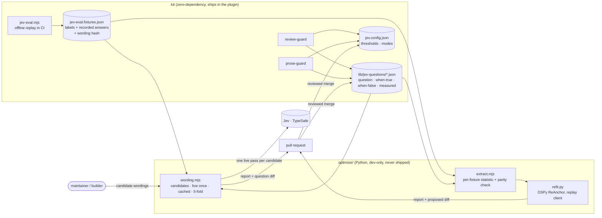

# Seed: Compiled prompts, wave 1: Jev questions become data, optimize/ is committed, and wording gets measured

From the [single-product audit](../audits/single-product-and-grooming-2026-09-28.md) §0.5. **Decision:** E5 (DSPy is a
dev-time Python dependency in `optimize/` only; the kit stays zero-dependency). Groomed 2026-09-29: **feature · shaped
bet · appetite M for wave 1** (the whole idea is L: each later wave is its own bet) · **risk low**. Stage-2.5 bucket:
**light enhancement.** Two of the three things the portfolio seed asked wave 1 to create already exist, so this wave is
smaller and aimed at what the ReAnchor spike said actually limits the guards: the wording of the questions.

**As a maintainer, I want** every Jev question to live in one data file with its measurement beside it, the ReAnchor
harness committed, and a way to test new wordings on held-out data, **so that** a guard gets better by a reviewed diff
backed by numbers, not by editing a JS string and hoping.

## The ask, as given

> "Groom seeds/compiled-prompts.md (wave 1: optimize/ plumbing)" (the product owner, 2026-09-29), on the portfolio
> seed's wave 1: "`optimize/` (DSPy pinned) writes versioned `compiled/jev-thresholds.json` and
> `compiled/prompts/<name>.json`; the kit reads them; every compiled change is a reviewed PR diff."

## System, actors and data flow (wave 1)

## What grooming measured (2026-09-29, against `main` @ 93aec48)

- **The compiled thresholds file already exists: it is `jev.config.json`.** It's the one committed switch the guards
  read (`lib/jev.mjs` → `loadJevConfig`), it's validated (`parseJevConfig` refuses unknown keys), and a threshold
  change is already a one-line reviewed diff. A second `compiled/jev-thresholds.json` would split that source. **Cut.**
- **The compiled prompts already exist too.** `cross-review.prompt.md`, `cross-panel.prompt.md`, the prose task files
  and the groom templates are versioned files the kit reads and ships (`requires_scripts` carries `.md`). Wave 3 can
  write straight into them. `compiled/prompts/<name>.json` would add a format with no reader. **Cut.**
- **The Jev questions don't exist as data.** They're JS constants: `REVIEW_QUESTIONS` in `lib/review-guard.mjs:307`
  and four family questions in `lib/prose-guard.mjs:524–565`, with their measurements in comments. The spike's sharp
  edge 2: a DSPy signature needs the same text as `OutputField(desc=…)`, so it lives in two places unless the question
  becomes the single source.
- **A wording change is invisible to CI today.** `replayAsk` in `jev-eval.mjs:72` looks up recorded answers **by
  question id**, not by text. Edit a question and the offline replay stays green, replaying answers Jev gave to the old
  wording. The model has this guard (`recorded by X, config pins Y — run --live`); the wording doesn't.
- **The spike harness isn't in the repo.** It was about 200 lines (a Node extractor plus a Python ReAnchor script),
  deliberately left out until this epic. Re-running it on a model bump or doubled fixtures means rebuilding it.
- **The label loop already exists.** `jev-report.mjs --json` turns disagreements into fixture candidates,
  `--append-labels` adds them, and `jev-eval --live` records them. What's thin is data: `.jev/decisions.jsonl` holds 24
  decisions locally; the cloud routines' decisions sit as `<!-- jev: -->` markers on PR comments.
- **The measured error is in one family.** Prose is 86.5% on 163 fixtures, 22 wrong, and 19 of those 22 are
  `flag-state-claim` (13 misses at 0.33–0.79, 6 false alarms at 0.80–0.96). Its two distributions overlap, so no
  threshold fixes it (spike, 2026-09-28). Only the question or the evidence can.
- **DSPy's optimizers don't cover question wording.** The DSPy tutorial lists ReAnchor as the optimizer for `Noul`,
  `Score` and `Choice`, and ReAnchor tunes decision parameters only (cuts, thresholds, weights), never the prompt text.
  Nothing documents GEPA or MIPROv2 rewriting a `Noul` field's question. So wave 1 proposes wordings by hand (strongest
  tier) and measures them; DSPy stays where it's proven.
- **The kickoff already picks rules per epic (#187, merged 2026-09-29).** `buildEpicRules` in `emit-epic-kickoff.mjs`
  adds high-risk, migration and flag rules by regex over the epic's docs, and the template is 22 lines, not 94. That
  shrinks wave 2 (see below).
- **Other seeds will add question sets.** `semantic-lint` (scaffolded on its branch) keeps each rule's question in
  `golden-frijoles.config.json → lint.rules[]`; `intent-match` (scaffolded on its branch) puts four question sets in
  `intent-match.mjs`. Both defer fitting to this `optimize/`.

## Bill of materials

| What | Why |
|---|---|
| **Question files**: `scripts/lib/jev-questions/<rail>.json` (id, question, when true, when false, and a `measured` block: model, date, n, decided, right) read by `review-guard` and `prose-guard` | One copy of each question for the kit and for DSPy; a wording change becomes a data diff with its evidence beside it. |
| **A recording remembers its wording**: each fixture recording stores a hash of the question text, and offline replay fails on a mismatch ("recorded against other wording, run --live") | Today an edited question replays stale answers and CI stays green. The same guard the model already has. |
| **`optimize/`** at the repo root: pinned `dspy[typesafe]==3.4.x`, `extract.mjs` (per-fixture statistic from the real Node judges, with the parity check), `refit.py` (ReAnchor with a replay client), one `npm run optimize:refit` | The spike becomes one command, so a re-run on a model bump or doubled fixtures costs minutes, not a rebuild. |
| **A leak guard**: `optimize/` is outside the kit closure and the skills mirror, and the kit never imports Python | E5: dev-time only; a plugin user never needs Python. |
| **`optimize/wording.mjs`**: for one question, N candidate wordings; each asked live once per fixture (cached by wording hash), scored on 5 held-out folds against the current wording, with a report | The spike's finding: the bottleneck is the question. This is the loop that tests one. |
| **First run on `flag-state-claim`**: 3 to 5 candidates; adopt only if held-out beats the current wording, with your OK | 19 of 22 prose errors are here; it proves the loop where the error is measured. |

## Rabbit holes (patched now)

- **The move must be byte-identical.** Same ids, same text, loaded from JSON: offline replay stays green with zero
  re-recordings, and a test compares the loaded questions to the recorded hashes. Any wording change is a separate PR.
- **The wording hash needs one migration.** Existing recordings have no hash. The first run stamps the current hash
  on every recording without asking Jev (the text hasn't changed), in the same PR as the move; from then on a mismatch
  fails.
- **Overfit on 163 prose fixtures.** Candidates are chosen before the run, scored on the same 5 seeded folds the spike
  used, and a candidate wins only if it strictly beats the current wording held-out, never on train. A wording that
  wins by one fixture is a tie, recorded as such.
- **Live cost is printed first.** The prose judge asks one question per eligible sentence, so a run is candidates ×
  eligible sentences across the 163 prose fixtures: a few thousand questions, cents at the audit's measured price. The
  harness prints the count and asks before sending, and caches by wording hash so a re-run is free.
- **Egress.** Fixture text goes to TypeSafe under the existing `jev.egress: true`, as `jev-eval --live` already does.
- **Python on the builder's Mac.** `optimize/README.md` names the setup (`python3 -m venv`, `pip install -r
  requirements.lock`). CI runs no Python: the parity check has a Node half that runs in `node --test`.
- **Per-family thresholds** are a schema change (`jev.config.json` has one shared `claim`). Not in this wave.
- **Consumers that land first.** If `semantic-lint` or `intent-match` ships before this epic's lock, their question
  sets move to the same file shape in S1 (a rule question in config uses the same four fields). If not, their builders
  use the shape from the start.

## No-gos

- No `compiled/` directory, no second thresholds file, no JSON prompt format.
- No GEPA or MIPROv2 in this wave; DSPy is used only for ReAnchor, where it's documented and proven.
- No kickoff assembly (wave 2), no generative-prompt optimization (wave 3).
- No threshold change unless a refit beats the hand values held-out (the spike says it doesn't today).
- No Python in the kit, the plugin, CI or the skills mirror.

## Later waves (re-bet at each boundary; not in this epic)

- **Wave 2, smaller than seeded.** #187 already selects rules per epic by regex (`buildEpicRules`: high risk,
  migration, flag). Wave 2 replaces those regexes with Jev `Noul` questions stored in the wave-1 format, measured on
  the frontmatter-contract corpus, and adds an architecture-lock `Score` per decision. Model routing as a `Choice`
  waits for logged outcomes.
- **Wave 3.** GEPA on the generative prompts (review, smoke writer, report prose), writing into the existing `.md`
  prompt files, with a human-labelled hold-out so reviewers don't learn to look real.

## Slices (one wave, stacked branches `feat/compiled-prompts` → `-s2`)

| Sprint | Stories | Risk | QA stage |
|---|---|---|---|
| **S1: Questions as data, optimize/ committed** | 1.1 question files + the guards read them (byte-identical) · 1.2 recordings carry a wording hash; replay fails on mismatch · 1.3 `optimize/` with extract, parity check and ReAnchor refit, reproducing the 2026-09-28 decision · 1.4 leak guard | low | `node --test`; `jev-eval` offline replay green with zero re-recordings; `kit-tarball` / `check-plugin-leaks` show no `optimize/`; `npm run optimize:refit` reproduces the spike table. |
| **S2: Measure a wording** | 2.1 `wording.mjs`: candidates, cached live pass, 5-fold held-out report · 2.2 first run on `flag-state-claim`: adopt (question diff + re-recorded fixtures) or record a clean negative here | low | `node --test` with a replay client; one live run, its report committed. Owed to Daniel: read the report and approve or reject the winning wording. |

**Cut line:** 2.2 goes first (the harness ships without its first run). 1.1, 1.2 and 1.3 never go.

**Model routing:** 1.2, 2.1 and 2.2 on the strongest tier (recording integrity and wording are judgement). 1.1, 1.3
and 1.4 go to builders against the locked contract. Risk **low**: dev tooling; the byte-identical move keeps every live
verdict unchanged, and an adopted wording is its own reviewed PR. No kill-switch (Stage 6b is for `risk: high`); the
rails keep their `off | shadow | jev` switch. Every change under `skills/` is a plugin release.

## Acceptance (Daniel can check)

- `grep -n "Does \`sentence\`" skills/template/scripts/lib/prose-guard.mjs` finds nothing; the questions are in
  `lib/jev-questions/prose.json`, each with a `measured` block.
- Change one word of a question and run `node scripts/jev-eval.mjs`: it fails and names the question and "run --live".
- `npm run optimize:refit` (after the one-time Python setup) prints the spike's table: review kept 0.85 / 0.30, prose
  kept 0.80, held-out 76 and 141.
- `npm pack` of the kit contains no `optimize/` file, and nothing in the kit imports Python.
- After S2, this seed has a `## Wording result` section: adopted wording with held-out counts, or a clean negative.

## Reuse

`lib/jev.mjs` (`loadJevConfig`, `askJev`, `parseJevConfig`), `jev-eval.mjs` (`replayAsk`, `recordingAsk`,
`evaluate`) + `jev-eval.fixtures.json`, `jev-report.mjs` (the label loop), the spike's method and numbers
(`jev-reanchor-thresholds`), `build-kit`'s `requires_scripts` closure, `check-plugin-leaks.mjs`, `kit-tarball.test.mjs`,
`check-template-drift.mjs` (root `scripts/` ↔ `skills/template/scripts/`).

## Sources

- DSPy 3.4.0 release: https://github.com/stanfordnlp/dspy/releases/tag/3.4.0
- DSPy, decision-making with Jev types (ReAnchor tunes decision parameters only): https://dspy.ai/current/tutorials/jev_decisions/
- DSPy ♥ Jev: https://stacktoheap.com/blog/2026/09/25/dspy-heart-jev/

## Wording result (2026-09-30, S2.2; not adopted, by the product owner's call)

The first live run of `optimize/wording.mjs` asked five hand-written candidates for `flag-state-claim`, 795
questions to `jev-1.13.0`. They were scored on the spike's 5 seeded folds through the real `judgeProse`. The report
is `optimize/reports/wording-flag-state-claim-2026-09-30.md`, with the analysis in `….analysis.md`
beside it.

| Wording | Held-out right | vs current | D6 |
|---|---|---|---|
| current | 141/163 | — | — |
| examples-extended | 146/163 | +5 | passes |
| running-for-real · needs-production-proof · state-vs-history-short · reader-would-believe | 128–133 | −8 to −13 | lose |

**Not adopted: a win on paper, driven by leakage.** The candidates were written after reading all 163 drafts.
`examples-extended` passes D6 only because its examples were lifted from the sentences it then fixes: 9 of its 10
fixes contain a borrowed phrase. Every wording that reframes the question without borrowed examples loses. The
breaks exposed the rule the labels actually encode: **"shipped" alone is not a release claim; "shipped *to prod*"
and "ON *in prod*" are.**

One confound isn't isolated: candidates were asked one family per request, while the current wording's answers
were batched with the other three families. The losses of 8 to 13 are too large for that to explain.

**What this means:** the spike's reading holds. This family's error is labels and evidence more than wording. D6
as written can't stop leakage when the author has seen the folds, so the next attempt needs **drafts the author has
never seen**. Label the disagreements `jev-report --json` finds, write one candidate that encodes the
"to/in prod" qualifier without reading those drafts, and score it on them alone.
