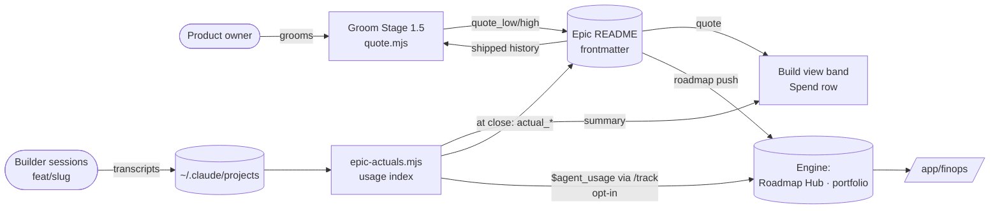
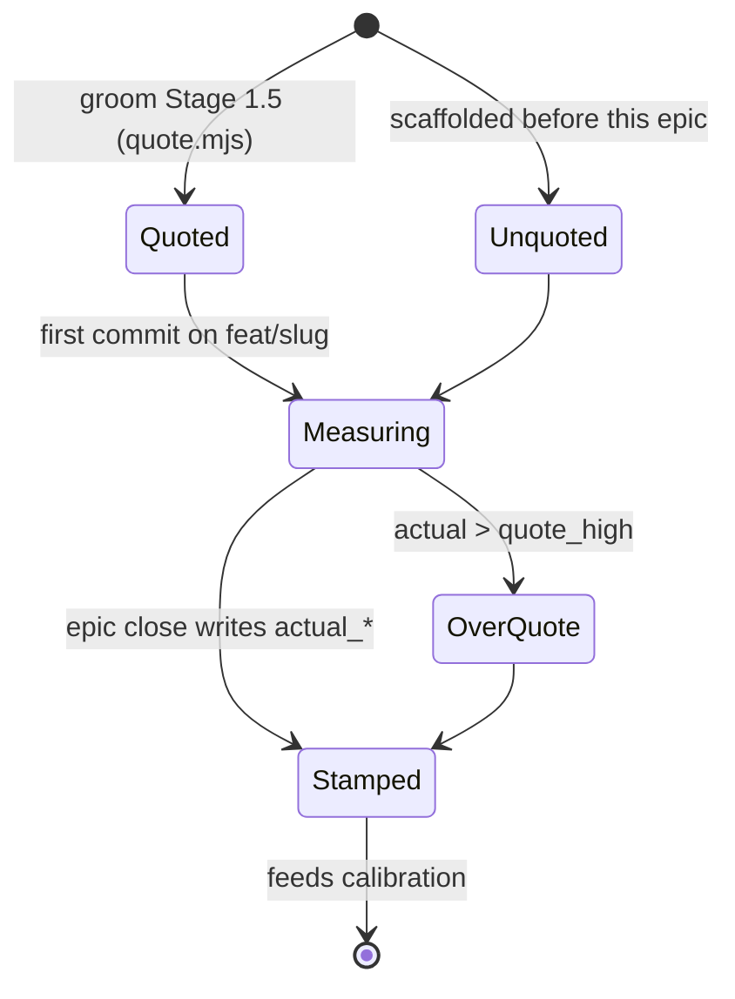

# Pitch — FinOps: quote vs actual per epic

> **Consolidated 2026-10-01.** This pitch is the deep groom of **two** audit seeds: this one (actuals) and
> [`finops-quotes`](finops-quotes.md), which now points here. Product owner's call at grooming: "2 epics" —
> FinOps is one loop (quote → measure → stamp → calibrate), so it is one epic; `portfolio-view` is the other.

## The ask, as given

> hi claude help me groom three seeds:
> Roadmap/00-ideas/seeds/finops-actuals.md
> Roadmap/00-ideas/seeds/portfolio-view.md
> Roadmap/00-ideas/seeds/finops-quotes.md
> The three must be scaffolded in full in this session no matter if the ways of work say to add extra ceremony, we are not. The seeds are related so lets ensure our work is connected and even consolidate as needed. We are doing them both in one session hope thats clear.
> check if the groom skill is outdated and if it is update t or provide steps to do so.
> this work is visual, we require visualisation until we ensure that the intent is matched.
>
> One thing that wasnt in the seeds i believe is the cli visualisation we have built and are using. Lets also make sure we can surface in there relevant info, particularly im thinking of something like:
> Quote vs current: this means each epic would have to have an estimated quote and then show it on the cli visualisation along time real consumption . We would keep track of this at epic level so we can improve as we progress. Lets figure out a way to automate this process.

### Claims
1. Every epic carries an estimated quote.
2. The CLI visualisation (the build view band) shows the quote alongside real consumption, over time, while the epic is built.
3. Consumption is tracked at epic level.
4. The record is kept so quotes improve as we progress (calibration from history).
5. The whole process is automated — nobody types a quote or an actual by hand.
6. Agent token and cost usage lands in the engine, attributed to skill and epic (the seed's own problem).
7. The work stays connected to `portfolio-view` (spend vs quote is one of its columns).

**Teach-back:** yes — "You want every epic to carry a quote set at grooming, see real spend against it live in the
build view while it's built, and have the actual recorded at close so the next quote is calibrated from your own
history — automatically, end to end. Right?" (Product owner confirmed the shape, unit and engine scope through the
grooming questions on 2026-10-01.)

## Problem

Grooming sets an appetite (S/M/L) in sessions with only an *implied* cost, and nothing measures what an epic actually
consumed. So appetite never learns: an M that cost 4× its siblings looks the same on the board as one that came in
cheap, and the landing's FinOps surface is `unbuilt` (`apps/web/lib/maker-ops.ts:190`). The product owner builds
epic after epic with agents and cannot answer "what did that epic cost, and was it what we expected?"

## Appetite

**L — two waves**, re-bet at the boundary (WAYS-OF-WORKING → *Betting & appetite*).
- **Wave 1 = Sprints 1–2: the local loop.** Quote at groom, actual measured on this machine, quote vs actual live in
  the band, actual stamped at close, calibration from history. This is the product owner's headline ask and it ships
  on its own.
- **Wave 2 = Sprint 3: the engine.** Usage events through the existing `/track` ingest, quote/actual on the roadmap
  push, a per-project FinOps view, the landing claim flips. If wave 1 exhausts the appetite, Sprint 3 returns to
  shaping — it does not extend in flight.

## Outcome & signal

After this ships, the product owner opens any epic branch and the band says, e.g. `$ Spend ▰▰▰▰▰▰▱▱▱▱ ≈$38 of quote
$30–55 (M) · 1.9M tok · 4 sessions`. Every shipped epic README carries `quote_*` and `actual_*`; `quote.mjs --appetite M`
prints a range computed from those; and `/app/finops` shows the same numbers per epic, per skill and per model.
**Signal:** after five epics groomed with a quote, the share of actuals landing inside their quote band is visible
(`quote.mjs --report`), and the band narrows as history grows.

## Stage-2.5 bucket

**Light enhancement on the data side, genuinely new on the surface.** The data already exists: Claude Code's own
transcripts log `sessionId`, `gitBranch`, `model`, per-message `usage` and `attributionSkill` (verified live,
Claude Code 2.1.287, 2026-10-01). The epic slug is already derivable from `feat/<slug>` (`build-state.mjs`'s
`parseBranch`). Epic frontmatter already travels to the engine on `/api/v1/roadmap/push`. **So the audit's OTel
receiver, the session-start hook and the "which auth scope" question all go away.** What is new: reading those
transcripts, the quote, the band row, the stamp, and the engine view.

## Bill of materials (What / Why)

| What | Why |
|---|---|
| `epic-actuals.mjs` — reads local transcripts, attributes by `gitBranch` | the data is already on disk; no hook, no receiver |
| Incremental usage index in `.golden-frijoles/` | transcripts are large; the band must stay fast |
| Dated price table → **≈ API $** | raw tokens are ~99% cache reads; $ weights cache and model mix (PO's pick) |
| `Spend` row in the build view band | the ask: quote vs actual in the CLI, live |
| `quote_*` / `actual_*` epic frontmatter, in `roadmap-contract.mjs` | one place the numbers live; git-tracked history |
| `quote.mjs` — p25–p75 of past actuals by appetite | calibration: quotes improve as we progress |
| Groom Stage 1.5 + `scaffold-epic --quote` write it | automated: nobody types a quote |
| Epic close stamps the actual (`--write`), `epic-dod` checks it | automated: nobody types an actual |
| Backfill from ~30 days of local transcripts | the first quote rests on history, not a guess |
| `$agent_usage` event on the existing `/track` ingest | per-skill/model breakdown in the engine (PO's pick); rule #1 |
| Roadmap push carries `quote_*`/`actual_*` | Roadmap Hub and `portfolio-view` read it with no new pipeline |
| `/app/finops` per project | the engine-side answer to "what did this cost" |
| `maker-ops.ts` FinOps: `unbuilt` → shipped | the public page never lags, never over-claims |

## Scope

**In v1:**
- Claude Code sessions only, on the machine(s) where the analyser runs; attributed by branch to an epic.
- ≈ API $ headline (list-price equivalent), tokens as detail, by kind / model / skill.
- Quote = a $ range per appetite, from shipped history; stated basis (n, percentile) every time.
- Band row in four states (inside quote · over quote · no quote · thin history), as approved in the mockup.
- Alert-only budget: the band turns red past the top of the quote and says by how much. That *is* the v1 alert.
- Engine: `$agent_usage` events (opt-in per project), quote/actual on the roadmap push, `/app/finops`.

**Out of v1 (no-gos):**
- **Other agents** (Codex, Agy, Vibe, Devin review/prose passes). They are real spend; v1 names them "not measured",
  never zero. A follow-up seed reads `~/.codex/sessions` etc.
- **Rate-limit or stop.** We do not host the agents; "stop" is not enforceable honestly. Alert-only.
- **Prompt or completion content.** Metrics only — no message text ever leaves the machine or enters the index.
- **Planning-session attribution.** Groom/Cowork sessions run on `main`; they show as `unattributed`, not guessed.
- **Subscription accounting.** ≈ API $ is a list-price equivalent, labelled as such; we don't model plan pricing.
- **Per-story or per-sprint quotes.** Epic level, as asked.

## Rabbit holes

- **Streaming duplicates.** A transcript writes several entries per API response; summing naively double-counts.
  Dedupe by `message.id` (fallback `requestId`) — a spec pins it with a fixture of a split response.
- **Worktrees and subagents.** Builders run in `git worktree`s (different `cwd`, so a different
  `~/.claude/projects/<encoded-cwd>/` folder) and spawn subagents (sidechain transcripts). The reader scans every
  project folder and keeps entries whose `cwd` resolves to this repo or one of its worktrees (`git worktree list`),
  then attributes by `gitBranch`. The lock verifies the subagent transcript layout on the current Claude Code.
- **Stacked branches.** `feat/<slug>-s2`, `-s3` and `fix/…` all map to the same epic — reuse `branchCandidates()`,
  never a second parser.
- **Latency.** The band refreshes every turn; scanning hundreds of MB there would stall the prompt. The resolver
  only *reads* the index summary; the index is updated off the hot path (on `session.measure`, timeout-bound).
- **Prices change.** The table is dated and cites its source; an unknown model counts tokens and shows `$ unknown`,
  never a guessed price (D4: unknown is not zero). A stamped actual keeps the $ it was stamped with.
- **Thin history.** With fewer than 3 shipped epics at an appetite, the quote is a wide default band and says
  "n=2, wide" — never a confident range from one data point.
- **Machine coverage.** Cloud (CCR) or second-machine sessions are not on this Mac. The band says "this machine";
  wave 2's events from each machine are what make the engine total complete.
- **Retention.** Claude Code deletes transcripts after `cleanupPeriodDays` (default 30). The index keeps the
  aggregates it already read, so an epic longer than 30 days still totals correctly once indexed.

## What already exists (reuse, don't rebuild)

- **Transcripts:** `~/.claude/projects/*/*.jsonl` — `sessionId`, `gitBranch`, `cwd`, `model`, `message.usage`
  (`input_tokens`, `output_tokens`, `cache_read_input_tokens`, `cache_creation_input_tokens` + 5m/1h split),
  `attributionSkill`, `isSidechain`, `timestamp`.
- **Branch → epic:** `scripts/build-state.mjs` `parseBranch()` / `branchCandidates()`; epic lookup `findEpic()`.
- **The band:** `skills/plugins/golden-frijoles/hooks/{index.tsx,build-view.mjs}` (rows from resolver lines, `LABEL_GLYPHS`,
  `toneOf`, `progressOf`), vendored resolver via `render-hook-vendor.mjs`.
- **Local log dir:** `.golden-frijoles/` with its own `.gitignore` (`session-budget.mjs` `LOG_GITIGNORE`).
- **Frontmatter contract:** `scripts/lib/roadmap-contract.mjs` (+ `doc-format.mjs`, `roadmap-extract.mjs`, `epic-dod.mjs`).
- **Scaffolder/templates:** groom `scaffold-epic.mjs`, `templates/{epic-README,RETROSPECTIVE}.md`.
- **Engine:** `POST /api/v1/track` (`lib/track-schema.ts`, idempotency fingerprint, quota, reserved-event pattern in
  `lib/signal-events.ts`); `POST /api/v1/roadmap/push` (`lib/roadmap-artifact-schema.ts`, `push_report_artifact` RPC);
  `lib/report-artifacts.ts` `getLatestArtifact()`; `lib/maker-ops.ts` availability.
- **Settings:** kit `config set` + `GF-NEEDS-SETTING` for the opt-in push.

## Visuals

System context (approved as a drawn diagram in the grooming session, 2026-10-01):



The epic's lifecycle of numbers:



Data sample — what `epic-actuals.mjs --json` returns per epic (three real-looking rows):

| epic | sessions | in · out · cache-read · cache-write (tok) | ≈ API $ | top skill | quote | state |
|---|---|---|---|---|---|---|
| workspaces | 9 | 1.2k · 410k · 38.1M · 2.9M | ≈ $61 | groom | — | no quote (backfilled) |
| finops-actuals | 4 | 0.4k · 120k · 11.6M · 0.8M | ≈ $38 | (none) | $30–55 (M, n=6) | inside |
| portfolio-view | 6 | 0.9k · 260k · 27.0M · 2.1M | ≈ $71 | babysit-pr | $30–55 (M, n=6) | 29% over |

The band, four states (approved mockup — the `Spend` row sits between `Progress` and `Status`):

```
  $ Spend    ▰▰▰▰▰▰▱▱▱▱ ≈$38 of quote $30–55 (M) · 1.9M tok · 4 sessions
  $ Spend    ▰▰▰▰▰▰▰▰▰▰ ≈$71 · 29% over quote $30–55 (M) · 3.4M tok
  $ Spend    ≈$22 · no quote · 1.1M tok · 2 sessions
  $ Spend    ▰▰▱▱▱▱▱▱▱▱ ≈$9 of quote $25–90 (M · 2 past epics, wide)
```

The engine view:

```surface
state: finops
route: /app/finops
- head "FinOps" action "Export CSV"
- summary "Spend this month · quote hit rate · cost per shipped story" count 3
- list "Epics" columns "Epic | Appetite | Quote | Actual | Δ | Sessions"
- list "By skill" columns "Skill | ≈ API $ | Tokens | Share"
- note "≈ API $ is a list-price equivalent. Claude Code only — other agents not measured."
```

```surface
state: finops-empty
route: /app/finops
- head "FinOps"
- empty "No usage yet. Turn on usage push with gf-kit config set finops.push true, then build an epic."
```

```surface
state: finops-error
route: /app/finops
- head "FinOps"
- card "Couldn't load usage for this project. Try again."
```

## UX heuristics & rails check
- **CI guards covering this surface:** `doc-format --check` (frontmatter contract), `build-view.test.mjs` + the vendor
  render check, `claude plugin validate`, `check-release.mjs` (plugin + kit version bump), api project Playwright
  specs for `/track` and `/roadmap/push`, the `tenancy` semantic-lint rule (shadow) for `/app/finops`.
- **Audits-lens findings that apply:** `single-product-and-grooming-2026-09-28` §0.3 — the build view only reaches
  plugin users via the vendored resolver (E3); the Spend row must ride the same vendoring, not the repo's script.
- **Design-language debt:** the band's colours are terminal tones (`toneOf`); reuse them — over-quote = `bad`.

## Kill-switch / runtime gate (risk:high only — Stage 6b)
**Decision: no flag (default), carve-out recorded.** The only path that sends anything off the machine is the
`$agent_usage` push, and it is **opt-in per project** (`finops.push`, a kit setting, unset = off); the band row and
quote are local and advisory. Turning the push off is one `config set`; the engine side adds a reserved event name on
an existing route and a read-only page. Rollback = `git revert` + pin the previous plugin version.

## Acceptance criteria

**Sprint 1 — actuals, measured locally**
- On an epic branch with past sessions, `node scripts/epic-actuals.mjs --epic <slug> --json` prints sessions, tokens by
  kind/model/skill and ≈ $; running it twice changes nothing (idempotent index).
- A transcript response split across several entries is counted once (fixture spec, observed failing once).
- A session in a worktree of this repo on `feat/<slug>-s2` counts toward `<slug>`; a session in another repo never does.
- The band shows the `Spend` row on an epic branch, and nothing new on `main`.
- An unknown model shows tokens and `$ unknown`, never a price.
- `--backfill` lists every shipped epic it found in local transcripts and every one it couldn't, with the reason.

**Sprint 2 — quotes, calibrated, and the loop closes**
- `quote.mjs --appetite M` prints `$lo–hi (M, n=<n>, p25–p75)`, or the wide default band with `n<3` stated.
- A groom run records the quote in the seed and `scaffold-epic --quote` writes `quote_low_usd`/`quote_high_usd`/
  `quote_basis`; `doc-format --check` passes on the throwaway CI epic.
- The band shows all four approved states on fixture epics (inside · over · no quote · thin history).
- At close, `epic-actuals.mjs --epic <slug> --write` stamps `actual_usd`/`actual_mtok`/`actual_basis`;
  `epic-dod --check` reports a shipped epic without an actual (warning, not a failure, for epics shipped before this).
- The retrospective template carries a "Quote vs actual" line.

**Sprint 3 — the engine**
- With `finops.push` unset, nothing is sent (spec); with it set, one `$agent_usage` event per (session, epic) reaches
  `/api/v1/track`, and a re-push does not double-count (idempotency).
- No event carries message content (a spec asserts the payload's keys).
- `roadmap/push` accepts and stores `quote_*`/`actual_*`; an older client without them still pushes (nullish).
- `/app/finops` shows the caller's project only; a non-member gets 404 (api spec).
- The landing's FinOps surface shows its shipped state with the same claim the console can back.

## Open risks / research
- **Pricing (present-day fact, to verify at the lock):** third-party reports give Claude Opus 5.5 at $4 / $20 per MTok
  input / output (e.g. [bazaarlink](https://bazaarlink.ai/en/blog/claude-opus-5-5-api-pricing-en),
  [finout](https://www.finout.io/blog/claude-opus-5.5-pricing-2026-what-anthropics-new-flagship-actually-costs)). The
  official table at docs.claude.com could not be fetched during grooming; the architect reads it before writing
  `model-prices`, and the table cites it with a date.
- **Transcript format is not a public contract.** It has been stable enough for build-state's peers, but a field can
  move. The reader treats a missing field as unknown, and a fixture spec on the current shape fails loudly on drift.
- **Credential for the push:** the lock decides between the project ingest key (`/track`'s existing auth) and a CLI
  PAT route; rule #1 holds either way (the same ingest core).
