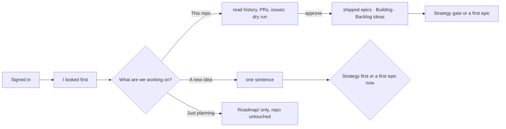

# Pitch — First run: setup starts

Moves: proving_workspaces · Tests: Value proposition — the minutes after sign-in decide whether a founder sees their
own product in Golden Frijoles or an empty folder (closes the last gap in the canvas First run flow, frames 7, 8a, 8b).

## The ask, as given

> follow up, please remind me what happened to the whole onboarding flow we designed at the beginning? where can i
> find it

> yeah lets close the gaps

(Daniel, 2026-10-05, after the launch epics were groomed. Gaps 1–3 went into `account-from-the-terminal`; this is gap 4.)

### Claims
1. After sign-in, setup says what just happened and what it found in the repo before asking anything.
2. An existing project is read into the roadmap: what shipped, what's being built, the open issues as ideas, with
   nothing moved or deleted.
3. A new idea starts with one sentence, then strategy first or a first epic now.

**Teach-back:** yes — "You want the first minutes after sign-in to look at what's already there and turn it into your
roadmap, or start a new idea the right way, as the canvas First run shows. Right?"

## Problem
Setup today asks "existing repo, new project or planning only?" and "idea, plan or already building?" cold, then
routes to groom or the coaches. An existing product with years of commits, open pull requests and issues starts with
an empty `Roadmap/`; nothing it already shipped shows on the board, and the Outcome report has nothing to read. A new
idea isn't told that strategy first is what makes its first epic grounded.

## Appetite
**M**, one wave. If it runs out, ship frames 7 and 8b and keep the existing-project read to shipped work and open pull
requests (issues as ideas after launch).
quote: $22–34 (M, n=8, p25–p75)

## Outcome & signal
After sign-in: "Signed in as …, for the product …", then "I looked first" (is `Roadmap/` here; the stack, commits and
open pull requests), then "What are we working on? 1 This repo · 2 A new idea · 3 Just planning". This repo: it reads
the README, docs, commits, pull requests and issues and writes, as plain Markdown, shipped work as shipped epics (no
target, so no verdict), open pull requests as Building, open issues grouped into Backlog ideas; then "Review the
strategy (about 10 minutes) · Later: plan a first epic now". A new idea: one sentence, then "Strategy first
(recommended) · A first epic now (marked not grounded)".
**Test:** run setup on a real repo with history and issues; the board shows what shipped, what's building and the
backlog, and nothing in the repo moved.

## Stage-2.5 bucket
**Light enhancement, with one new piece.** Setup's questions and routes exist (`golden-frijoles` SKILL.md Stage 2 Q1/Q2,
Stage 3 routing); `scaffold-epic.mjs` and the seed template write epics and ideas; `roadmap-backfill.mjs` already fills
the contract on epic docs; `gh` reads pull requests and issues when installed. New: reading a repo's history into
shipped epics and grouping issues into ideas.

## Bill of materials (What / Why)

| What | Why |
|---|---|
| Frame 7: what sign-in did, what setup found, then Q1 in plain words | No cold questions |
| Frame 8a: shipped work → shipped epics, open PRs → Building, issues → Backlog ideas | The board starts with the founder's real product |
| A dry run first, then write on approval; nothing moved or deleted | A first run must never touch what's there |
| Frame 8b: one sentence, then strategy first or a first epic now | New ideas start grounded, or say they aren't |
| Then the Strategy gate (launch epic 7) or groom | Every route ends at a gate |

## Scope
**In v1:** frames 7, 8a and 8b in the setup skill, using launch epic 7's gate shape; a read script for the existing
project (dry run, then write); the hand-off to the coaches or groom.

**Out of v1 (no-gos):**
- Drafting persona, business model canvas or value proposition: the three existing coaches draft what they draft today.
- Targets or verdicts for backfilled shipped work: none were written then, so none are invented.
- Moving, renaming or deleting anything in the repo, and the folder layout move (`plain-outcome-rename` sprint 4).
- Issue trackers other than GitHub (Linear, Jira): after launch.
- Anything in the console beyond what the pushed roadmap already shows.

## Rabbit holes
- **What counts as "shipped work".** Group by merged pull requests and their titles, else by release tags, else by
  top-level docs; each backfilled epic says where it came from (PR numbers, tag) and is marked "backfilled, no target".
  Cap it (the last 12 months, or the 20 largest) and say what was left out.
- **Grouping issues into ideas.** One idea per cluster with its issue numbers listed; never close, label or comment on
  an issue.
- **No `gh`.** Without it, read git only (merge commits, tags) and say pull requests and issues were skipped.
- **Dry run first.** Show the counts and the first few entries, write only on approval.
- **Contract.** Everything written passes `roadmap-contract.mjs`; reuse `scaffold-epic.mjs` and the seed template,
  never hand-write the frontmatter.
- **Private repo content.** Nothing leaves the machine unless the founder pushes the roadmap.

## What already exists (reuse, don't rebuild)
- `skills/plugins/golden-frijoles/skills/golden-frijoles/SKILL.md` (Stage 1 detect, Stage 2 Q1/Q2/Q4, Stage 3 routing).
- `skills/plugins/golden-frijoles/skills/groom/scaffold-epic.mjs`, `templates/scope-seed.md`, `scripts/roadmap-backfill.mjs`,
  `scripts/lib/roadmap-contract.mjs`, `scripts/build-order.mjs`.
- The coaches: `pmf-narrative`, `north-star`, `risk-validation`.
- From launch epics 2, 4, 7: the sign-in result, "not grounded", the gate shape.
- Design source: the private canvas, page 2 · First run: frames 7, 8a, 8b.

## Visuals



```surface
state: setup-existing-idle
route: terminal · setup
- note "I'll read what's here and write it down. Nothing is moved or deleted."
- list "Read README.md, docs/ (12 files), package.json and 1,284 commits · 3 open pull requests and 41 open issues"
- list "11 shipped, from the history (no targets back then, so no verdicts) · 3 Building: your open pull requests · 41 issues grouped into 17 ideas"
- action "1 Yes, review the strategy (about 10 minutes)" action "2 Later: help me plan a first epic now"
```

## UX heuristics & rails check
- **CI guards covering this surface:** `roadmap-contract.test.mjs`, the skill checks, `check-template-drift.mjs`.
- **Audits-lens findings that apply:** the canvas First run flow; audit decision 1 (words).
- **Design-language debt:** none (terminal text).

## Kill-switch / runtime gate
Not needed: risk low (skill text and a local script that writes `Roadmap/` only after approval). Rollback is a revert.

## Slices (stories, risk, QA)

**Sprint 1 · Setup starts.**
- **S1.1 · low.** As a founder who just signed in, I want setup to say what happened and what it found before asking
  anything, so that the first question makes sense. Frame 7. *QA:* a setup run on a fixture repo.
- **S1.2 · low.** As a founder with an existing product, I want my history, pull requests and issues read into my
  roadmap, so that the board starts with my real product. Frame 8a: a read script, dry run then write, then "Review
  the strategy · Later". *QA:* pure-logic specs on grouping and caps; a fixture repo with and without `gh`; the
  contract check on everything written.
- **S1.3 · low.** As a founder with a new idea, I want to say it in a sentence and choose strategy first or a first
  epic now, so that I know what being grounded means. Frame 8b. *QA:* a setup run on an empty repo.

**Smoke walkthrough:** owed by Daniel: setup on a real repo with history, and on an empty one.

## Acceptance criteria
- After sign-in, setup states who and which product, what it found, then asks what we're working on in plain words.
- On an existing repo, a dry run shows shipped work, open pull requests and issue groups with counts; on approval they
  are written as shipped epics (marked backfilled, no target), Building, and Backlog ideas; nothing else in the repo
  changes; without `gh` it says what it skipped.
- On a new idea, one sentence, then strategy first or a first epic now (marked not grounded).
- Every written file passes the contract check.

## Open risks / research
- None external.
