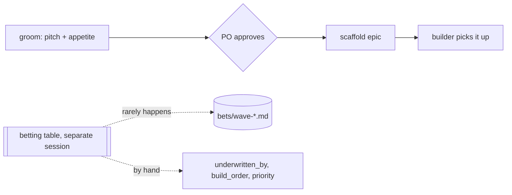
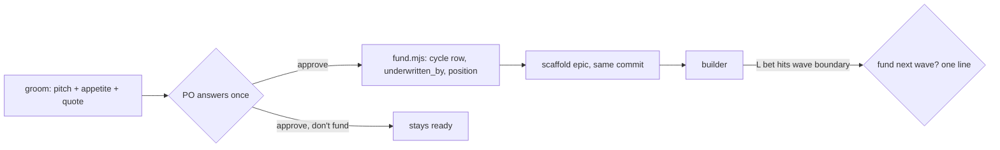

# Pitch — Fund at approval: the approval gate is the betting table

Moves: bets_placed_per_workspace · Tests: Value proposition

## The ask, as given

> the last open step from groom, placing the bet in a funding cycle and setting its build order . i believe we should
> fold it in, otherwise it will just be taken from there and be built. Which makes sense as it cuts down ceremony, so
> lets find a way to make the betting table part of the process.
>
> after grooming a scaffolded item must come out funded and th bet placed without adding extra ceremony or steps for
> operators to follow up later.

### Claims
1. Approving a groomed pitch also funds it: the bet is placed in a cycle and given its build position, in the same answer.
2. Nothing comes out of grooming scaffolded but unfunded.
3. No extra ceremony or follow-up step for the operator.

**Teach-back:** yes — "You want approving a pitch to also fund it, so nothing leaves grooming unfunded and nobody has a follow-up step. Right?" (2026-10-04)

## Problem

The betting table is a separate step that `groom` never reaches. The documented flow
(`00-ideas/README.md` → *How seeds flow*) is Capture → Scope → **Queue (bet)** → Scaffold, but `groom` scaffolds right
after approval, so the Queue step is skipped by design. Evidence on 2026-10-04:

- **43 of 51** scaffolded or shipped seeds have no `underwritten_by` (84%).
- `build-order.mjs` only warns about a missing underwriter on a seed with `status: queued`; a scaffolded epic with no
  underwriter passes silently.
- `underwritten_by` holds two formats (`wave-2026-09-16-plugin` and `"Roadmap/bets/wave-2026-08-08.md"`).
- `build_order` is a global integer that includes shipped history, so putting a new bet *next* means renumbering by
  hand; two epics already share `16`.
- `priority` (intent) and `underwritten_by` (record) are two fields for one decision; the board once rendered the wrong
  one.

So bets are approved, built and shipped without a funding record, and the opportunity-cost ledger (`Roadmap/bets/`)
records only the few that happened to get a separate session.

## Appetite

**S**: one builder session, fixed scope.
quote: $7–16 (S, n=4, p25–p75)

## Outcome & signal

After this ships, every `groom` approval leaves the bet funded: a row in the open cycle file (bet · appetite ·
displaced), `underwritten_by` set, and a build position, all in the same commit as the scaffold. **The PO tests it** by
grooming one throwaway idea and finding all three without doing anything after "approve". **Signal:** the board's
unfunded count stays at zero.

## Stage-2.5 bucket

**Light enhancement.** The parts exist (wave files, `underwritten_by`, `build_order`, `build-order.mjs`); they move into
the approval gate and become automatic.

## Bill of materials (What / Why)

| What | Why |
|---|---|
| A **Bet block** in `groom`'s approval gate: appetite + quote (already there), cycle, position, displaced | One answer funds the bet |
| `fund.mjs`: appends the cycle row, sets `underwritten_by`, places the bet in the queue and renumbers the **queue only** | No hand renumbering; shipped history keeps its numbers |
| Cycle files open themselves (one per month) | No "wave boundary" meeting to start a cycle |
| `build-order.mjs` hard-fails a scaffolded bet with no underwriter | "Scaffolded ⇒ funded" is enforced, not hoped for |
| `priority:` retired (the cycle row is the intent and the record) | One field per decision |
| One-off backfill of the 43 unfunded items into a `backfill` cycle | The guard can go hard on day one, honestly labelled |
| Absorbs `build-order-render-fix` (the board rendering `priority`) | Retiring `priority:` removes the bug's cause |
| Wave-boundary re-bet for L bets as one line, asked when the builder stops at the boundary | L bets stay funded wave by wave without a meeting |

## Scope

**In v1:** the gate's Bet block, `fund.mjs`, monthly cycle files, the hard guard, `priority:` retired, the backfill, the
wave-boundary line, and the docs that describe the flow (`00-ideas/README.md`, WAYS-OF-WORKING → *Betting & appetite*,
`bets/README.md`).

**Out of v1 (no-gos):** a betting UI in the console; budgets in dollars per cycle; capacity planning; renaming
`bets/` → `cycles/` and `wave` → `cycle` (that is bet A's slice 4, which will rename these files too).

## Rabbit holes

- **Renumbering must never touch shipped numbers.** Only the queue (Ready and later) renumbers; history is fixed.
- **Declining to fund is a real answer.** "Approve, don't fund" keeps the pitch at `ready` (shaping done, not
  scaffolded), so nothing scaffolded is ever unfunded.
- **Bet A renames these files.** Write against today's names; bet A's migration script maps `bets/wave-*.md` →
  `cycles/*.md` and `underwritten_by` values with it.

## What already exists (reuse, don't rebuild)

- `Roadmap/bets/README.md` (the three-line row: Bet · Appetite · Displaced), 13 wave files.
- `scripts/build-order.mjs` (the queue view and the underwriter check), `scripts/lib/stage.mjs`.
- `groom` Stage 1.5 (appetite + `quote.mjs`) and Stage 7 (the gate), `scaffold-epic.mjs` (copies quote into the README).

## Visuals

As it runs today:

As it will run:

## UX heuristics & rails check
- **CI guards covering this surface:** `build-order.mjs` freshness guard, `doc-format`, `epic-dod`.
- **Audits-lens findings that apply:** dogfood-launch-2026-10 (this conversation, 2026-10-04).

## Acceptance criteria
- Approving a pitch in `groom` writes the cycle row, `underwritten_by` and the build position in the same commit as the
  scaffold, with no further step.
- "Approve, don't fund" leaves the seed at `ready` and scaffolds nothing.
- `fund.mjs --after <slug>` and `--next` place a bet in the queue; shipped `build_order` values never change.
- `build-order.mjs` fails on a scaffolded bet with no `underwritten_by`; passes after the backfill.
- The cycle file for the month is created on first use.

## Open risks / research
- None external.
