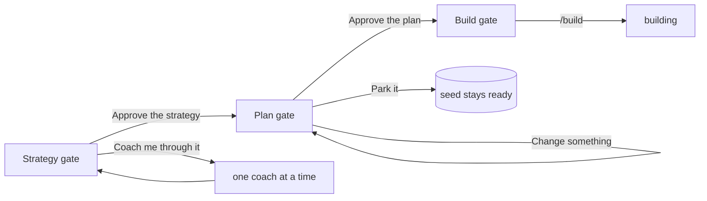

# Pitch — Gates in plain agile

Moves: grounded_bets_share · Tests: Value proposition — the first run happens in the terminal, and every decision a
founder makes there is a gate (launch epic 7 of [`audits/ux-ui-audit-2026-10.md`](../audits/ux-ui-audit-2026-10.md),
decision 1).

## The ask, as given

> lets switch to plain agile … Epic, Sprint, User story, Backlog → Grooming → Ready → Building → QA → Shipped … bet,
> funding, displacement and slice only as concepts … stories must remain stories

> simplify, use graphics … drop the You and Next lines

(Daniel, 2026-10-05, UX audit session, on the language and the canvas Gates board. Shape answer the same day: its own
small epic; coaches-v2 stays after launch, unchanged.)

### Claims
1. Every gate has one shape: where to read it, what's already decided, the two or three things only you decide, then
   approve, park or change.
2. The Plan gate (groom's approval) and the Build gate read in plain agile words.
3. The strategy coaches end in one Strategy gate.
4. The bookkeeping words (fund, scaffold, underwritten, displaced, kickoff, epic mode, agreed, draft) stop appearing
   on screen; files keep their values.

**Teach-back:** yes — "You want every decision in the terminal to look the same and speak plain agile, so a founder
always knows what to read, what's already decided and what they're deciding, without our bookkeeping words. Right?"

## Problem
The first run happens in the terminal, and its gates speak our bookkeeping: groom ends with "approve (fund +
scaffold) · approve, don't fund · change something" over a Bet block of cycle, position and displaced; the coaches
ask to mark files `agreed`; the build hand-off says kickoff and epic mode. Each gate has its own shape. A founder who
knows agile has to learn our words before deciding anything (F42).

## Appetite
**M**, one wave. If it runs out, ship the Plan and Build gates and leave the Strategy gate for after launch.
quote: $22–34 (M, n=8, p25–p75)

## Outcome & signal
Strategy, Plan and Build each end the same way: where to read it, what's decided for you, two or three decisions,
then "Approve · Park it · Change something" (the Strategy gate adds "Coach me through it"). The words on screen are
decision 1's. Files, folders, scripts and their values don't change.
**Test:** a founder who knows agile and has never seen Golden Frijoles runs setup to the first `/build` without asking
what a word means.

## Stage-2.5 bucket
**Light enhancement.** The gates exist; only their shape and words change. Groom Stage 7 and `references/funding.md`
hold the Plan gate; the hand-off after scaffold holds the Build gate; the three coaches (`pmf-narrative`,
`north-star`, `risk-validation`) and setup's routing hold the strategy step. The canvas has all three gates drawn
(StrategyGate, PlanGate, Approved) and the Gates board.

## Bill of materials (What / Why)

| What | Why |
|---|---|
| One gate shape, written once (`groom/references/gates.md`), with the screen-word table | Every gate looks the same; one place to change it |
| Plan gate: Moves · Target · Read date · Size · Flag · Measured by, then Approve the plan · Park it · Change something | Groom's approval in plain words, with the bet in it |
| Build gate: what was created, the one command, optional setup items | The hand-off says what to do next |
| Strategy gate: one review of the coaches' drafts, three decisions, Approve · Change · Coach me through it | The coaches end in one decision |
| The screen words checked in the skills' printed gate text, across every copy | They stay gone |

## Scope
**In v1:** the gate shape reference; the Plan, Build and Strategy gates in the groom, setup and coach skills; the
screen-word check; every copy kept in step (template, kit skeleton, `WAYS-OF-WORKING`, `SESSION-KICKOFFS`).

**Out of v1 (no-gos):**
- File values, frontmatter keys, folder names and script names (`status: agreed`, `underwritten_by`, `fund.mjs`,
  `Roadmap/00-ideas/seeds/`): unchanged. The folder move is `plain-outcome-rename` sprint 4, after launch.
- The Set up gate (install, sign in): launch epic 2. The Result gate (the read): launch epic 4.
- The coach improvements in `coaches-v2` (cold read, research, one-pagers): after launch.
- Anything in the console: decisions are made with the agent; the console only shows them.
- New gates or new steps.

## Rabbit holes
- **"Park it" is today's "approve, don't fund".** Same behaviour (the seed stays ready, nothing is funded or
  scaffolded); only the words change. Don't invent a new state.
- **The record still says what it pushed back.** The funding row keeps its "displaced" column; the gate says "What
  this pushes back".
- **Many copies.** Gate text lives in the plugin, the template, the kit skeleton and the repo's own
  `WAYS-OF-WORKING` and `SESSION-KICKOFFS`; `check-template-drift.mjs` and the parity checks must stay green.
- **Bet stays as a concept.** "Bet" may appear as the idea behind an epic ("We bet that…"), never as a stage, a
  button or a status.
- **The strategy approval writes `status: agreed`.** Approve sets it per file, exactly as each coach does today;
  "Change something" leaves `draft`.
- **Measured by.** The Plan gate shows the events a target needs only when the target metric has them; never invent
  event names.

## What already exists (reuse, don't rebuild)
- `skills/plugins/golden-frijoles/skills/groom/SKILL.md` (Stage 7 and 8), `groom/references/funding.md` (the Bet
  block), `groom/references/kill-switch.md` (the flag line), `fund.mjs`, `session-line.mjs`.
- `skills/plugins/golden-frijoles/skills/golden-frijoles/SKILL.md` (setup, Stage 3 routing), `pmf-narrative/`,
  `north-star/`, `risk-validation/` skills (each writes `status: draft` / `agreed`).
- `skills/template/Roadmap/{WAYS-OF-WORKING,SESSION-KICKOFFS}.md`, `skills/kit/dist/skeleton/`, `Roadmap/WAYS-OF-WORKING.md`,
  `scripts/check-template-drift.mjs`, `scripts/semantic-lint.mjs`, `scripts/lib/prose-guard.mjs`.
- From launch epic 4: target, read date and the groom question (the Plan gate shows them).
- Design source: the private canvas: Gates, StrategyGate, PlanGate, Approved.

## Visuals



```surface
state: plan-gate-idle
route: terminal · groom Stage 7
- note "The plan is ready: Roadmap/00-ideas/seeds/overdue-reminders.md"
- note "We bet that polite reminders will get more invoices paid on time."
- list "Moves: invoices paid by their due date · Target: 10 points above today · Read date: 30 days after it reaches everyone · Size: S, about $7–16 · Flag: invoices.overdue_reminders"
- list "Two decisions only you can make: 1. Their own email address, or ours? 2. On the due date, or three days after?"
- action "1 Approve the plan" action "2 Park it" action "3 Change something"
```

## UX heuristics & rails check
- **CI guards covering this surface:** `check-template-drift.mjs`, the skills' own checks, `check-onboarding-parity.mjs`,
  `semantic-lint`; a new screen-word check for printed gate text.
- **Audits-lens findings that apply:** dogfood F42; audit decision 1.
- **Design-language debt:** none (terminal text).

## Kill-switch / runtime gate
Not needed: risk low (skill text and docs; no runtime change). Rollback is a revert and a plugin release.

## Slices (stories, risk, QA)

**Sprint 1 · The Plan and Build gates.**
- **S1.1 · low.** As a founder, I want every gate to have the same shape, so that I always know what to read and what
  I'm deciding. `groom/references/gates.md`: the shape and the screen-word table. *QA:* the skill checks.
- **S1.2 · low.** As a founder approving a plan, I want the gate in plain words with the bet in it, so that I approve
  without learning ours. Groom Stage 7 and `funding.md`: Moves, Target, Read date, Size, Flag, Measured by; "Approve
  the plan · Park it · Change something". *QA:* the skill checks; a groom run on a fixture seed.
- **S1.3 · low.** As a founder who just approved, I want to be told what was created and the one command to start, so
  that I start building without reading docs. The Build gate after the scaffold. *QA:* a groom run end to end.

**Sprint 2 · The Strategy gate, and the words.**
- **S2.1 · low.** As a founder, I want the strategy coaches to end in one decision, so that I approve my strategy once.
  The Strategy gate in setup's routing: where to read the drafts, what was decided from the repo, three decisions,
  "Approve the strategy · Change something · Coach me through it". *QA:* a setup run on a fixture repo.
- **S2.2 · low.** As a founder, I want the bookkeeping words gone from what the agent shows me, so that I only meet
  plain agile. A check over printed gate text; every copy in step. *QA:* the new check; `check-template-drift.mjs`.

**Smoke walkthrough:** owed by Daniel: setup in an empty repo through the Strategy, Plan and Build gates.

## Acceptance criteria
- Strategy, Plan and Build gates each show where to read, what's decided, two or three decisions, and their options.
- "Park it" behaves exactly as "approve, don't fund" did.
- No gate shows fund, scaffold, underwritten, displaced, kickoff, epic mode, agreed or draft; files keep their values.
- Every copy of the gate text matches; drift and parity checks are green.

## Open risks / research
- None external.
