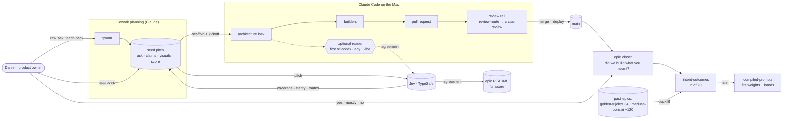

# Seed: Intent match (wave 1, advisory): a score for how well the plan captured the ask, routed follow-ups, and a rule for visuals

## The ask, as given

_Proxy (`intent_ask: proxy`, intent-match D8): groomed before the seed template kept the product owner's words, so
this is the ask as groomed, not as said. Claims split by the builder at the S1 lock; the teach-back was not recorded._

> **As the product owner, I want** each groomed pitch to show how well it matches what I asked, with the diagram or
> wireframe its shape calls for, and a named next artifact for each gap, **so that** "that's not what I meant" surfaces
> before the build instead of after.
> **As the product owner, I also want** every closed epic to record whether we built what I meant, and the past epics
> of both my projects to seed that record, **so that** we can tell soon whether the score predicts anything.

### Claims
1. Each groomed pitch shows how well it matches what I asked.
2. Each pitch carries the diagram or wireframe its shape calls for.
3. Each gap between the pitch and the ask names the next artifact to make.
4. Mismatches surface before the build, not after it.
5. Every closed epic records whether we built what I meant.
6. Past epics of both my projects seed that record.
7. We can tell soon whether the score predicts anything.

## Background

From the [single-product audit](../audits/single-product-and-grooming-2026-09-28.md) §0.6. **Decision:** E6 (advisory
for the first 20 epics; thresholds decided with data). Groomed 2026-09-29: **feature · shaped bet · appetite M · risk
low**. Stage-2.5 bucket: **new, built almost entirely from parts we have.** Approved 2026-09-29 with readers made optional. Jev's client, typed questions and decision
log, the cross-family CLI plumbing, groom's teach-back and the epic close check all exist. What's new is one scoring
script, one groom stage with a visuals rule, an optional reader at the architecture lock, and one question at epic close.
Wave 2 is [`sketch-specs`](sketch-specs.md).

**Product owner's calls at grooming (2026-09-29):**
1. Pitches need visuals: "at least some diagram or wireframe of the overall system and data flow + actors." No rule
   for when to draw exists yet, so this epic adds one.
2. **Readers are optional, off by default, and never Claude.** Planning runs on Claude's frontier model; a Claude
   reader adds no independent read. The other families run on free tiers, can be finicky, and three reads of every
   pitch cost more time than they return. So a reader is **one** opt-in pass from the first family that answers,
   and any failure (not installed, capped, timeout, empty reply) is skipped with one line. It never stops the lock.
3. Learn from past builds now, **in both golden-frijoles and medusa-bonsai.**

**Amended 2026-09-29 (grooming `sketch-specs` and `compiled-prompts`):** the visuals rule writes a screen as a
`surface` block rather than an HTML or ASCII sketch, and names a screen's states from the ten-state taxonomy, so every
wireframe drawn from here on is already a spec `sketch-specs` can render. The four question sets stay in one exported
object (id → question, when true, when false) so `compiled-prompts` can move them to a data file unchanged. No story
added, appetite unchanged.

## System, actors and data flow (this wave)



## What grooming measured (2026-09-29, against `main` @ 93aec48)

- **The raw ask is never stored.** No seed and no template section keeps the product owner's words as given
  (`templates/scope-seed.md` goes straight to `## Problem`). Stage 1's teach-back ("You want X so that Y. Right?") is
  asked but its answer isn't recorded. Two signals can't be computed without both, so capturing them is story 1.
- **No rule decides when to draw.** Neither Roadmap (golden-frijoles or medusa-bonsai) contains a single Mermaid block,
  and neither WAYS-OF-WORKING nor groom says when a pitch needs a diagram or a wireframe. The only visual rule is
  WAYS-OF-WORKING's "an APPROVED design is the contract", which covers UI after the fact. The audit's routing list
  (wireframe, flow, data sample, state machine, sequence, container diagram) is the vocabulary a rule can reuse.
- **Jev already asks typed questions.** `skills/template/scripts/lib/jev.mjs` has `askJev` (never throws, returns
  `could-not-look`), `effectiveMode` and `logDecision`, and `review-guard.mjs` shows the pattern: `noul` and `choice`
  questions with measured wording and thresholds in `jev.config.json`.
- **The ReAnchor spike's lesson applies** (`jev-reanchor-thresholds`, 2026-09-28): design each judge as **one statistic
  per Noul/Score** from day one, or it can't be fitted later. The bottleneck is wording and labelled data.
- **Jev works from where grooming runs.** The Cowork planning shell has `.env.local` with `TYPESAFE_API_KEY` and reaches
  `api.typesafe.ai`; `jev.config.json` has `egress: true`.
- **Other families don't run from Cowork.** The Cowork shell is a sandboxed Linux machine on the Mac, separate from
  macOS: it has `claude` and `node`, and no `codex`, `agy` or `vibe` (their logins live in macOS). They do run in Claude
  Code on the Mac, through `lib/cross-agent-cli.mjs` (`runCodex`, `runAntigravity`, `runVibe`). So the optional reader
  belongs at the **architecture lock**, the first step a builder takes, when it is switched on at all.
- **Enough history to calibrate now.** golden-frijoles has 34 shipped epics (39 retrospectives). medusa-bonsai has
  about 120 shipped epics, 152 retrospectives and 118 seeds, on the same Roadmap layout and the same plugin. Epic
  READMEs with a dated amendment or a disproved scope (a derived "correction" label): 11 here, 6 there.
- **`epic-dod.mjs` already reads the retrospective** (`retro-written` parses `_Closed: YYYY-MM-DD_`). An `_Intent:`
  line is the same parse.

## The score (every signal is one statistic, so it can be fitted later)

| Signal | When | Jev question (one per item) | Statistic |
|---|---|---|---|
| **Coverage in** | groom | Noul, per claim in the raw ask: "Does this pitch address it?" | mean P(true) |
| **Coverage out** | groom | Noul, per acceptance criterion: "Does this trace to the ask or a recorded decision?" | mean P(true) |
| **Clarity** | groom | Score, per acceptance criterion: "Could two builders test this the same way?" | mean score |
| **Teach-back** | groom | The product owner's answer to the Stage 1 mirror | yes 1 · partly 0.5 · no 0 |
| **Agreement** *(optional)* | lock | Noul: the lock's own plan vs one reader's reading (first of codex, agy, vibe that answers): "Same build?" | P(true) |

The score shows coverage, clarity and teach-back at the approval gate, labelled **"uncalibrated"**. That is the whole
score by default. If the reader is switched on and answers, the lock adds agreement to the epic README; if it doesn't
answer, the lock prints one line ("reader skipped: <why>") and carries on. Total = 100 × the equal-weight mean of the
signals present, and the log records which were present. Bands: **80+** build · **60–79** resolve the follow-ups first ·
**below 60** sketch or spike first. Weights and bands are placeholders; the calibration fits them.

**Each gap is routed** (Jev Choice) to one artifact from the same vocabulary as the visuals rule below, plus spike and
think chain (`think-skills`, not built yet, so "answer by hand").

## The visuals rule (groom Stage 4.6)

Drawn from the shape of the ask, not from taste. Every shaped bet (appetite M or L) gets a **system context**: actors,
systems and the data flow between them, like the one above. On top of that:

| The ask has… | Draw | Format |
|---|---|---|
| a screen or a page someone uses | wireframe (low fidelity, the words that matter) | a `surface` block in the seed: state, route, ordered blocks by kind with the words that matter (the [`sketch-specs`](sketch-specs.md) format, which renders it and makes it the contract) |
| a multi-step journey | flow | Mermaid `flowchart` |
| a new table, record or payload | data sample (3 real-looking rows) | table in the seed |
| a lifecycle or statuses | state machine (a screen's states named from the ten-state taxonomy in `references/ux-guidelines.md`) | Mermaid `stateDiagram` |
| calls across services, async or retries | sequence | Mermaid `sequenceDiagram` |
| a new repo, package or deploy boundary | container diagram | Mermaid `flowchart` with subgraphs |

Mermaid because it renders on GitHub and diffs as text: it is already the spec for flows, states, sequences and
containers, so `sketch-specs` adds no format for those. Screens are the exception: a `surface` block, which
`sketch-specs` renders as a grey wireframe and turns into the route's state contract. Fixed-scope work
(appetite S) draws only when a trigger in the table fires.

## Bill of materials

| What | Why |
|---|---|
| **The ask, as given**: a verbatim section in the seed template, numbered claims, and the teach-back answer | Without your own words, "did the plan capture the ask?" has nothing to compare against. |
| **The visuals rule** in groom (Stage 4.6) and a `## Visuals` section in the seed template | You asked for a picture of the system on every set of asks; the rule makes it the default, not a favour. |
| **`intent-match.mjs`** in the kit: reads a seed, asks Jev, prints components + total + routed gaps; no key → "could not look" | One script is the whole engine; the zero-dependency kit already has everything it calls. |
| **Measured wording**: a small labelled fixture set recorded with `jev-eval --live` | An unmeasured question is a guess with a decimal point (the review question went 38/76 → 74/76 on wording alone). |
| **An optional reader at the lock** (`intentReader: off` by default in `golden-frijoles.config.json`): one pass from the first family that answers, a short timeout, skipped on any failure | A second family's read is sometimes worth it, but never worth a stalled build or a Claude clean-up. |
| **The close question**: `_Intent: yes \| mostly \| no_` in the retrospective, checked by `epic-dod` only for scored epics | The label that makes the score learnable; old epics aren't retroactively failed. |
| **`intent-outcomes.mjs`**: joins scores with answers and derived corrections, across any repo on this Roadmap layout, prints "n of 20" | Calibration readiness is visible, and corrections are derived from files, never self-reported. |
| **Backfill across both projects**: you answer the close question for a sample of shipped epics (20 to 30, mixed), and the scorer runs on each approved pitch | A first read on whether the score means anything now, not in months. |

## Rabbit holes (patched now)

- **The reader never disrupts.** One single-pass call through `cross-agent-cli`, a hard timeout, and every failure
  (missing CLI, quota, timeout, empty or unstructured reply) becomes a skip line and a score without agreement. It
  gets the pitch file only, with a fixed prompt ("what you'll build, what you won't, the first thing you'd ask").
- **Claims are split by the groom agent, not the script.** Splitting the ask is a language task. Groom writes numbered
  claims under the verbatim ask, and you can edit them. The script only scores.
- **Backfilled pitches have no verbatim ask.** For past epics the seed's Problem (or the audit it came from) stands in,
  flagged `ask: proxy`, so the calibration can weigh or drop them. Agreement can't be backfilled.
- **Egress:** the pitch goes to TypeSafe under the existing `jev.egress` answer. Business-sensitive pitches live in the
  private docs repo (E1). medusa-bonsai has its own `jev.config.json`; the backfill runs under that repo's answer.
- **Frontmatter:** `intent_match:` is a new flat seed key and epic README key. The lock checks `roadmap-extract`,
  `build-order` and `doc-format` tolerate it in both repos.
- **Cost:** roughly 20–40 Jev questions per groom and one read per family at the lock. The scorer prints the count
  before it asks; `session-budget` will put it on the budget line.

## No-gos

- **The score never gates.** It can add a step; it never removes your approval or blocks a scaffold (E6).
- **No Claude readers, and never more than one reader.** No reader ever blocks or retries into a stall.
- **No threshold fitting in this epic.** The data is collected; `compiled-prompts`' `optimize/` fits it later.
- **No spec-to-render tooling.** The visuals rule says what to draw and writes screens as `surface` blocks; rendering
  them and making them the contract is `sketch-specs` (wave 2).
- No dashboard, no engine table, no CLI change.

## Slices (one wave, stacked branches `feat/intent-match` → `-s2` → `-s3`)

| Sprint | Stories | Risk | QA stage |
|---|---|---|---|
| **S1: The scorer** | 1.1 `intent-match.mjs`: the question sets, one statistic each, total + bands, "could not look" without Jev · 1.2 gap routing (Choice) · 1.3 a labelled fixture set and measured wording (`jev-eval --live`) | low | `node --test` with a replay client (no key); one `--live` record of the fixtures. |
| **S2: Planning captures intent** | 2.1 seed template: "The ask, as given", numbered claims, teach-back, `## Visuals` · 2.2 groom Stage 3.5 (score) and Stage 4.6 (visuals rule) · 2.3 an optional reader at the lock: off by default, one pass from the first family that answers, skipped on any failure, agreement into the epic README when present | low | Template and kickoff tests; a groom dry run on a real seed. Owed to Daniel: read one scored pitch and say whether its gaps and its diagram are right. |
| **S3: Learning from what shipped** | 3.1 `_Intent:` in the retro template + an `epic-dod` item for scored epics · 3.2 `intent-outcomes.mjs` across repos (the join, derived corrections, "n of 20") · 3.3 backfill: golden-frijoles and medusa-bonsai samples scored, your answers recorded | low | `epic-dod.test.mjs` extended. Owed to Daniel: 20–30 yes/mostly/no answers (about fifteen minutes). |

**Cut line:** 1.2 goes first (the groom agent names the artifact by hand), then the medusa-bonsai half of 3.3. The
score, the ask capture, the visuals rule and the close question never go.

**Model routing:** 1.1, 1.3 and 2.2 on the strongest tier (question wording, reader isolation). The rest go to
builders against the locked contract. Risk **low**: planning tooling, advisory, no runtime seam, so no kill-switch
decision (Stage 6b is for `risk: high`). Every change under `skills/` is a plugin release, and medusa-bonsai picks it
up by pinning the new plugin version.

## Acceptance (Daniel can check)

- Grooming a new M-sized seed leaves a system context diagram in it, plus any diagram its shape triggers.
- The same seed has "The ask, as given", `intent_match: <n>` in its frontmatter, and a `## Intent match` section showing
  each component, "agreement pending", and a route for each gap.
- With `intent.reader` off (the default) the lock runs no reader. Switched on with no CLI installed, or with a capped
  one, the lock prints "reader skipped" and carries on without a pause.
- With no `TYPESAFE_API_KEY`, groom says "could not look", with no number.
- Closing a scored epic without `_Intent:` fails `epic-dod --check`; closing an older one doesn't.
- `node scripts/intent-outcomes.mjs --repo . --repo ../medusa-bonsai` prints a row per scored epic and "n of 20".

## Reuse

`lib/jev.mjs` (`askJev`, `effectiveMode`, `logDecision`), `review-guard.mjs`'s question pattern, `jev-eval.mjs` +
fixtures, `lib/cross-agent-cli.mjs` (`runCodex`, `runAntigravity`, `runVibe`), `review-route.mjs`'s family preference
order, `cross-panel.mjs`'s single-pass shape, the groom skill + `templates/scope-seed.md` + `RETROSPECTIVE.md`,
`emit-epic-kickoff.mjs`, `skills/scripts/epic-dod.mjs`, `roadmap-contract.mjs`, and `build-kit`'s closure.

## Intent match

_Advisory and uncalibrated (intent-match D1, D3): it can add a step, never block one. Regenerate with `node scripts/intent-match.mjs <this seed> --write`._

```text
Intent match — Roadmap/00-ideas/seeds/intent-match.md
  coverage in   0.95  (7 claims)
  coverage out  0.87  (6 criteria)
  clarity       0.84  (6 criteria)
  teach-back    —     (not recorded)
  agreement     pending  (the optional reader at the architecture lock)
Total 89 / 100 — uncalibrated · signals: coverage in, coverage out, clarity
Band: build (placeholder bands: 80 build · 60 resolve follow-ups · below 60 sketch or spike)
Gaps: none
```

<!-- intent-match: {"coverage_in":0.951,"coverage_out":0.873,"clarity":0.836,"teach_back":null,"total":89} -->
