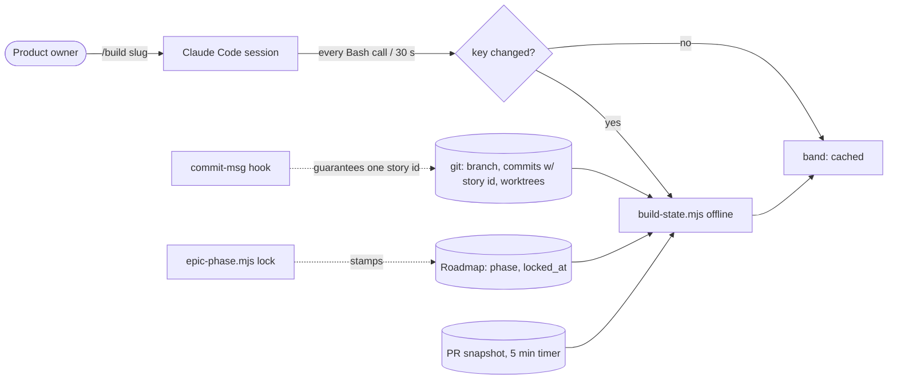
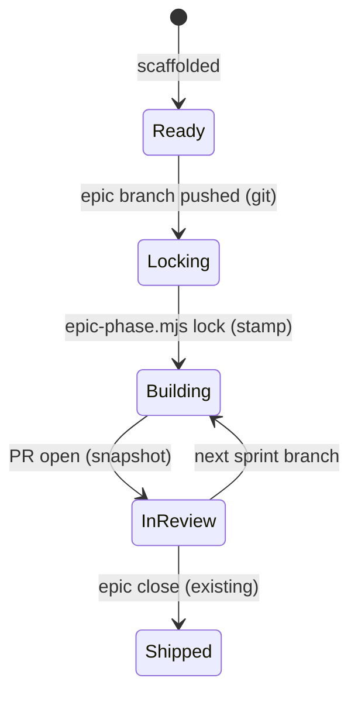

# Pitch — Live build view: the band moves while the agent works, from facts no agent writes

## The ask, as given

> After the finops actuals (but also before), when building the portfolio view, the visualisation didnt show data in
> the claude mod we have built, it was only until the end that i got to see only the epic name. So, id like to work out
> this Claude mod overall. Anthropic recently announced the official launch of claude mods so we might have some
> updates to do to it. First id like to see a diagram of how the system works at high level, what triggers what and
> when. What steps are taken by agent judgment vs mechanically/deterministically. Sometimes a session can go on for all
> sprints without the data updating, i believe it updates on turn change or something like that? so if theres no turn
> change, the visualisation wont update right? how woud you suggest we automate this so we dont miss out? […] The end
> goal is that users always have the context of whats going on. For example, our first step as building is locking the
> architecture, from that moment we could get statuses if we get our triggers correctly and deterministically, not for
> the agent to decide on build time. […] id come with a raw ask for grooming, items are groomed and scaffolded.
> Sometimes, agents make the whole plan on a feature/chore etc branch, including instructions to build, which are
> something like: to build, switch to feat/branch , copy the prompt from some folder (ones have used the references
> folder, others the Claude outputs one, we must make this deterministically as well, i believe the kickoff prompts
> should be part of the docs output from a grooming session and live on that folder as well, the scaffolding should be
> mechanical as with others for agents to only fill in values). These kickoff prompts i believe should be improved as
> well or make on par with the overall expectation. In fact, if its easier, we should only point agents at
> documentation and tools required to build whatever it is they are building rather than providing instructions in
> prose that could potentially make the agent interpret slightly different, breaking our workflow.
> All of this work must be balanced out so not to bloat or slow down development overall.

### Claims
1. The build view shows real data for the whole build, not only after the run ends.
2. It refreshes without waiting for a human message.
3. Statuses come from deterministic triggers from architecture lock onward, not from agent judgment.
4. The mod is brought up to date with the official Mods launch.
5. Kickoffs have one deterministic home that grooming produces, never an ad-hoc folder.
6. Kickoffs point at docs and tools instead of prose instructions.
7. None of it bloats or slows development.

**Teach-back:** yes — "You want the band to stay true for the whole build, driven by triggers no agent decides, and
the kickoff to come from one mechanical place, so you always know what is going on without anything slowing down."
(Daniel answered "go ahead" to this framing, 2026-10-03.)

## Problem

Diagnosed live on 2026-10-03, against the portfolio-view transcript and this session:

1. **The band refreshes only on `turn.start` — a human message.** An epic-at-once build is ONE human turn: portfolio-view
   had one message at 02:29 on `main` ("No epic in flight"), ~370 agent messages on `feat/portfolio-view[-s2]` over
   1.5 h, and the next human message on `docs/portfolio-view-close`. Reproduced in this session: a mid-turn branch
   switch did not show until Daniel's next message.
2. **Story and progress depend on how an agent words a commit.** S1 committed `S1.1/1.2/1.4` in one subject, then
   `S1 review`; the band said "Story 1 of 7 · Ready to build" at the end of S1. "Story n of m" is the position of the
   story in flight, not how many are done. The written `phase:` is advanced by agents (or not).
3. **The installed plugin lags the published one.** This project ran 0.14.1 while golden-frijoles/skills published
   0.24.0 — ten releases of build-view fixes never reached a session. Nothing updates a third-party marketplace by
   default, and a project-scope install still points at the pre-consolidation `golden-beans` folder.
4. **The kickoff has no home.** `emit-epic-kickoff.mjs` prints to stdout, so each planner saves it wherever it likes
   (`references/`, `Claude outputs/`). The same generator already feeds the Hub card's copy button.
5. The cache key dropped D4's "newest `Roadmap/` mtime", so a doc edit never refreshes the band either.

## Appetite
M — two sprints, one orchestrated run.
quote: $23–34 (M, n=5, p25–p75)

## Outcome & signal
During a build, without typing anything, the product owner sees the band move: the epic when the branch is pushed,
Locking until the lock script stamps it, each story as its commit lands, In review when the PR opens. **Test:** run any
epic build; glance at the band at three random moments mid-turn; every answer matches `git log` and `gh pr list`.

## Stage-2.5 bucket
light-enhancement — the resolver, the band, the kickoff generator and the Hub card all exist. What is missing is the
trigger, three deterministic facts, and one way to fetch the kickoff.

## Bill of materials (What / Why)

| What | Why |
|---|---|
| Re-key after every Bash `tool.call` + a 30 s `$.clock.every` from `session.start` | the band moves mid-turn; a key check is one `git rev-parse` (~10 ms), a resolve only when it changed |
| Key = HEAD + branch + other worktrees' heads + newest `Roadmap/` mtime | builders work in worktrees; restores D4's doc term |
| PR snapshot refreshed online by a 5 min timer, off the hot path | "In review" without `gh` inside a turn |
| `commit-msg` hook: a `feat`/`fix` commit on an epic branch names exactly one story the epic lists | the story in flight becomes a fact, not wording |
| Progress = stories with a commit / stories total | "done", not position |
| `node scripts/epic-phase.mjs lock` stamps `phase` + `locked_at`; the kickoff's step 1 runs it | Locking → Building is a command, not prose |
| Band row: installed ≠ published version · `autoUpdate: true` on our marketplace | the fixes we ship reach the session |
| `/build <slug>` mod command: switch to the branch, put the generated kickoff in the prompt | the kickoff's one home is its generator; nothing to save |
| Drop `CLAUDE_CODE_ENABLE_FUNCTION_HOOKS` | Mods are on by default since 2.1.287 |

## Scope
**In v1:** the nine rows above; the kit template carries the `commit-msg` hook and `epic-phase.mjs` (strangers get
the same facts); groom Stage 8 ends with the `/build <slug>` line.
**Out of v1 (no-gos):** no agent-written status anywhere new; no network call inside a turn's hot path; no new
daemon or launchd agent; no pane (the band stays the surface); no change to the Hub's stage resolver; no rewrite of
the kickoff text beyond removing prose a doc already says.

## Rabbit holes
- **Polling cost.** Every check must stay a single `git` call; a resolve runs only on a key change. Measured budget
  from D4 stays (resolver ≈ 0.33 s, measured 2026-10-03).
- **Mods API is "early access, may change without notice".** Use only `tool.call`, `$.clock.every`, `session.start`,
  `command.register`/`command.run`, `$.state` — all in the 2.1.288 types. Pin with the existing `build-view.test.mjs`.
- **The `commit-msg` hook blocking real work.** Exempt `docs`/`chore`/`test`/`ci`/merge/revert, non-epic branches, and
  honour an explicit bypass env (`GF_SKIP_STORY_CHECK=1`) that the build view then names.
- **autoUpdate known bug** (refreshes the catalog, not the plugin) — which is why the drift row exists.

## What already exists (reuse, don't rebuild)
- `skills/plugins/golden-frijoles/hooks/index.tsx` + `build-view.mjs` — the band, its cache, `attempt()`.
- `hooks/vendor/build-state.mjs` — the one resolver; D2 story-from-commits; `storyIdsIn()`; `gatherFacts` live/snapshot.
- `skills/groom/emit-epic-kickoff.mjs` + `lib/epic-kickoff.mjs` (`epicKickoffFromDir`) — the kickoff, already fed to
  the Hub card by `roadmap-extract.mjs`.
- `.githooks/` + `skills/template/.githooks/` — where `commit-msg` lands; `scripts/check-script-parity.mjs`.
- `lib/roadmap-contract.mjs` — the frontmatter contract `phase`/`locked_at` must join.

## Visuals





## UX heuristics & rails check
- **CI guards covering this surface:** `build-view.test.mjs`, `build-state` specs, `check-script-parity`,
  `check-release`, `claude plugin validate` in skills-ci.
- **Audits-lens findings that apply:** none found for the band.
- **Design-language debt:** none — the band's rows and colours stay.

## Kill-switch / runtime gate (risk:high only — Stage 6b)
No flag (default). Carve-out: the mod's kill switch already exists (remove the `hooks.json` module entry); the
`commit-msg` gate has `GF_SKIP_STORY_CHECK=1`. Risk is high only because the git hook is shared infra in every kit repo.

## Acceptance criteria
- Mid-turn, a branch switch or a story commit shows in the band within one Bash call or 30 s — no human message.
- A `feat:` commit on `feat/<slug>` naming no story, or two, is refused with the list of valid ids; `docs:` is not.
- Progress reads "2 of 7 done" from commits; the story in flight is the newest commit's single id.
- `epic-phase.mjs lock` stamps the README; the band says Building from that moment, Locking before it.
- With installed < published, the band shows one row naming both versions.
- `/build <slug>` puts the generated kickoff in the prompt; groom's Stage 8 prints that one line.
- No turn waits on the network; the key check stays one `git` call (measured in the PR).

## Open risks / research
- Mods GA 2026-10-01, Claude Code ≥ 2.1.287, on by default, API "may change between releases":
  [anthropics/claude-code mods](https://github.com/anthropics/claude-code/tree/main/mods),
  [wavect](https://wavect.io/blog/claude-mods-function-hooks/).
- Third-party marketplaces default to `autoUpdate: false`; known issue that it refreshes the catalog only:
  [code.claude.com plugins/org](https://code.claude.com/docs/de/plugins/org),
  [claudeissues #49410](https://claudeissues.com/issue/49410-marketplace-auto-update-fetches-but-doesnt-pull-so-plugin-updates-never-apply).
- **Open decision (product owner):** the kickoff's home — the `/build` command (recommended) or a committed
  `KICKOFF.md` per epic. See the approval question.

## Intent match

_Advisory and uncalibrated (intent-match D1, D3): it can add a step, never block one. Regenerate with `node scripts/intent-match.mjs <this seed> --write`._

```text
Intent match — Roadmap/00-ideas/seeds/live-build-view.md
  coverage in   0.86  (7 claims)
  coverage out  0.85  (7 criteria)
  clarity       0.85  (7 criteria)
  teach-back    1.00  (yes)
  agreement     pending  (the optional reader at the architecture lock)
Total 89 / 100 — uncalibrated · signals: coverage in, coverage out, clarity, teach-back
Band: build (placeholder bands: 80 build · 60 resolve follow-ups · below 60 sketch or spike)
Gaps: none
```

<!-- intent-match: {"coverage_in":0.86,"coverage_out":0.849,"clarity":0.851,"teach_back":1,"total":89} -->
