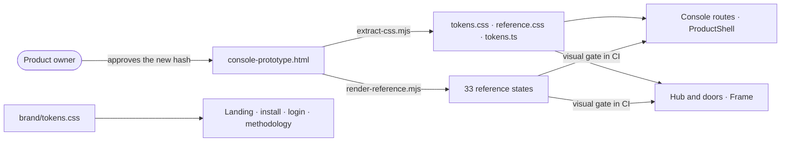

# Pitch — Night garden, in the shared design system

Moves · Tests: neither — the visual base every launch epic builds on (launch epic 1 of
[`audits/ux-ui-audit-2026-10.md`](../audits/ux-ui-audit-2026-10.md)).

## The ask, as given

> lets keep night garden, lets improve the material design we are using on the site, particularly for the beans so
> they look real. and ensure the whole site is very clear to navigate, meaning hover states for buttons, states for
> when something is clicked or ready to be clicked etc.

> the pages overall read like a huge wall of text, lets optimize space, use of elements, graphics instead of text
> where possible, icons etc. My preference is much more spaced and clear

> always keep in mind the use of icons and graphics wehere possible instead of text, space is , room to breathe is
> preferred

(Daniel, 2026-10-05, in the UX audit session. Scope answers the same day: public pages included, keep the token
names, switch the fonts, low risk, no flag.)

### Claims
1. The whole product uses the night garden look.
2. Beans look real.
3. Every control shows clearly when it can be clicked, is being pressed, is working, or is done.
4. Pages use icons and graphics instead of text where they can.
5. Pages have more room to breathe.

**Teach-back:** yes — "You want the whole product to look like the night garden at once, without touching page
layouts, so that launch looks like one product. Right?"

## Problem
The product still wears the coffee palette (roast, crema, gold-ingot) the brand left behind, while the brand is now
the magic-beans story. Gold is spent on buttons, so it can't mean "proven". There is no bean for a result, and the
pages read as walls of text. Launch needs one look across the console, the Hub and the public pages.

## Appetite
**M**, one wave: an architect session, builder fan-out, review rounds. If it runs out, stop and reshape.
quote: $22–34 (M, n=8, p25–p75)

## Outcome & signal
Every console, Hub and public page renders in night garden: Night/Soil grounds, Paper text and actions, Moonlight
for the agent, Sprout for live, Ember for broken only, Gold for proven only. It uses Newsreader, Hanken Grotesk and
IBM Plex Mono. Nothing moves apart from what the new fonts' measurements shift. The Bean exists in four kinds,
icons come from one set, and every control shows its states.
**Test:** open `/login`, `/app`, a Hub board and `/` side by side; all four look like one product, and the visual
gate is green.

## Stage-2.5 bucket
**Light enhancement.** The design system was built for exactly this change. Colours, type and spacing are generated
from one approved file (`console-prototype.html`, hash-pinned in `APPROVED.md`), so a new approved version restyles
every route at once. The icon set (`Icon.tsx`, a closed set over Lucide) and the ten-state taxonomy already exist.
The Bean is the only genuinely new part.

## Bill of materials (What / Why)

| What | Why |
|---|---|
| Night garden values and fonts in `console-prototype.html`, with a new approval line | One file restyles all 27 routes; the hash keeps the approval honest |
| Regenerate `tokens.css`, `reference.css`, `tokens.ts`, `MEASURED-SPEC.md` | Generated, never hand-edited; CI checks them |
| `next/font`: Newsreader, Hanken Grotesk, IBM Plex Mono | The look depends on Newsreader |
| Paper for actions, Gold kept for "proven" | Gold has to mean one thing |
| Bean component, four kinds, as an approved state | Results need a symbol people recognise at a glance |
| A dozen icon names added to `Icon.tsx` | Icons instead of text, from the set we already ship |
| The ten states checked against the canvas sheet; gaps filled | "Is this clickable, is it working, is it done?" |
| Night values in `brand/tokens.css` | The first run starts on the public pages |
| Density rules in `CONSOLE-CONTRACT.md` | Later epics build pages to them |

## Scope
**In v1:** the approved prototype in night garden (values, fonts, Paper as the action colour); regenerated tokens;
the font switch; the Bean (four kinds, three sizes, a label for screen readers) as an approved state and on the
specimen route; the new icon names; the ten states against the canvas sheet; night values on the public pages;
density rules written into the contract.

**Out of v1 (no-gos):**
- Renaming the coffee token names (`--roast`, `--crema`, `--gold`): a later chore. They touch every page.
- Any layout change: the epic page, Today, Plan and the Outcome report get their layouts in their own epics.
- Using the Bean on pages: the result record (launch epic 4) and those page epics put it there.
- The landing redesign (the single headline and prompt): launch epic 2.
- A light theme.
- Editing `references/ux-guidelines.md`: it's byte-mirrored and guarded.

## Rabbit holes
- **Font metrics.** New fonts move text by a few pixels everywhere, and every visual baseline re-renders once. The
  baselines are derived from the prototype, never stored, so that's expected. A route that fails for any reason other
  than font metrics is a real regression.
- **Gold is used as the action colour today.** Moving actions to Paper changes rules, not just values, and it's done
  in the prototype only. A gold that survives anywhere other than "proven" is a bug.
- **`.is-console` alias and the ~150 bare-class rules in `console.css`.** They read the same token names, so new
  values reach them. Don't rename them here.
- **Two token sets.** `brand/tokens.css` owns `:root` for the landing; `.ds` scopes the product set. Change values in
  both and merge neither. `--roast-2` already differs between them on purpose.
- **The approval.** The new hash needs the PO's line in `APPROVED.md` before regeneration counts. The builder
  renders the states for review; nothing ships on an unapproved hash.

## What already exists (reuse, don't rebuild)
- `apps/web/design-system/console-prototype.html`: the approved source (33 states); `APPROVED.md`, the approval
  lines and hash.
- `extract-css.mjs` (emits `tokens.css`, `reference.css`, `tokens.ts`, with `FONT_STACK_OVERRIDES`),
  `measure-contract.mjs`, `render-reference.mjs`, `_harness.mjs`.
- `system.css`: the ten-state taxonomy from `references/ux-guidelines.md`.
- `components/ui/Icon.tsx`: a closed union over Lucide. Flag, Check, Copy, Lock, Users, Shield, TriangleAlert,
  Route, Webhook, Gauge and Clock already exist.
- `apps/web/app/layout.tsx`: `next/font` (Archivo and IBM Plex Mono today).
- `apps/web/brand/tokens.css`: the public pages' 27 tokens on `:root`.
- `/app/design-system`: the specimen route.
- CI: `extract-css --check`, `measure-contract --check`, the visual gate with its coverage ratchet, `tokens.test.ts`,
  `tokens-defined.test.ts`, `system-cascade.test.ts`, `check-design-drift.mjs`.
- Design source: the private canvas, foundation page (Visual, Beans, States, Density, Icon).

## Visuals



```surface
state: specimen-beans-idle
route: /app/design-system
- head "Beans" 
- figure "Proven · Growing · Disproven · Unclear, at 18, 24 and 36 px"
- note "Gold only on Proven. Each bean carries its word for screen readers."
```

## UX heuristics & rails check
- **CI guards covering this surface:** `extract-css --check`, `measure-contract --check`, the visual gate and its
  coverage ratchet, `tokens.test.ts`, `tokens-defined.test.ts`, `check-design-drift.mjs` (bans pictographs inside `/app`).
- **Audits-lens findings that apply:** `ux-ui-audit-2026-10.md` decision 6; dogfood F45 (walls of text).
- **Design-language debt:** coffee-named tokens (kept on purpose, a later chore); gold doubling as the action colour
  (fixed here).

## Slices (stories, risk, QA)

**Sprint 1 · The look, approved.**
- **S1.1 · low.** As the product owner, I want the approved prototype in night garden, so that I approve the look
  once for every page. Values, fonts, Paper actions, Gold for proven only; render the 33 states for review.
  *QA:* `render-reference.mjs` with zero page errors; my review of the renders.
- **S1.2 · low.** As a builder, I want the tokens regenerated from the newly approved prototype and the fonts
  switched, so that the product resolves the new look from one definition. Includes the approval line and
  `FONT_STACK_OVERRIDES`. *QA:* `extract-css --check`, `measure-contract --check`, `tokens.test.ts`.
- **S1.3 · low.** As anyone using the product, I want every page to pass the visual gate in the new look, so that
  nothing breaks quietly. *QA:* the visual gate on all in-scope routes; the coverage ratchet holds.

**Sprint 2 · The pieces, and the public pages.**
- **S2.1 · low.** As a founder, I want results shown as beans I recognise at a glance, so that I can see what paid
  off without reading. The Bean component, approved as a state and shown on the specimen route.
  *QA:* a pure-logic spec on kind → label; a specimen render.
- **S2.2 · low.** As a founder, I want icons where text used to sit, so that pages read faster. Add the night garden
  icon names to `Icon.tsx`. *QA:* the closed union compiles; the drift check passes.
- **S2.3 · low.** As a founder, I want every control to show when it can be clicked, is pressed, is working or is
  done, so that I never wonder. Check the ten states against the canvas sheet and fill the gaps.
  *QA:* `system-cascade.test.ts`; a keyboard pass on the specimen.
- **S2.4 · low.** As a visitor, I want the public pages in the same look, so that the first run feels like the
  product. Night values in `brand/tokens.css`. *QA:* a browser smoke on `/`, `/install`, `/login`, `/methodology`.
- **S2.5 · low.** As a builder, I want the density rules in the contract, so that later page epics build to them.
  Docs only.

**Smoke walkthrough:** owed by Daniel, signed in on production. `/login` → `/app` → a Hub board → `/app/design-system`
(beans, icons, states) → `/`. Each step: one action, one look.

## Acceptance criteria
- `console-prototype.html` renders night garden; `APPROVED.md` carries Daniel's new approval line and hash.
- The generated files match the prototype (`--check` green); the visual gate is green on every in-scope route.
- Fonts are Newsreader (display), Hanken Grotesk (UI) and IBM Plex Mono (numbers); no Archivo anywhere.
- Gold appears only in the Proven bean and the proven state; actions are Paper.
- The Bean renders in four kinds and three sizes on `/app/design-system`, each with its word for screen readers.
- `Icon.tsx` has the night garden names: target, split, coin, agent, user, doc, branch, chart, calendar, mail,
  idea, eye.
- Every control in the specimen shows rest, hover, focus, pressed, working, done and not ready, as on the canvas sheet.
- `/`, `/install`, `/login`, `/methodology` use night values.
- `CONSOLE-CONTRACT.md` carries the density rules.

## Open risks / research
- Newsreader and Hanken Grotesk are on Google Fonts and load through `next/font/google`, as Archivo does today.
