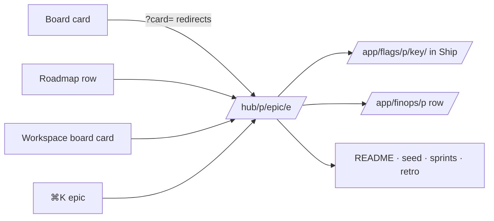

# Pitch — One epic page

Moves: grounded_bets_share · Tests: Value proposition — the epic page is where a founder sees the bet, the work and
the result together (launch epic 5 of [`audits/ux-ui-audit-2026-10.md`](../audits/ux-ui-audit-2026-10.md), decision 4;
dogfood F44).

## The ask, as given

> is this a redesign of the Claude mod, and if so add a "why are we building this" section (hypothesis, quantitative
> and qualitative), simplify, use graphics

> what happens when an epic is built and shipped in one run … what do the checkboxes do … why was the flag removed

> always keep in mind the use of icons and graphics wehere possible instead of text, space is , room to breathe is
> preferred

(Daniel, 2026-10-05, UX audit session. Shape answers the same day: commands as plain lines; the flag shown on the
page and changed in Ship.)

### Claims
1. One page per epic: the Board's card and the Hub's epic page become one.
2. It says why we're building it: the hypothesis, the number and the read date.
3. It shows where the epic is (a stage track) and what to do next (one command, the rest under More).
4. It shows progress, the flag, the spend and the documents, with graphics before text.
5. Commands read as plain lines any agent understands.

**Teach-back:** yes — "You want one page per epic that tells you why it exists, where it is, what to do next and
whether it paid off, at a glance, instead of two views that disagree. Right?"

## Problem
An epic has two views with different content (F44): the Hub's epic page (`/hub/<p>/epic/<e>`: tiles, sprint list,
FinOps line) and the Board's card view (`?card=<e>`: stage, stats, commands, kickoff, docs). Neither says why the
epic exists or what it should move, neither shows its flag, and the commands are shorthand only our plugin
understands ("Wrap S2"). Both read as walls of text (F45).

## Appetite
**M**, one wave. If it runs out, ship sprint 1 (one page, stage track, commands) and cut the flag line.
quote: $22–34 (M, n=8, p25–p75)

## Outcome & signal
Every card opens `/hub/<p>/epic/<e>`. The page shows the title and stage, small chips, a stage track from Backlog to
Read, a Now panel with one plain-line command (the rest under More), "Why we're building this" with hypothesis,
target and read date, one bar per sprint, the flag's state, spend against quote, the documents and a freshness line.
Old `?card=` links still land on it.
**Test:** open any card on the board; without scrolling, say why the epic exists, where it is, and the next command.

## Stage-2.5 bucket
**Light enhancement.** Every part already exists in one of the two views or in the data: the card view's stage,
stats, commands and docs (`board-components.tsx` `CardView`, `lib/stage-commands.ts`), the epic page's sprint list
and FinOps line (`epic/[epicSlug]/page.tsx`, `lib/roadmap-finops.ts`), the README's Why (`goal` in the pushed row),
the target and read date (launch epic 4), the Bean (launch epic 1), the flag registry (`lib/flag-registry.ts`) and
the flag page (`/app/flags/<p>/<key>`). New: the stage track, the epic → flag link, and plain-line commands.

## Bill of materials (What / Why)

| What | Why |
|---|---|
| `?card=<e>` opens the epic page; `CardView` merged into it | One view per epic (decision 4); old links still work |
| Chips for area, risk ("you merge" when high), appetite, build order | Replaces four tiles and seven stats |
| Stage track: Backlog · Grooming · Ready · Building · QA · Shipped · Read | Where it is, in one glance |
| Now panel: one plain-line command with Copy, the rest under More | What to do next, for any agent |
| "Why we're building this": goal, hypothesis, target from → to, read date, bean when read | The bet, on the page |
| One bar per sprint | Progress without reading |
| `flag_key` on the epic, set at grooming; its state shown, linked to Ship | The flag stops going missing |
| Spend against quote, linked to its FinOps row | The cost beside the result |
| Documents: The idea, The epic, Sprints, Retrospective; freshness line | Where the words live, and how fresh |

## Scope
**In v1:** the merged page (`/hub/<p>/epic/<e>`) for epics and seeds; `?card=` redirecting to it from the project
board, the workspace board, the Roadmap and ⌘K; the parts in the table; plain-line commands in
`lib/stage-commands.ts`; `flag_key` set at grooming Stage 6b, copied by the scaffold, pushed.

**Out of v1 (no-gos):**
- Changing a flag from the epic page: it's shown, and changed on its own page in Ship.
- Per-user flag targeting ("on for you only"): open question 3, after launch.
- The build view in the terminal (launch epic 8) and the Outcome report (launch epic 6).
- New stages or stored values: "Read" is shown when a verdict exists (launch epic 4), not stored as a stage.
- Any change to the kickoff generator; the kickoff copy stays as it is at Ready.
- Styling (epic 1) and header and names (epic 3).

## Rabbit holes
- **Plain lines must still work.** Today's shorthand ("Wrap S2", "Groom: <slug>", "Build epic <slug>") is what
  `SESSION-KICKOFFS` and the skills recognise. Each plain line names the step, the epic and the product, and the
  builder pastes every one into an agent with the plugin to prove it lands on the same step; the shorthand keeps
  working.
- **`?card=` is in shared links.** Redirect, don't remove; keep any filter in the back link.
- **Seeds have no README.** A Backlog or Grooming card is a seed: the page shows "The idea" and "No target yet: that
  comes with grooming", no sprints, no flag.
- **The flag lookup is per project.** Read the flag by key from this project's registry only; an unknown key shows
  "flag not found" with the key, never another project's flag.
- **Stage words.** Use launch epic 3's label module; stage keys stay as they are.
- **Workspace board cards** link through the project's own page, so access rules stay the project's.

## What already exists (reuse, don't rebuild)
- `app/hub/[projectSlug]/epic/[epicSlug]/page.tsx` (tiles, sprint list, FinOps line, provenance),
  `app/hub/[projectSlug]/board/{page,board-components}.tsx` (`CardView`, `?card=`), `app/hub/w/[workspaceId]/board`,
  `app/hub/[projectSlug]/page.tsx` (Roadmap links).
- `lib/hub-board.ts` (`BoardCard`: stage, sprints, links, pr, kickoff, appetite, bet), `lib/stage-commands.ts`,
  `lib/hub-query.ts`, `lib/hub-freshness.ts`, `lib/roadmap-finops.ts`.
- `lib/flag-registry.ts` (`getFlagRegistryView`), `/app/flags/[projectSlug]/[flagKey]`, `/app/finops/[projectSlug]`.
- `scripts/roadmap-extract.mjs`, `lib/roadmap-artifact-schema.ts`; groom Stage 6b (`references/kill-switch.md`) and
  `scaffold-epic.mjs`.
- From launch epics 1, 3, 4: the Bean, the label module, the target and verdict fields.
- Design source: the private canvas, page 0: Epic (seven stages) and "Where each part comes from".

## Visuals



```surface
state: epic-building-idle
route: /hub/[projectSlug]/epic/[epicSlug]
- head "Overdue reminders" chip "Building" chips "invoices · Risk high · you merge · Appetite S · #12"
- track "Backlog · Grooming · Ready · Building · QA · Shipped · Read" current "Building"
- panel "Now" title "S2.2 · Send the first reminder three days after the due date" action "Copy" value "Resume building the overdue-reminders epic in Ledgerly" more "Wrap sprint 2 · Pause"
- section "Why we're building this" note "Clients forget to pay. Paid on time 61% → 70% · read 4 Dec"
- bars "S1 Know which invoices are late 3/3 · S2 The reminder itself 1/3 · S3 Know if it worked 0/3"
- row "Flag overdue_reminders_enabled" meta "off" action "Open in Ship"
- row "Spend $6.10" meta "quote $7–16" action "FinOps"
- list "The idea · The epic · Sprints 1–3"
- note "Every number comes from the epic's README and git · updated 2 minutes ago"
```

## UX heuristics & rails check
- **CI guards covering this surface:** `hub-board.test.ts`, the hub specs, `vocabulary.test.ts`, `check-design-drift.mjs`,
  the visual gate and its coverage ratchet.
- **Audits-lens findings that apply:** dogfood F44, F45; audit decision 4, density rules (decision 6).
- **Design-language debt:** none; uses epic 1's pieces.

## Kill-switch / runtime gate
Not needed: risk low (a read-only page, a redirect, copy). Rollback is a revert.

## Slices (stories, risk, QA)

**Sprint 1 · One page.**
- **S1.1 · low.** As a founder, I want every card to open one epic page, so that I never see two versions of an epic.
  `?card=` redirects to `/hub/<p>/epic/<e>` (filters kept in the back link); `CardView`'s parts move to the page; the
  Roadmap, workspace board and ⌘K link there; seeds get a page too. *QA:* `hub-board.test.ts`; an authed spec on the
  redirect.
- **S1.2 · low.** As a founder, I want to see where the epic is at a glance, so that I don't read to find out. Title,
  stage chip, small chips (risk high says "you merge"), the stage track Backlog → Read, the freshness line.
  *QA:* a pure-logic spec on the track position per stage; the visual gate.
- **S1.3 · low.** As a founder, I want one next command I can paste into any agent, so that I don't have to know our
  shorthand. Now panel with one plain line and Copy, the rest under More; `lib/stage-commands.ts` rewritten to plain
  lines, shorthand still understood. *QA:* the commands' unit test; each line pasted into an agent with the plugin.

**Sprint 2 · Why, progress, flag and spend.**
- **S2.1 · low.** As a founder, I want the page to say why we're building it, so that the bet is in front of me.
  Goal, hypothesis, target from → to, read date, the bean once read; "No target yet" for seeds. *QA:* the visual gate
  for a seed, a building epic and a read epic.
- **S2.2 · low.** As a founder, I want progress as one bar per sprint, so that I see it without reading. *QA:* the
  visual gate.
- **S2.3 · low.** As a founder, I want the epic's flag, spend and documents on the page, so that nothing about it
  lives somewhere I forget. `flag_key` written at grooming Stage 6b, copied by the scaffold, pushed; its state from
  this project's registry with "Open in Ship"; spend against quote with "FinOps"; the documents. *QA:* extract and
  push tests for `flag_key`; an authed spec for flag found, not found and none.

**Smoke walkthrough:** owed by Daniel, signed in on production.

## Acceptance criteria
- Every card, Roadmap row and ⌘K epic opens `/hub/<p>/epic/<e>`; an old `?card=` link lands there.
- The page shows title, stage, chips, the stage track, the Now panel with one plain-line command and More, Why, sprint
  bars, flag, spend, documents and freshness.
- Every plain line, pasted into an agent with the plugin, starts the same step its shorthand does.
- A seed's page says "No target yet: that comes with grooming", with no sprints and no flag.
- The flag shows its state and opens its page in Ship; a missing key says so.

## Open risks / research
- None external.
