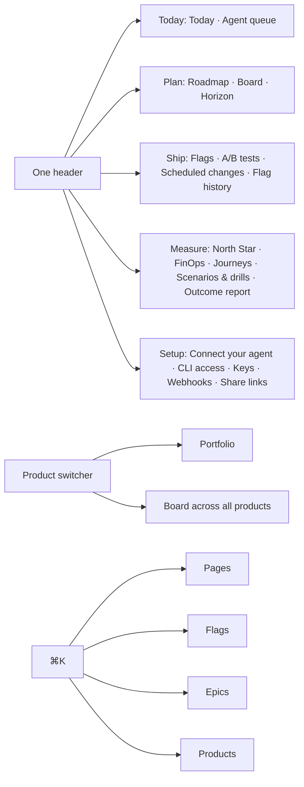

# Pitch — One header and one name per thing

Moves: proving_workspaces · Tests: Value proposition — a founder who can't find the board, or reads three names for
one thing, never gets to "did it pay off" (launch epic 3 of [`audits/ux-ui-audit-2026-10.md`](../audits/ux-ui-audit-2026-10.md),
decisions 2 and 3).

## The ask, as given

> what does experiments mean? ab tests? … the whole hub/ routes … I dont think the navigation has been well thought
> out … help me reframe this whole thing … Maybe we should have just figured out ways to integrate an entry way for hub

> only 7 stays finops, all others approved, carry on

> 1. yes perfect, it ties to the landing page one liner 2. yes on measure 3. yes 4. yes

(Daniel, 2026-10-05, in the UX audit session: the words board and the navigation board on the canvas. Split answer
the same day: this is a new epic; `plain-outcome-rename` keeps its sprints 1–4 for after launch and hands its
sprint 5 to this epic.)

### Claims
1. One header for the console and the Hub, in the loop's order: Today · Plan · Ship · Measure · Setup.
2. The Hub's Roadmap, Board and Horizon live under Plan; the Outcome report under Measure.
3. Portfolio and the board across all products sit at the top of the product switcher.
4. ⌘K finds epics and products, not only pages and flags.
5. One name per thing on screen (decision 2), and the old names stay gone.

**Teach-back:** yes — "You want the console and the Hub to feel like one product, with one header in the order of the
loop and one name for each thing, without losing a page or a URL. Right?"

## Problem
The Hub and the console are two products (F35): the Hub has its own frame and reaches the console only through a
"Back to the console" button, and the header has no Plan at all. The same thing has several names (F36): Features and
Flags, Experiments and A/B tests, Report and Pod report and Outcome report, To groom and Backlog. ⌘K can't find an
epic. A founder at launch can't tell where the board is or what a word means.

## Appetite
**M**, one wave: an architect session, builder fan-out, review rounds. If it runs out, ship the header and the renames
and cut ⌘K's new kinds to a follow-up.
quote: $22–34 (M, n=8, p25–p75)

## Outcome & signal
Every console and Hub page wears one header, Today · Plan · Ship · Measure · Setup; the Hub's own frame is gone; no
URL changed. The switcher offers Portfolio and the board across all products. ⌘K finds an epic by name. Every label in
decision 2 reads its new name, and a check fails if an old one comes back.
**Test:** sign in, press ⌘K, type an epic's name, open it, and walk Plan → Ship → Measure without a "back" button.

## Stage-2.5 bucket
**Light enhancement.** The header is one list (`CONSOLE_SECTIONS` in `lib/project-route-inventory.ts`), and every
console surface is an entry in that inventory with its section, icon and href. The Hub pages already render through
the shared `Frame`; they only need the console's. Portfolio is already in the switcher (`ProductShell.tsx`, 2+
products). ⌘K's entries are a closed union with two kinds (`lib/console-palette.ts`). `design-system/vocabulary.ts`
already holds the words that aren't allowed.

## Bill of materials (What / Why)

| What | Why |
|---|---|
| `plan` in `CONSOLE_SECTIONS`, in the loop's order | One header, the loop's words |
| Roadmap, Board, Horizon and the Outcome report as inventory surfaces | The header, rail and ⌘K list them for free |
| Hub pages in `ProductShell`, `HubFrame` retired | One product, no back button |
| "Board across all products" beside Portfolio in the switcher | The workspace view is reachable |
| ⌘K kinds `epic` and `product` | Find work by its name |
| One label module for decision 2, stored values untouched | Screen words change, data doesn't |
| The old names in `vocabulary.ts` | They stay gone |
| `Roadmap/README.md` overview in the same words (from plain-outcome-rename S5.2) | The repo says what the screen says |

## Scope
**In v1:** the header with Plan; the Hub pages inside the console shell (no URL changes); the switcher entry; ⌘K for
epics and products; the decision 2 renames on screen (Features → Flags, "On in Production" → "Flags on", Experiments →
A/B tests, Report and Pod report → Outcome report, Setup's Destinations → Webhooks, Your workspace → Portfolio, Tasks →
Agent queue, Activity → Flag history, To groom → Backlog, Ready to build → Ready); the guard; the roadmap overview
and the walkthrough taken over from `plain-outcome-rename` sprint 5.

**Kept as they are (decision 2):** FinOps, Today, North Star, Journeys, Scenarios & drills, Scheduled changes, Roadmap,
Board, Horizon, Portfolio's Consider · Operate · Exit, and Horizon's "destinations".

**Out of v1 (no-gos):**
- Any URL change, redirect or removed page. The Hub keeps `/hub/…`, the console `/app/…`.
- Stored values: `status:` fields, stage keys in pushed roadmaps, flag keys, table names. Screen words only.
- `plain-outcome-rename` sprints 1–4 (one stage list behind the board, skill and coach names, env vars, the config
  file and demo name, the repo layout): after launch, re-groomed to plain agile words first.
- The epic page merge (launch epic 5), the Outcome report's new layout (launch epic 6), the build view (launch epic 8).
- The share page `/s/<token>`'s layout: it gets the new name, not the console header.
- Plugin and skill wording (launch epic 7).
- Night garden styling: epic 1 owns the look.

## Rabbit holes
- **Stage names are data keys.** `'To groom'` and `'Ready to build'` key `lib/stage-commands.ts`, `lib/hub-areas.ts` and
  the pushed roadmap. Rename at the label, never the key; a renamed key silently empties a board column.
- **Who can see a Hub page.** Hub pages gate with `requireDashboardAccess`; the console shell assumes a signed-in
  member with an active project. The shared report (`/s/<token>`) and any page a non-member can open must keep working
  without console chrome (`shell-nav.ts` already has a public-page branch, read it first).
- **Products across a workspace in ⌘K.** Listing products is a cross-project read: it goes through the switcher's
  existing membership list (`getShellNav`), and anything per project through `getWorkspaceProjects` (the tenancy
  invariant). Epics come from the active project only.
- **`design-system-rails` DD2** kept the Hub out of the header. This reverses it; record the reversal in that epic's
  README, don't just break its test.
- **Guards that pin the old shape:** `console-shell` tests, `route-manifest.test.ts`, `surface-map.test.ts`,
  `vocabulary.test.ts`, the visual gate. Update them deliberately; a deleted assertion is a finding.
- **"Destinations" means two things.** Setup's becomes Webhooks; Horizon's stays. A blanket rename breaks Horizon.

## What already exists (reuse, don't rebuild)
- `lib/project-route-inventory.ts` (`CONSOLE_SECTIONS`, the surface inventory with section, `iconKey`, href),
  `lib/shell-nav.ts` (`getShellNav`, gates, the public-page branch), `components/product/ProductShell.tsx` (header,
  switcher with the Portfolio entry, `portfolioHrefFor`), `ConsoleRail.tsx`.
- `app/hub/hub-frame.tsx` (`HubFrame`, four tabs), `app/hub/[projectSlug]/{page,board,horizon,report,epic}`,
  `app/hub/w/[workspaceId]/board`, `lib/hub-query.ts` (`getHubRoadmap`), `lib/hub-board.ts`, `lib/hub-areas.ts`,
  `lib/stage-commands.ts`.
- `components/product/CommandPalette.tsx`, `lib/console-palette.ts` (`PaletteEntry`, kinds `surface` · `feature`).
- `design-system/vocabulary.ts` and its test, `lib/flag-vocabulary.ts`.
- `app/s/[token]/page.tsx` and `app/hub/report-components.tsx` (the shared and in-console report titles).
- Design source: the private canvas, page 0: Map, Words, Nav (the four calls decided).
- `plain-outcome-rename/sprint-5.md`: its "one label module with a test" acceptance, carried over.

## Visuals



```surface
state: header-plan-idle
route: /hub/[projectSlug]/board
- head "Ledgerly ▾" nav "Today · Plan · Ship · Measure · Setup" current "Plan"
- rail "Roadmap · Board · Horizon" current "Board"
- columns "Backlog · Grooming · Ready · Building · QA · Shipped"
- note "No 'Back to the console' button: this is the console."
```

```surface
state: palette-epic-idle
route: ⌘K
- field "Search" value "overdue rem"
- row "Overdue reminders" meta "Epic · Building"
- row "overdue_reminders_enabled" meta "Flag · on"
- row "Board" meta "Plan"
```

## UX heuristics & rails check
- **CI guards covering this surface:** `console-shell.authed.spec.ts`, `console-shell-public.browser.spec.ts`,
  `command-center.authed.spec.ts`, `route-manifest.test.ts`, `surface-map.test.ts`, `vocabulary.test.ts`,
  `check-design-drift.mjs`, the visual gate and its coverage ratchet.
- **Audits-lens findings that apply:** dogfood F35, F36, F43, F44 (the epic page half is launch epic 5); audit
  decisions 2 and 3.
- **Design-language debt:** none new; uses epic 1's look.

## Kill-switch / runtime gate
Not needed: risk low (navigation and labels, no data, auth or money change). Rollback is a revert.

## Slices (stories, risk, QA)

**Sprint 1 · One header.**
- **S1.1 · low.** As a founder, I want Plan in the header, in the loop's order, so that I find the roadmap and board
  where the rest of the product is. `CONSOLE_SECTIONS` becomes Today · Plan · Ship · Measure · Setup; Roadmap, Board
  and Horizon join the inventory under Plan, the Outcome report under Measure. *QA:* `route-manifest.test.ts`,
  `surface-map.test.ts`, the console shell specs.
- **S1.2 · low.** As a founder, I want the Hub pages inside the console, so that it feels like one product. Hub pages
  render in `ProductShell`; `HubFrame` and its back button go; every URL stays; the shared report and any page a
  non-member can open keep working. Records the reversal of `design-system-rails` DD2. *QA:* the shell specs for a
  member and a visitor; the visual gate.
- **S1.3 · low.** As a founder with several products, I want the board across all of them next to Portfolio in the
  switcher, so that I can see all my work in one move. *QA:* an authed spec on the switcher with one and two products.

**Sprint 2 · One name per thing, and ⌘K.**
- **S2.1 · low.** As a founder, I want ⌘K to find epics and products, so that I get to work by its name. Kinds `epic`
  (active project, from `getHubRoadmap`) and `product` (from the switcher's list). *QA:* a pure-logic spec on the
  palette entries; `command-center.authed.spec.ts`.
- **S2.2 · low.** As a founder, I want one name for each thing, so that I never wonder if two words mean two things.
  The decision 2 renames through one label module with a test; stored values and keys untouched; the old names added
  to `vocabulary.ts` so they stay gone. *QA:* the label module's test; `vocabulary.test.ts`; the visual gate.
- **S2.3 · low.** As the product owner, I want the roadmap overview in the same words and the walkthrough run on
  production, so that the launch surfaces are verified, not assumed. From `plain-outcome-rename` S5.2: `Roadmap/README.md`
  has no retired word and no Golden Beans title. *QA:* the walkthrough, blind.

**Smoke walkthrough:** owed by Daniel, signed in on production; one action, one look per step.

## Acceptance criteria
- Every console and Hub page shows Today · Plan · Ship · Measure · Setup; Plan holds Roadmap, Board and Horizon;
  Measure holds the Outcome report.
- No "Back to the console" anywhere; no URL changed; the shared report still opens for someone signed out.
- The switcher shows Portfolio and the board across all products when a workspace has two or more.
- ⌘K finds an epic of the active project and any product you belong to, labelled by kind.
- Every decision 2 label reads its new name; Horizon still says destinations; no stored value changed; a retired word
  on screen fails `vocabulary.test.ts`.
- `Roadmap/README.md` has no retired word and no Golden Beans title.

## Open risks / research
- None external. The one judgement call is the Hub for non-members (the demo Hub), settled at the lock against
  `shell-nav.ts`'s public-page branch.
