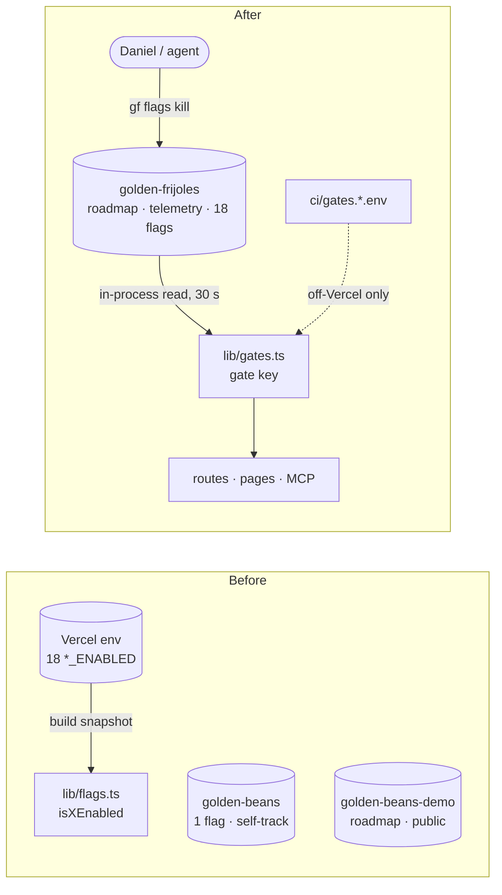

# Pitch — One product project, and every flag in it

Moves · Tests: neither — internal plumbing. It makes the product run on itself (one project, one flag provider),
which is the dogfood claim the landing makes, but it moves no North Star input.

## The ask, as given

> yeah the flags and projects are a mess need untangling. Thanks for surfacing. So we are building golden-frijoles
> using golden-frijoles right? im not sure why we need two project, one golden-beans and the other golden-beans-demo .
> i believe we should only have one, where we manage all, i mean all including flags roadmaps etc. So either lets
> consolidate on golden-beans or golden-beans-demo, whatever is easiest and update the name to golden-frijoles.

(Daniel, 2026-10-07, during the one-epic-page build. Answered the same day, both by his choice:)
- **Visibility: public, built in the open.** One project, `golden-frijoles`, made from `golden-beans-demo` (it is the
  demo, so rule #2 keeps working: the demo IS us). The Hub, funnels and North Star are public; flag administration
  stays members-only.
- **Sequencing: its own epic, groomed right after one-epic-page closes.** Risk high (tenancy, rule #2, prod data, env).

Fold-in, Daniel, 2026-10-08, at grooming:

> groom and build Roadmap/00-ideas/seeds/one-product-project.md fold in reviewing vercel as we were using env vars as
> flags, the only provider is us, ourselves, golden-frijoles. Migrate whatever flags exist there so all is managed on
> golden-frijoles

### Claims
1. One project, not two: consolidate `golden-beans` and `golden-beans-demo` into one, whichever is easiest.
2. That one project is named `golden-frijoles`.
3. Everything is managed there — flags, roadmaps, everything.
4. Review Vercel: env vars have been used as flags.
5. The only flag provider is Golden Frijoles itself.
6. Migrate every flag that lives in Vercel so it is managed on Golden Frijoles.

**Teach-back:** yes — "You want Golden Frijoles to run on ONE project called `golden-frijoles` that holds
its roadmap, its telemetry and every one of its flags — including the 18 gates that today are Vercel env vars — so that
the product is managed with the product, and turning a gate off is `gf flags kill`, not a Vercel edit plus a commit.
Right?"

## Problem
Two tangles, one cause: the product was never pointed at itself.
1. **Two projects.** The roadmap lives in `golden-beans-demo`, the one real flag in `golden-beans`. The epic page reads
   an epic's flag from the roadmap's project, so every flag line on prod says "not found".
2. **Flags in the wrong provider.** `lib/flags.ts` holds **19 gates read from `process.env`** (18 set in Vercel
   production; `CLI_WRITE_API_ENABLED` is born ON and unset). Changing one takes a Vercel edit **and** a commit to
   `main` (env vars are snapshotted at build — AGENTS rule #4), it is invisible in the flag console, has no history,
   and six of the production values are sensitive-masked so nobody can even read them back. Meanwhile the product
   sells exactly the thing that fixes this, and already uses it once (`auth.terminal_sign_in_enabled`,
   `lib/terminal-sign-in-flag.ts`). Vercel Flags holds nothing (`vercel flags list`: none) — nothing to migrate there.

## Appetite
**L** — a full epic: three sprints, architect + builder fan-out, prod data work.
quote: $55–111 (L, n=4, p25–p75)

## Outcome & signal
- There is one project, `golden-frijoles`. The Hub, the Pod Report pushes, the landing's self-tracking and every flag
  are in it. `golden-beans` is archived, its keys revoked; `golden-beans-demo` links redirect.
- `vercel env ls production | grep _ENABLED` prints nothing. `gf flags ls` in `golden-frijoles` lists every gate, each
  activated in production with today's live value.
- Daniel can test it blind: `gf flags kill platform.agent_rail_enabled --env production`, reload `/app`, the rail is
  gone within a minute, no deploy; turn it back on, it returns.

## Stage-2.5 bucket
**Light enhancement, mostly.** The provider, the CLI, the console and an in-process read already exist and are live
(`terminal-sign-in-flag.ts` is the whole pattern, for one flag). What is new: one seam that serves 19 keys, the
sync→async change at ~190 call sites in ~73 files, and the prod data moves.

## Bill of materials (What / Why)

| What | Why |
|---|---|
| Rename `golden-beans-demo` → `golden-frijoles` (slug, constants, reserved list, `hubUrl`, CI) | the easiest base: it already holds the roadmap, the CI keys and the public role (rule #2 keeps working) |
| Old-slug redirect for Hub/share links | links already in the wild keep working |
| Move `golden-beans`' flag, 3 features, North Star into `golden-frijoles` | "manage all" in one place |
| Self-tracking writes with the demo project's existing key | no new prod credential minted; one key fewer |
| Archive `golden-beans` (revoke keys, keep rows) | events are append-only; nothing is deleted |
| `lib/gates.ts`: one `gate(key)` reading the catalog in-process, 30 s cache, one query per env | generalises `terminal-sign-in-flag.ts` from 1 key to all; no self-HTTP, no snapshot route in the path |
| A typed gate table: key · env var it replaces · fallback when the read fails | a DB blip must not silently turn signup off |
| Every `isXEnabled()` becomes `await` through the seam | the one mechanical cost; kept behind the same function names |
| Off-Vercel env override (CI, local) | CI's two servers (gates ON/OFF) still need two states; never honoured on Vercel |
| Create the 17 flags with `gf flags create`, activated per env at today's value | activation is its own step (kill-switch.md); a definition alone serves nothing |
| Delete the 18 Vercel env vars after the catalog read is live | the target is zero, and a leftover var is a second source of truth |
| Guard: no `process.env.*_ENABLED` outside `lib/gates.ts` | stops the next epic reaching for an env var |
| Docs: AGENTS rule #4 + "Key env vars", LEARNINGS, the `flags.ts` comments | AGENTS currently instructs the opposite |

## Scope
**In v1:** both tangles above, in prod; every gate in `lib/flags.ts` plus `isTerminalSignInEnabled` on the one seam.

**Out of v1 (no-gos):**
- Moving past events from `golden-beans` (append-only; they stay, archived).
- Non-flag env vars (`SUPABASE_*`, `SITE_URL`, `CRON_SECRET`, `TELEGRAM_*`, project slugs/keys) — config and secrets,
  not flags. `TURBO_DOWNLOAD_LOCAL_ENABLED` is Vercel's own build setting, not ours.
- Vercel Flags / the Flags SDK — Daniel: the only provider is us.
- Changing what any gate gates, or its live value. A migration, not a redesign: every gate comes out serving what it
  served going in.
- `isTaskAlertEnabled` (`lib/notify-policy.ts`) — a notification rail setting read by scripts, not a product gate.
- New flags for this epic.

## Rabbit holes
1. **Two gates cannot live in the catalog they gate (the position at the gate).** `FLAG_SERVING_ENABLED` gates
   *activation itself* (`app/app/flags/[projectSlug]/actions.ts:84,116`, `api/v1/flags/admin`) and Miyagi's snapshot
   route; `CLI_WRITE_API_ENABLED` gates the CLI that would turn it back on. Killed through the catalog, either one
   locks the operator out of the switch that restores it — only raw SQL gets back. **Proposal: those two stop being
   flags at all** — they become code constants, always on, rolled back with `git revert` (Daniel's no-flag doctrine,
   2026-08-31). That still leaves zero env-var flags; it means 17 move to the catalog, 2 retire. The alternative is
   moving them too, with a written SQL break-glass.
   **Decided (Daniel, 2026-10-08, at the Plan gate): retire both as code constants, always on.** Approved by name in
   the same answer: the project rename + data moves in prod Supabase, revoking `golden-beans`' keys, creating 17 prod
   flags, deleting 18 Vercel env vars (production and preview).
2. **Fail-open vs fail-closed per gate.** Today an env var cannot fail; a DB read can. Each gate's fallback is written
   in the gate table: live features fall back to ON (signup, connector, rail …); the two that authorise action on
   others' systems (`SECURITY_SIMULATIONS`, `AUTOMATIC_CIRCUIT_BREAKERS`) and the one OFF in prod
   (`SCENARIO_AUTHORING`) fall back to OFF. Previews have no database (`SUPABASE_*` is Production-only), so previews
   serve the fallbacks — stated, not a bug.
3. **Six production values are masked** (`AUTOMATIC_CIRCUIT_BREAKERS`, `DESTINATION_DELIVERY`, `FLAG_RULE_BUILDER`,
   `FLAG_SERVING`, `RESILIENCE_SCENARIOS`, `SECURITY_SIMULATIONS`). Each is read back from live behaviour (a 404 vs a
   non-404 on the route it gates) before its flag is created. Never assumed.
4. **Order of the cutover.** Flags created + activated → seam deploys (reads the catalog, env ignored on Vercel) →
   verify each gate on prod → only then delete the env vars. Deleting first, or deploying the seam before activations
   exist, serves fallbacks for real.
5. **Sync → async.** Registration predicates for MCP tools and `lib/shell-nav.ts` are sync today. The seam is read
   once per request (`cache()`), then passed down; no gate read inside a render loop.
6. **The rename touches CI** — the roadmap/Pod Report pushes use the demo key and slug; `golden-frijoles.config.json
   → hubUrl`; `tenant-slug.ts` must reserve the old slugs so nobody can register `golden-beans-demo` after it frees.
7. **Public now means public.** The landing's self-tracking funnel moves into the public project. Daniel chose this;
   the build confirms nothing else becomes readable (rule #2: the allow-list still names one project).

## What already exists (reuse, don't rebuild)
- `apps/web/lib/terminal-sign-in-flag.ts` + `terminal-sign-in-flag-decision.ts` — the in-process catalog read, cache,
  env mapping (`flagEnvironmentFor(VERCEL_ENV)`) and fallback. The seam is this, for N keys.
- `lib/flag-registry.ts → getFlagRegistryView`, `lib/cli-flag-view.ts → toCliFlagView` — the reads.
- `gf flags create --kill-switch|--enablement --all-envs`, `gf flags get`, `gf flags kill` (`@golden-frijoles/cli`).
- `lib/public-demo.ts` (`DEMO_PROJECT_SLUG`), `lib/self-track.ts` (`SELF_PROJECT_SLUG`), `lib/tenant-slug.ts`.
- `ci/gates.on.env`, `ci/gates.off.env`, `scripts/lib/gate-env.mjs` — become the off-Vercel override files.
- `golden-frijoles.config.json → lint.rules` — where the env-read guard goes.
- Prod DB work: `supabase db query --linked` (memory: the auto-mode classifier blocks prod writes — expect to leave
  auto mode for the data moves).

## Visuals



| Env var (today) | Flag key (proposed) | Prod today | Fallback |
|---|---|---|---|
| `SIGNUP_ENABLED` | `auth.signup_enabled` | true | ON |
| `SECURITY_SIMULATIONS_ENABLED` | `ops.security_simulations_enabled` | masked → read live | OFF |
| `SCENARIO_AUTHORING_ENABLED` | `ops.scenario_authoring_enabled` | false | OFF |

(The full 19-row table is the S2 architect's first artifact, in the epic README.)

## UX heuristics & rails check
- **CI guards covering this surface:** `gate` (required), e2e `api` / `authed` against the ON and OFF servers, the
  `tenancy` semantic-lint rule (shadow), rule #2's public-route specs.
- **Audits-lens findings that apply:** none found — no new screen.
- **Design-language debt:** none — no UI change; a killed gate draws exactly what the env-OFF state draws today.

## Kill-switch / runtime gate (risk:high only — Stage 6b)
**Carve-out: no new flag.** This epic moves the flags; it adds none. Its rollback is staged by construction: the env
vars are deleted last, so until S3's final step `git revert` of the seam restores env reads with the values still in
Vercel. The data moves are reversible renames, not deletes.

## Acceptance criteria
**S1 — One project (high).**
- `golden-frijoles` exists (the renamed demo project); `/hub/golden-beans-demo/…` redirects; the old slugs are reserved.
- `auth.terminal_sign_in_enabled` is in `golden-frijoles`, activated as it was; the epic page's flag line reads it.
- The landing's self-tracking lands in `golden-frijoles`; `golden-beans`' keys are revoked; rule #2 specs green.
- Roadmap + Pod Report CI pushes land in `golden-frijoles`.

**S2 — One seam (high).**
- `lib/gates.ts` serves every gate from the catalog; the gate table names key · env var · fallback for all 19.
- On Vercel, no gate reads `process.env`; off Vercel, `ci/gates.*.env` still drive the two CI servers.
- A spec per fallback: catalog unreadable ⇒ the gate serves its written fallback.
- Guard: a `process.env.*_ENABLED` read outside `lib/gates.ts` fails CI.

**S3 — Migrate and delete (high).**
- The six masked values read from live behaviour and written down before anything is created.
- 17 flags created and activated in all three envs at today's values; `gf flags get <key>` shows no `—` in production
  for any of them. `FLAG_SERVING_ENABLED` and `CLI_WRITE_API_ENABLED` are always-on code constants (decided at the Plan gate).
- After the seam deploy, each gate verified on prod; then the 18 Vercel env vars deleted (preview's too).
- Kill test: `gf flags kill` on the rail turns it off on prod within a minute with no deploy, and back on.
- AGENTS rule #4 / Key env vars, LEARNINGS, `flags.ts` comments say the catalog is the gate; nothing says "set a
  Vercel var".

**QA stage:** pure-logic specs on the gate table + fallback (`lib/gates-decision.ts`); the existing ON/OFF e2e servers;
a prod smoke walkthrough per sprint — S1 and S3's are owed to Daniel (signed in).

## Open risks / research
- Vercel env vars are snapshotted at build; a deletion only takes effect on the next deploy (AGENTS rule #4, verified
  2026-07-21) — that is why the delete is last and harmless.
- `vercel flags list` on `golden-beans` (2026-10-08): no Vercel Flags. `vercel env pull` (2026-10-08): 18 `*_ENABLED`
  in production (12 readable, 6 masked), 5 in preview.
- Prod writes needed, named here so the approval covers them by name: **project rename + data moves in prod Supabase,
  revoking `golden-beans`' keys, creating 17 prod flags, deleting 18 Vercel env vars** (production and preview).
  No new prod credential is minted.

## Intent match

_Advisory and uncalibrated (intent-match D1, D3): it can add a step, never block one. Regenerate with `node scripts/intent-match.mjs <this seed> --write`._

```text
Intent match — Roadmap/00-ideas/seeds/one-product-project.md
  coverage in   0.91  (6 claims)
  coverage out  0.83  (13 criteria)
  clarity       0.76  (13 criteria)
  teach-back    —     (not recorded)
  agreement     pending  (the optional reader at the architecture lock)
Total 83 / 100 — uncalibrated · signals: coverage in, coverage out, clarity
Band: build (placeholder bands: 80 build · 60 resolve follow-ups · below 60 sketch or spike)
Gaps: none
```

<!-- intent-match: {"coverage_in":0.91,"coverage_out":0.828,"clarity":0.764,"teach_back":null,"total":83} -->
