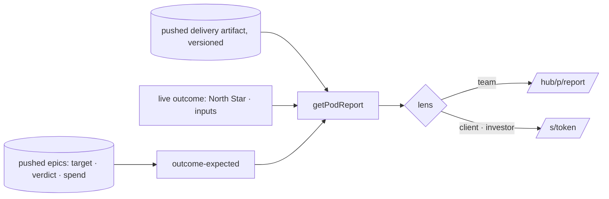

# Pitch — Outcome report v2

Moves: proving_workspaces · Tests: Value proposition — "prove it paid off", for the founder and for anyone they send
the link to (launch epic 6 of [`audits/ux-ui-audit-2026-10.md`](../audits/ux-ui-audit-2026-10.md), decision 5; dogfood
F42).

## The ask, as given

> yeah the outcome report is the one place where its ok to have more details … Expected vs Actuals … spend column you
> removed the delta … include column names … epic name and hypothesis below … metric name in the column … How fast
> needs a subtitle … where this sits on the ladder needs context, whats the ladder, a copy paste prompt for your agents
> … outcome report … at product level, maybe we should link to it from the portfolio view … start by communicating if
> the product is paying off … Lets ensure it all links back to dedicated sections

> when i was telling you about the ladder for context i meant the actual guide we use, we have one already against
> which we measure

(Daniel, 2026-10-05, UX audit session, on the canvas Outcome frame. Shape answers the same day: "expected" comes from
the epics' targets; overspend is neutral with a marker.)

### Claims
1. The report opens by saying whether the product is paying off: actual against expected, over time.
2. Four figures, each with its expected value.
3. An epics table: epic and hypothesis, metric expected → actual with the gap, result, spend against quote with the gap.
4. "How fast" says what it is, with deltas against the previous two months.
5. The ladder is the Steps of AI Adoption, with where you are, what the next step needs, and a prompt for your agent.
6. Every section says what it is and why to care, and links to its own page.

**Teach-back:** yes — "You want the Outcome report to answer 'is this product paying off?' first, show expected
against actual everywhere, and explain each section in a line with a link to dig in, so you can send it to anyone.
Right?"

## Problem
Today's Pod report is hard to read even for its author (F42): it leads with delivery numbers, never says whether the
product is paying off, has no expected values to read actuals against, and its ladder doesn't explain itself. Launch
epic 4 adds targets and verdicts per epic; nothing yet shows them together at product level.

## Appetite
**M**, one wave. If it runs out, ship sprint 1 (paying off, figures, epics table) and leave sprint 2's sections as
they are today.
quote: $22–34 (M, n=8, p25–p75)

## Outcome & signal
The Outcome report (`/hub/<p>/report`, under Measure after launch epic 3) opens with one sentence and a chart: the
North Star's actual against the expected line built from the epics' targets, with the epics marked where they
shipped. Then four figures with expected values, the epics table, How fast with deltas, who did the work, the Steps of
AI Adoption, and benchmarks. Each section has a line saying what it is and a link to its own page. Share links still
work, through the same lens rules.
**Test:** send a share link to someone who has never seen the product; they can say in one sentence whether it's
paying off and which epics did.

## Stage-2.5 bucket
**Light enhancement.** The report is already one read path (`lib/pod-report-query.ts`): a pushed delivery artifact
(`scripts/pod-report.mjs`, versioned in `report_artifacts`) joined to a live outcome read (`lib/pod-outcome.ts`
through `north-star-query` and `tars-query`), narrowed by an audience lens (`lib/pod-report-lens.ts`) that share
links already enforce. The ladder is already scored against the Steps of AI Adoption (`scripts/lib/maturity-lens.mjs`,
`references/Steps-of-AI-Adoption.md`). Benchmarks, composition and how fast already render. New: the expected line,
the four figures, the epics table, deltas against earlier versions, and the explanations.

## Bill of materials (What / Why)

| What | Why |
|---|---|
| A pure `outcome-expected` module: the expected series from shipped epics' targets on the North Star and its inputs | "Expected" with no new number to invent |
| Headline sentence and chart: actual against expected, epics marked at ship dates | Answers "is it paying off?" first |
| Four figures: North Star vs expected · epics paid off · spend vs quote · cost per epic that paid off | The summary, each with its expected |
| Epics table with column names, hypothesis under the name, metric name in the column, gaps | Expected against actual, per epic |
| How fast: a subtitle, deltas against the previous two months | Says what it is and which way it's going |
| The Steps of AI Adoption: five steps, you are here, the next step's criteria, an agent prompt | The ladder you actually use, explained |
| One line per section on what it is and why to care, and a link to its page | Context without a wall of text |
| Lens rules for the new parts (spend and the per-epic table team-only in v1) | Nothing new leaves through a share link by accident |

## Scope
**In v1:** the headline and chart; the four figures; the epics table; How fast with deltas; who did the work as one
bar; the ladder as the Steps of AI Adoption with the agent prompt; benchmarks as links ("Read against"); a line and a
link per section (North Star, Board, FinOps, each epic page); the lens rules for the new parts.

**Out of v1 (no-gos):**
- A product-level North Star target: "expected" comes from the epics' targets.
- Ember for overspend: neutral Paper with "▲ $3.30 over $5–8".
- Opening spend or the per-epic table to client or investor share links: after launch, decided per lens.
- Portfolio's per-product link: it exists; launch epic 3 renames it.
- The name and its place under Measure (launch epic 3); the result record itself (launch epic 4).
- Counting Golden Frijoles's own North Star.
- New delivery metrics in `pod-report.mjs`.

## Rabbit holes
- **The expected line.** Only epics with a target on the North Star metric or one of its inputs count; an input epic
  contributes to that input's line, not the North Star's, unless the North Star is the target. With no grounded
  epics, the chart shows actual only and the sentence says "No targets yet, so we can't say if it's on pace": never a
  flat invented line.
- **Honesty survives every lens.** Unread and unclear epics, and "not instrumented" rows, are counted in every lens
  (the module's own invariant). New detail is team-only until a lens decision opens it.
- **Deltas need earlier versions.** Artifacts are versioned; read the latest of each earlier window. With fewer than
  two, show what exists and say so.
- **One read path.** Everything goes through `getPodReport`; the share page and the Hub page must stay the same view
  through different lenses.
- **The guide is the source.** Step names and criteria come from `maturity-lens.mjs` and
  `references/Steps-of-AI-Adoption.md`, never retyped into the page.
- **Gold only for Proven; Ember only for broken.** The table's gaps are neutral; the bean carries the result.

## What already exists (reuse, don't rebuild)
- `app/hub/[projectSlug]/report/page.tsx`, `app/hub/report-components.tsx` (`PodReportBody`, `OutcomeSectionView`,
  `MaturityLadder`, `MetricTable`, `NotInstrumentedPanel`, `BenchmarkLink`), `app/s/[token]/page.tsx`.
- `lib/pod-report-query.ts` (`getPodReport`), `lib/pod-outcome.ts`, `lib/pod-report-lens.ts` (team · client ·
  investor), `lib/pod-report-view.ts`, `lib/pod-report-schema.ts`, `lib/report-artifacts.ts` (versions),
  `lib/report-shares.ts`, `lib/north-star-query.ts`, `lib/tars-query.ts`, `lib/roadmap-finops.ts`, `lib/portfolio.ts`.
- `scripts/pod-report.mjs`, `scripts/lib/maturity-lens.mjs` (`STEP_LABELS`, the criteria),
  `references/Steps-of-AI-Adoption.md`.
- From launch epics 1, 3, 4, 5: the Bean, the name and Measure, the target and verdict fields, the epic page to link.
- Design source: the private canvas, page 0: Outcome (v2) and "Where each part comes from".

## Visuals



| Epic · what we bet | Metric · expected → actual | Result | Spend · vs quote |
|---|---|---|---|
| Overdue reminders — "a reminder gets invoices paid on time" | Paid on time · 61% → 70% · actual 72% (▲ 2) | Proven | $9.80 · within $7–16 |
| Smart defaults — "sensible defaults finish setup" | Setup completed · 44% → 55% · actual 43% (▼ 12) | Disproven | $11.30 · ▲ $3.30 over $5–8 |
| Export CSV — "teams that export come back weekly" | Weekly active teams · 120 → 140 · not read yet | Growing | $4.10 · within $3–6 |

```surface
state: outcome-report-idle
route: /hub/[projectSlug]/report
- head "Ledgerly is paying off, a little behind the pace you planned."
- figure "North Star actual against expected, epics marked where they shipped"
- figures "North Star 68% · expected 70% (▼ 2) · 3 of 5 epics paid off · $57.70 spent · quote $36–69 · $19.23 per epic that paid off"
- table "Epic · what we bet | Metric · expected → actual | Result | Spend · vs quote"
- section "How fast" note "From groomed to shipped, and how that compares with the last two months"
- section "Where you are on the Steps of AI Adoption" note "Assisted, next Parallel: 4 of 6 criteria met" action "Copy prompt for your agent"
- links "North Star · Board · FinOps"
```

## UX heuristics & rails check
- **CI guards covering this surface:** `pod-report-lens` unit tests, `pod-outcome` tests, the share specs, the visual
  gate, `vocabulary.test.ts`.
- **Audits-lens findings that apply:** dogfood F42, F45; audit decision 5; open question 2 (resolved: neutral).
- **Design-language debt:** none; uses epic 1's pieces.

## Kill-switch / runtime gate
Not needed: risk low (a read-only page; new detail stays team-only, so nothing new reaches a share link). Rollback is
a revert.

## Slices (stories, risk, QA)

**Sprint 1 · Is it paying off.**
- **S1.1 · low.** As a founder, I want the report to open by saying whether the product is paying off, so that I know
  before I read anything else. The expected series (pure module), the sentence, the chart with epics marked.
  *QA:* pure-logic specs on the expected series (none, one, several, inputs vs North Star); the visual gate.
- **S1.2 · low.** As a founder, I want four figures, each against what I expected, so that I see the summary in one
  look. *QA:* pure-logic spec on the figures; lens test (spend figures team-only).
- **S1.3 · low.** As a founder, I want every epic's bet, expected and actual, result and spend in one table, so that I
  see which paid off and what each cost. Rows link to the epic page; team-only in v1. *QA:* the table's spec; lens
  test (absent for client and investor, honesty counts present).

**Sprint 2 · How it got there.**
- **S2.1 · low.** As a founder, I want How fast to say what it measures and how it moved against the last two months,
  so that I know if we're speeding up. *QA:* spec on deltas with 0, 1 and 2 earlier versions.
- **S2.2 · low.** As a founder, I want to see where we are on the Steps of AI Adoption and what the next step needs,
  with a prompt for my agent, so that I know what to change. *QA:* the ladder's spec reads `maturity-lens`; the prompt
  names product and next step.
- **S2.3 · low.** As anyone reading the report, I want each section to say what it is and link to its own page, and
  who did the work and the benchmarks in one line each, so that I can dig in. *QA:* link checks; the visual gate for
  team and a share link.

**Smoke walkthrough:** owed by Daniel: the report signed in, then the same report through a share link, signed out.

## Acceptance criteria
- The report opens with one sentence and the actual-against-expected chart; with no grounded epics it says it can't
  tell yet.
- Four figures each show an expected value or say there isn't one.
- The epics table has column names, the hypothesis under each epic, the metric name in its column, gaps for metric
  and spend (overspend neutral, "▲ … over …"), and links to each epic page.
- How fast has a subtitle and deltas against the previous two months, or says how many it has.
- The ladder names the five Steps of AI Adoption, marks where you are, lists the next step's criteria, and offers a
  copy-paste prompt.
- Every section has a one-line explanation and a link to its page.
- A client or investor share link shows no spend and no per-epic rows; unread and unclear counts appear in every lens.

## Open risks / research
- None external.
