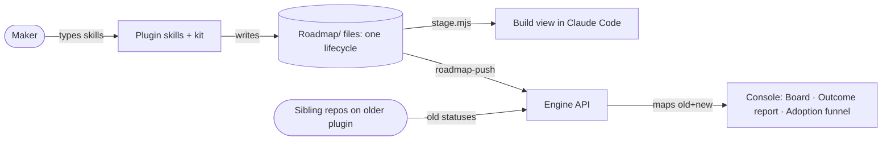
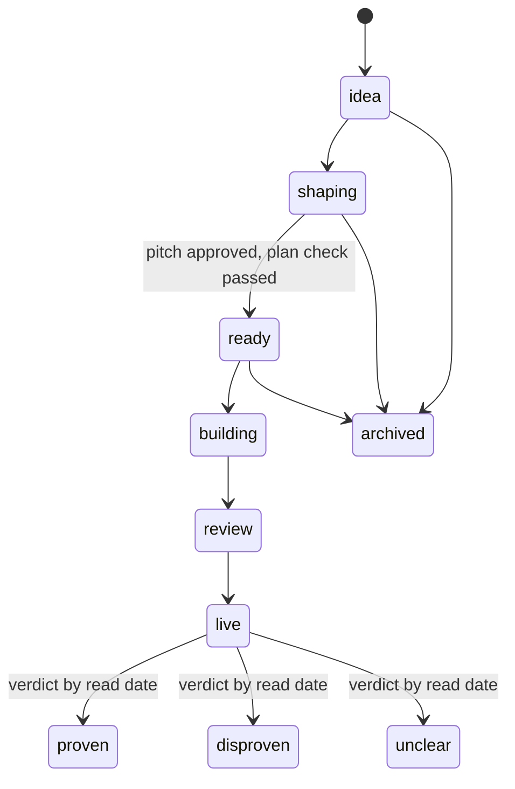

# Pitch — Plain Outcome: one vocabulary and one lifecycle across the plugin, the repo and the console

Moves: proving_workspaces · Tests: Value proposition

## The ask, as given

> renaming our artifacts in general to actually follow a theme, including our folder structure, states, artifacts
> names, etc as right now we have built a bit disconnected but thats fine.
>
> the coaches and skills they use are using generic names that i just made up from summaries, not really following a
> brand direction
>
> agreed. lets keep golden frijoles and launch with it, using the plain outcome language we have decided.

### Claims
1. One lifecycle replaces the seven status vocabularies in files, the board, reports, the console and the build view.
2. Skills, coaches, the review agent and work objects use the Plain · Outcome names; old names keep working for one
   release.
3. Folders and file names follow the spec; existing repos move with one script and old layouts keep working meanwhile.
4. Console and report labels follow the spec; no customer names in product copy.
5. Legacy names are gone from every stranger surface.
6. *(Bet B, `coaches-v2`, groomed separately)* the coaches are resynthesized.
7. The Golden Frijoles name and its addresses stay.

**Teach-back:** yes — "You want every surface of Golden Frijoles to speak one plain, outcome-driven vocabulary, with
the coaches reworked into a guided sequence, so that a stranger meets a small, consistent set of words before launch.
Right?"

## Problem

A stranger meets Golden Frijoles through about forty house words drawn from two methods (Shape Up and Scrum) plus our
own (wave, lock, lane, poster, kickoff, Jev, TARS, Hub, Pod Report), and through **seven lifecycle vocabularies for one
journey**: a seed that is `ready` shows on the board as *Grooming*, becomes an epic that is `scaffolded`, in phase
*Shaping*, shown as *Ready to build* (`audits/naming-inventory-2026-10-04.md` §2, dogfood F23). Legacy names
(`golden-beans`, `dobby`, `ways-of-work`, `GOLDEN_BEANS_*`) and a customer's name (F25) still reach stranger surfaces.
The agreed riskiest assumption is that the method doesn't travel and that its vocabulary *is* the ceremony
(`00-strategy/risk-validation.md`, blind-run compare). The decided fix is the Plain · Outcome system
(`audits/naming-spec-plain-outcome-2026-10-04.md`).

## Appetite

**L**: a multi-wave bet, re-bet at the wave boundary. Wave 1 = slices 1–3 (lifecycle, renames, legacy names); wave 2
= slices 4–5 (folder layout, console and report labels).
quote: $67–144 (L, n=3, p25–p75)

## Outcome & signal

After this ships, a stranger who installs the plugin and plans one idea meets only the Plain · Outcome words: `start`,
`shape`, `build`; idea → bet → slice → task; one lifecycle from Idea to Live. **The PO tests it** by running the
smoke walkthrough on a fresh repo and by `grep` returning zero legacy or retired words on the stranger surfaces (plugin
skills, template, console copy). **Signal later:** the pre-launch "method travels" sessions (risk-validation, step 1)
record no vocabulary questions about retired words.

## Stage-2.5 bucket

**Light enhancement, at width.** Nothing new is built except three lifecycle values (`proven · disproven · unclear`)
that exist only as states here; recording a verdict is F16's bet. Everything else renames what exists and keeps the
old names readable for one release.

## Bill of materials (What / Why)

| What | Why |
|---|---|
| One lifecycle enum + labels in `scripts/lib/stage.mjs` | Already the ONE place stage is decided; extend it, don't add a second |
| Read-both mapping (old values → new) in every reader | Existing files and sibling repos keep working through the release |
| Engine accepts old and new statuses on `/api/v1/roadmap/push` | Sibling repos on older plugin versions keep pushing |
| Renamed skills + one-release stub skills under the old names | Claude Code has no skill aliases; a stub is the alias |
| Vocabulary pass on SKILL.md bodies, templates, generators | The words a stranger reads live here |
| `GOLDEN_FRIJOLES_*` env names, old ones as warned fallback | Legacy name on the SDK path |
| Configs folded into `golden-frijoles.config.json` via the registry | Four config files become one; registry already reads legacy files |
| `gf-kit migrate-layout` move script + new template layout | A repo moves in one command; new repos start flat |
| Console/report label pass (Board, Outcome report, Adoption funnel) | The house words on the signed-in surfaces |
| A `retired-words` guard on stranger surfaces | Keeps them from coming back |

## Scope

**In v1:** claims 1–5 and 7, across the plugin (`skills/plugins/`), the kit, the spawn template, this repo's
`Roadmap/` layout, the CLI and SDK names that carry legacy words, and the console's labels and copy.

**Out of v1 (no-gos):**
- Rewriting history: old retros, shipped seeds' prose and commit messages stay as written (only structure and front
  matter move).
- The verdict record and any UI to set a verdict (F16, its own bet).
- The coaches' content rework (bet B, `coaches-v2`); this bet only renames the coach skills and their output files.
- The homepage hero test and landing copy (its own S bet, after this one).
- Renaming the product, the plugin id, `gf`, `gf-kit`, the npm scope or the domain.
- Migrating stored status values in the engine's database: the UI maps them.
- Migrating the PO's sibling repos: they move with the script when they take the plugin release.

## Rabbit holes

- **Two-way compatibility across repos.** Sibling repos push old statuses to the engine for weeks. The engine must
  accept both, and must be **deployed before** the plugin emits new values (LEARNINGS: a merge-triggered push races
  its own deploy; rollout order is part of the design).
- **No native skill aliases.** Claude Code supports aliases only for bundled skills; a plugin skill is
  `/golden-frijoles:<name>` and also bare `/<name>` "unless another command already uses that name". So: stub skills
  for one release, and check every new bare name against built-ins and the existing `/build` mod command.
- **The public mirror.** `skills/` is mirrored to `golden-frijoles/skills`; this is a plugin release under
  `skills/RELEASING.md` (merge commit, never squash; version bump; kit pins in the generated adverts).
- **Wide text, narrow change.** `groom` appears 1,683 times and `kickoff` 1,367. No blind replace: change stranger
  surfaces by allowlist, leave history.
- **Guards that read today's layout.** `epic-dod`, `doc-format`, `check-template-drift`, `build-order`, the CI
  workflows and Notion sync read `00-ideas/`, `sprint-N.md`, `RETROSPECTIVE.md` and the status values; each reads both
  until the move script has run.
- **`strategy.mjs` keys on today's coach file names**; it reads both names until bet B.

## What already exists (reuse, don't rebuild)

- `scripts/lib/stage.mjs`: the single stage resolver (board-sinks-and-scrumban D2, D13) feeding the Hub, Notion,
  `BUILD-ORDER.md`, the build view and the kickoff's WIP advice; `DOCS_STAGE` is the old → board mapping to extend.
- `scripts/roadmap-extract.mjs` (`seedAppetite`, status enum), `scripts/build-order.mjs`, `scripts/roadmap-push.mjs`.
- `apps/web/lib/roadmap-artifact-schema.ts`: `isRoadmapStatusShipped()` is the one place "shipped" is decided
  server-side; it learns `live`.
- `skills/plugins/golden-frijoles/skills/groom/scaffold-epic.mjs` + `templates/` (writes `sprint-N.md`,
  `RETROSPECTIVE.md`), `vendor/emit-epic-kickoff.mjs`, `strategy.mjs`.
- `skills/scripts/render-skill-adverts.mjs`, `build-kit.mjs`, `pack-skills.mjs`, `check-onboarding-parity.mjs`,
  `check-plugin-leaks.mjs`: the release tooling that regenerates names and checks the kit.
- `lib/config.mjs` + `lib/config-registry.mjs`: one config file, section per module, legacy files as fallback (already
  built; `golden-frijoles.config.json` exists).
- `apps/web/lib/public-demo.ts`: `DEMO_PROJECT_SLUG` is env-overridable.
- `apps/web/lib/hub-board.ts`, `pod-report-view.ts`, `tars.ts`, `project-route-inventory.ts`: where the console's
  labels live.
- The naming spec and inventory in `Roadmap/00-ideas/audits/`.

## Visuals

System context:



The lifecycle (claim 1):



The Board (claim 4):

```surface
state: board
route: /hub/[projectSlug]
- head "Board"
- tabs "Idea | Shaping | Ready | Building | Review | Live"
- list columns "Bet | Slice | Appetite | Read by"
```

## UX heuristics & rails check
- **CI guards covering this surface:** `check-template-drift`, `doc-format`, `epic-dod`, `check-plugin-leaks`,
  `check-onboarding-parity`, `check-release`, the build-order freshness guard; a new `retired-words` guard is added.
- **Audits-lens findings that apply:** `naming-inventory-2026-10-04.md` (all), `dogfood-launch-2026-10.md` F1, F3,
  F20, F23, F25.
- **Design-language debt:** the console still carries the Golden Beans roastery tokens (F24); not this bet.

## Kill-switch / runtime gate (risk:high only — Stage 6b)
**No flag (carve-out):** every change ships with read-both compatibility, and the plugin release is the gate: old names
keep working through it, and the engine's accept-both deploy lands before any client emits a new value. A flag would
guard nothing the compatibility layer doesn't already.

## Acceptance criteria

**Slice 1 — one lifecycle (wave 1).**
- Every old status value (seed, epic, phase, board) maps to exactly one new state, pinned by a fixture per value.
- New files are written with new values; the board, `BUILD-ORDER.md` and the build view show the new labels.
- The engine accepts a push with old values and one with new values, and shows both as the same stage.

**Slice 2 — skill and coach renames (wave 1).**
- The 14 skills, the review agent and the three coaches answer to their new names; each old name opens a stub that
  says the new name and runs nothing else; `check-onboarding-parity` and the kit build pass.
- Skill bodies, templates and generators use idea / bet / slice / task / cycle / plan check; `strategy.mjs` reads the
  old and new coach file names.

**Slice 3 — legacy names out (wave 1).**
- The SDK and CLI read `GOLDEN_FRIJOLES_*`, fall back to `GOLDEN_BEANS_*` with one warning; the demo slug redirects;
  `jev.config.json`, `live-smoke.config.json` and `reporting.config.json` are read as fallbacks only.
- A `retired-words` guard fails on `dobby`, `ways-of-work`, `golden-beans`, `Golden Beans` or a customer name in the
  plugin, the template and console copy.

**Slice 4 — layout (wave 2).**
- `gf-kit migrate-layout` moves a repo to the new layout in one command, rewrites front-matter statuses and internal
  links, and is idempotent; every script reads both layouts for one release.
- This repo is migrated by the script, and CI stays green.

**Slice 5 — console and report labels (wave 2).**
- The console shows Board, Outcome report and Adoption funnel (Reached · Adopted · Retained); stored statuses render
  with new labels.
- A smoke walkthrough the PO follows blind passes on production.

## Open risks / research
- Claude Code skills: no custom aliases; plugin skills are `/plugin:skill`, bare name works unless taken
  (https://code.claude.com/docs/en/skills, read 2026-10-04).
- Scrum Guide replaced "grooming" with "refinement" (2013): https://www.agileambition.com/Essays/Grooming-Vs-Refinement
- Sibling repos' plugin versions: unknown; read from each repo's `.claude/settings.json` before wave 2.
