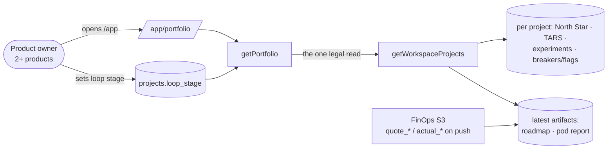

# Pitch — Portfolio view: every product in a workspace on one page

> **Groomed with [`finops-actuals`](finops-actuals.md) on 2026-10-01** (the product owner's "2 epics" call). They
> connect at one seam: the `Spend vs quote` column reads the `quote_*` / `actual_*` fields that FinOps Sprint 3 adds
> to the roadmap push. Everything else here stands on what is already live.

## The ask, as given

> hi claude help me groom three seeds:
> Roadmap/00-ideas/seeds/finops-actuals.md
> Roadmap/00-ideas/seeds/portfolio-view.md
> Roadmap/00-ideas/seeds/finops-quotes.md
> The three must be scaffolded in full in this session no matter if the ways of work say to add extra ceremony, we are not. The seeds are related so lets ensure our work is connected and even consolidate as needed. We are doing them both in one session hope thats clear.
> check if the groom skill is outdated and if it is update t or provide steps to do so.
> this work is visual, we require visualisation until we ensure that the intent is matched.

The seed's own problem, as it arrived from the audit (2026-09-23): *"One person now holds several products. There's no
view across them, and until Seed 7 there's no boundary that allows one."* Its sketch: one row per product — North Star
+ WoW, TARS stage, running experiments, open kill switches, epic lead time, spend vs appetite — placed on the
Consider · Operate · Exit loop, plus a cross-product bets table.

### Claims
1. One view across every product a person holds in a workspace.
2. One row per product: North Star + WoW, funnel (TARS) stage, running experiments, open kill switches, epic lead
   time, spend vs quote.
3. Each product is placed on the method's Consider · Operate · Exit loop.
4. It helps decide which product gets the next wave.
5. It is connected to the FinOps work (spend vs quote comes from there).
6. It is the front door for multi-product users (PO's pick: `/app/portfolio`, default at 2+ products).

**Teach-back:** yes — "You want one page that lists every product in your workspace with its health, its place on the
loop and what it's costing against its quotes, so you can choose where the next wave goes. Right?" (Confirmed through
the grooming questions and the approved mockup, 2026-10-01.)

## Problem

The product owner now runs several products, and each lives behind its own project switch. To answer "which product
needs me next?" they open each one, read its North Star, its funnel, its experiments and its roadmap, and hold the
comparison in their head. Workspaces (shipped 2026-10-01) made a legal multi-project read exist —
`getWorkspaceProjects()` — but nothing uses it yet.

## Appetite

**M — one wave**: an architect session, a builder fan-out, one review round. It is composition over reads that already
exist; the only new storage is one written field (the loop stage).

## Outcome & signal

A product owner with two or more products signs in and lands on `/app/portfolio`: one row per product, every figure
traceable to the project page it came from, with a clear "not set" wherever a figure doesn't exist. **Signal:** the
product owner picks the next wave's product from this page without opening a single project.

## Stage-2.5 bucket

**Genuinely new page, light data.** Every number already has a per-project read: North Star
(`getProjectNorthStarByProjectId`), funnel (`getFeatureFunnelByProjectId`), experiments (`listExperimentRegistries`),
breakers/flags, epic lead time (the Pod Report artifact's `delivery.epicLeadTime`), roadmap (the latest roadmap
artifact). The page composes them through the one legal seam.

## Bill of materials (What / Why)

| What | Why |
|---|---|
| `getPortfolio(userId, workspaceId)` built only on `getWorkspaceProjects()` | the tenancy invariant: one legal multi-project read |
| One row = existing per-project reads, in parallel | reuse; no new metrics pipeline |
| `projects.loop_stage` (consider · operate · exit), written, never inferred | the loop placement is a judgment, not a metric |
| Spend vs quote from the latest roadmap artifact | FinOps S3's fields; no second spend store |
| `/app/portfolio` page, one row per product | the ask |
| `/app` opens on it at 2+ products in the workspace | PO's pick; single-product users see no change |
| Links from each cell to the project page it came from | every figure is traceable |

## Scope

**In v1:** the page, the read model, the written loop stage (set by a project owner from the row), the `/app` default
at 2+ products, a switcher link. Every cell can be "not set".

**Out of v1 (no-gos):**
- **The cross-product bets table.** Bets stay in `Roadmap/bets/` files; the page links to them and does not write
  bets or rank products. (Shown as a "Next wave" panel in the grooming mockup — cut to keep the appetite; it's a
  follow-up seed.)
- **Inferring the loop stage** (from North Star trends or anything else). Written by a person, or "not placed".
- **A workspace-level total spend.** Rows only; no summing across products in v1.
- **Any write besides the loop stage**, and any view of a project the caller isn't a member of (access model A).
- **Invites, billing, quotas** — workspaces' own no-gos still hold.

## Rabbit holes

- **N projects × 6 reads.** Fan out per project in parallel with a per-cell timeout; a slow cell renders "couldn't
  load" for that cell, never blanks the page. The lock measures with the real workspace.
- **Rows the caller can't open.** `getWorkspaceProjects()` already intersects with memberships — the page must not
  "improve" on it (no workspace-member shortcut).
- **WoW with no history.** A North Star with < 2 weeks of data shows the value and "WoW not yet", never 0%.
- **Lead time and spend come from pushed artifacts**, which can be stale. Each cell says "as of <push date>".
- **Loop stage write is a migration** (a nullable enum column) — risk HIGH, applied before merge per DoD.

## What already exists (reuse, don't rebuild)

- `apps/web/lib/workspace.ts` — `getUserWorkspaces`, `getWorkspaceProjects` (the ONE legal multi-project read);
  `lib/workspace-access.ts`, `lib/membership.ts` (`getUserProjects`, `getMembershipByProjectId`, `isOwner`).
- `lib/north-star-query.ts` `getProjectNorthStarByProjectId`; `lib/tars-query.ts` `getFeatureFunnelByProjectId`.
- `lib/experiments.ts` `listExperimentRegistries`; `lib/breaker-*.ts` and flag reads for open kill switches.
- `lib/report-artifacts.ts` `getLatestArtifact` (roadmap and pod artifacts); `lib/pod-report-view.ts` (epic lead
  time, `delivery.epicLeadTime`); `lib/roadmap-artifact-schema.ts` `summarizeRoadmap`.
- `app/app/page.tsx` (the `/app` front door, already redirects by membership); the grouped project switcher.
- The `tenancy` semantic-lint rule (shadow) and AGENTS § The tenancy invariant.

## Visuals

System context:



Data sample — one row of the read model per product:

| product | loop_stage | north_star (wow) | funnel_stage | experiments_running | kill_switches_open | epic_lead_time_days | spend_vs_quote |
|---|---|---|---|---|---|---|---|
| golden-frijoles | operate | 212 (+8%) | retention | 2 | 1 | 3.1 (as of 09-30) | ≈$410, +18% (last 5 epics) |
| miyagisanchez | operate | 1,480 (−3%) | activation | 1 | 0 | 5.4 (as of 09-28) | ≈$96, −6% (last 2 epics) |
| medusa-bonsai | null | null | null | 0 | 0 | null | null (no quotes yet) |

The page, by state (approved as a mockup in the grooming session, 2026-10-01; the "Next wave" panel was cut — see no-gos):

```surface
state: portfolio
route: /app/portfolio
- head "Your workspace" action "Open a product"
- list "Products" columns "Product | Loop | North Star | Funnel | Running | Lead time | Spend vs quote"
- note "Figures from pushed reports say when they were pushed. Not set means not set, never zero."
```

```surface
state: portfolio-loading
route: /app/portfolio
- head "Your workspace"
- list "Products" columns "Product | Loop | North Star | Funnel | Running | Lead time | Spend vs quote"
```

```surface
state: portfolio-empty
route: /app/portfolio
- head "Your workspace"
- empty "Your workspace has one product. The portfolio appears when you add a second."
```

```surface
state: portfolio-error
route: /app/portfolio
- head "Your workspace"
- card "Couldn't load your workspace. Try again."
```

```surface
state: portfolio-loop-unbuilt
route: /app/portfolio
- list "Products" columns "Product | Loop | North Star | Funnel | Running | Lead time | Spend vs quote"
- note "Loop: Not placed · Place it"
```

## UX heuristics & rails check
- **CI guards covering this surface:** the `tenancy` semantic-lint rule (shadow → it must stay clean on this route),
  api-project Playwright specs (non-member 404, foreign-workspace 404), `design-system` rails/state-contract checks for
  console pages, the browser project for the rendered table.
- **Audits-lens findings that apply:** `app-ux-audit-2026-08-01` — console pages use the shared app shell and
  component kit (`app-component-kit-adoption`); "unknown is not zero" (Pod Report honesty).
- **Design-language debt:** none new — reuse the console's table and badge components; loop badges map to existing tones.

## Kill-switch / runtime gate (risk:high only — Stage 6b)
**Decision: no flag (default), carve-out recorded.** The page is read-only except the loop-stage write (owner-only,
one column), and the `/app` default is a one-line branch on project count. Rollback = `git revert`; the migration is
additive (nullable column) and safe to leave in place.

## Acceptance criteria

**Sprint 1 — the read model and the loop stage**
- `getPortfolio(userId, workspaceId)` returns one row per project from `getWorkspaceProjects()` and nothing else; a
  project the caller isn't a member of never appears (spec).
- Each cell is a value, `null` with a reason, or "couldn't load" — never a fabricated 0 (spec over a fixture workspace).
- `projects.loop_stage` exists (nullable: consider · operate · exit); only a project owner can set it (api spec: member
  403, non-member 404); the migration is applied before merge and verified live.
- Spend vs quote reads `quote_*`/`actual_*` from the latest roadmap artifact; with none, it says "no quotes yet".

**Sprint 2 — the page and the front door**
- `/app/portfolio` renders one row per product, in all five sketched states; each cell links to the page it came from.
- `/app` opens on `/app/portfolio` when the caller has 2+ projects in the workspace, and is unchanged with one.
- The `tenancy` lint stays clean; a browser spec covers the table.
- A project owner can place a product on the loop from its row and sees it change.

## Open risks / research
- **Depends on FinOps Sprint 3** for the spend column. If FinOps S3 isn't merged when this builds, the column ships in
  its "no quotes yet" state and lights up when the push carries the fields — this epic does not wait on it.
- **Workspace size:** today one workspace holds a handful of projects. The lock confirms the row count before deciding
  whether the fan-out needs batching.
