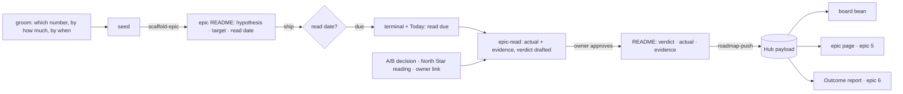

# Pitch — The result record

Moves: grounded_bets_share · Tests: Value proposition — "prove it paid off" is the third verb of the one line, and
today nothing records it (launch epic 4 of [`audits/ux-ui-audit-2026-10.md`](../audits/ux-ui-audit-2026-10.md); dogfood
F16, F37).

## The ask, as given

> yeah the outcome report is the one place where its ok to have more details … Expected vs Actuals … start by
> communicating if the product is paying off … The per epic results finops we do track

> Ok i think its time to pause … sound plan. lets go for it

(Daniel, 2026-10-05, UX audit session, on the Outcome report and the launch order. Shape answers the same day: the
record lives in the epic file and is pushed like FinOps; the agent drafts the verdict and Daniel approves it; counting
Golden Frijoles's own North Star waits; start from now, no bulk backfill.)

### Claims
1. Every epic carries what it should move: the number, from what, to what, and when we read it.
2. On the read date, the epic gets a verdict, Proven, Disproven or Unclear, with its evidence.
3. The verdict is drafted by the agent and approved by the product owner.
4. The record reaches the Hub, so the epic page, the Outcome report and Today can show expected against actual.
5. Nobody has to remember the read date.

**Teach-back:** yes — "You want each epic to say up front which number it should move and when we'll look, and on
that day to get an evidenced verdict you approve, so the Outcome report can say what paid off. Right?"

## Problem
No object ties an epic to the number it was meant to move or the verdict it got (F37). Groom never asks "which number,
by how much, by when"; the seed's "Outcome & signal" is free text. So the Outcome report can't say which epics paid
off, the epic page can't show its result, and the North Star, Proven bets, can't be counted (F16). Spend per epic
already exists (FinOps); the other half of "was it worth it" doesn't.

## Appetite
**M**, one wave. If it runs out, ship sprint 1 (targets set and pushed) and the read command; cut the Today line.
quote: $22–34 (M, n=8, p25–p75)

## Outcome & signal
Every epic groomed from now on carries a hypothesis, a target metric with from → to, and a read date. On that date
the terminal and Today say a read is due; `epic-read` drafts the verdict with its evidence; Daniel approves; the
verdict reaches the Hub and shows as a bean on the board card.
**Test:** groom a small epic with a target and a read date a day out; ship it; next day, run the read, approve it, and
see the bean on the board.

## Stage-2.5 bucket
**Light enhancement.** FinOps already built the exact path: fields at the top of the epic README (`quote_*`,
`actual_*`), copied from the seed by `scaffold-epic`, stamped by a kit script (`epic-actuals.mjs --write`), read by
`roadmap-extract.mjs`, declared in `roadmap-artifact-schema.ts`, stored in the pushed JSON payload (no migration),
shown by the Hub. The evidence the North Star accepts already exists: A/B decision records
(`experiment-decision-query.ts`) and each project's North Star readings (`gf north-star`). New: the fields, the
groom question, and the read.

## Bill of materials (What / Why)

| What | Why |
|---|---|
| Fields: `hypothesis`, `target_metric`, `target_from`, `target_to`, `read_date`; then `verdict`, `verdict_actual`, `verdict_evidence`, `verdict_at` | One record, in the file the epic already is |
| Groom asks "which number, by how much, by when", offering the agreed North Star inputs | A target written down before building is what makes a verdict count |
| `scaffold-epic` copies the target from the seed | Same as the quote |
| Extract, push schema and Hub read the fields | The epic page, report and Today can show them |
| `epic-read.mjs`: gathers the actual and evidence, drafts the verdict, stamps it on approval | The agent does the legwork; the owner decides |
| "Read due" in the terminal (`session-resume`) and on Today | Nobody has to remember |
| The bean on the board card | The result at a glance (epic 1's Bean) |

## Scope
**In v1:** the fields and their contract; the groom question; the seed → README copy; extract, push and Hub read; the
read command with the evidence rule; "read due" in the terminal and on Today; the bean on the board card.

**Out of v1 (no-gos):**
- Counting Golden Frijoles's own North Star (Proven bets, Proving workspaces) from the records: later, once real
  records exist; the four inputs stay pushed by hand.
- Bulk backfill of shipped epics. A shipped epic can be read one at a time with an owner verdict and an evidence link.
- The epic page's Why block and result (launch epic 5) and the Outcome report's expected-vs-actual table (launch
  epic 6): this epic supplies the data, they show it.
- Automatic verdicts with no human approval.
- A database table or new API: the pushed payload carries it.
- Groom's gate wording in plain agile (launch epic 7).

## Rabbit holes
- **The default read date.** Unset means 30 days after shipping, capped at 90 (the North Star's rule). Derive it in
  one place (extract) and show it as derived, never write it back silently.
- **Evidence or it doesn't count.** Proven and Disproven need a pointer that resolves: an A/B decision record, a North
  Star reading for the target metric, or a link the owner gives. Unclear needs a reason. A verdict after 90 days is
  recorded and marked late (it won't count for the North Star).
- **Works without an account.** With no account the read asks for the actual and the link; with one it fetches them
  through `gf`. Never fail because the platform isn't linked.
- **The metric key.** `target_metric` should name a North Star input key when the project has one (a grounded bet);
  free text is allowed and shown as "not grounded". Don't validate against the network at grooming.
- **Two copies of the target.** The seed holds it until scaffold; from then the README is the source, like `status:`.
- **The contract.** `roadmap-contract.mjs` and `doc-format` must know the fields (types, enums) so a typo'd verdict
  fails, the way an invalid appetite does.
- **Kit and plugin.** `epic-read.mjs` ships in the kit like `epic-actuals.mjs`; groom and `scaffold-epic` live in
  `skills/`. Both follow the release flow.

## What already exists (reuse, don't rebuild)
- FinOps path: `scripts/epic-actuals.mjs` (`--write` stamps the README), `scripts/quote.mjs`,
  `scripts/roadmap-extract.mjs` (`finopsFields`), `apps/web/lib/roadmap-artifact-schema.ts`, `lib/roadmap-finops.ts`,
  `scripts/roadmap-push.mjs`.
- `skills/plugins/golden-frijoles/skills/groom/` (`SKILL.md` Stage 1.5, `scaffold-epic.mjs`, `templates/scope-seed.md`,
  `strategy.mjs`, which prints the agreed North Star inputs), `scripts/lib/roadmap-contract.mjs`, `scripts/doc-format.mjs`.
- Evidence: `apps/web/lib/experiment-decision-query.ts`, `experiment-decision-contract.ts`, `lib/north-star-query.ts`,
  `packages/cli/src/commands/north-star.ts`.
- Reminders: `scripts/session-resume.mjs`, `apps/web/lib/today-bands.ts` ("Waiting on you"), `lib/hub-board.ts` and
  the board card.
- `Roadmap/00-strategy/north-star.md`: the metric's rules (read date default 30, cap 90; the evidence ladder).
- Design source: the canvas `Why` component (hypothesis, metric, from, to, read date) and the Outcome frame.

## Visuals



| epic | target | read date | verdict | evidence |
|---|---|---|---|---|
| overdue-reminders | `invoices_paid_on_time` 61% → 70% | 2026-11-04 | Proven (72%) | North Star reading, 2026-11-04 |
| export-csv | `weekly_active_teams` 120 → 140 | 2026-11-12 | Unclear | traffic too low to tell (n = 18) |
| smart-defaults | `setup_completion` 44% → 55% | 2026-10-28 | Disproven (43%) | A/B decision record #12 |

```surface
state: board-card-idle
route: /hub/[projectSlug]/board
- card "Overdue reminders" meta "Shipped · read 4 Nov" figure "bean: Proven" note "61% → 72% (target 70%)"
- card "Export CSV" meta "Shipped · read due" figure "bean: Growing" note "read due today"
```

## UX heuristics & rails check
- **CI guards covering this surface:** `roadmap-contract.test.mjs`, `doc-format --check`, `roadmap-extract.*.test.mjs`,
  `roadmap-push.test.mjs`, the push schema tests, the visual gate (board card).
- **Audits-lens findings that apply:** dogfood F16, F37; audit decisions 1 (Proven · Disproven · Unclear, gold only
  for Proven), 4 and 5.
- **Design-language debt:** none; uses epic 1's Bean.

## Kill-switch / runtime gate
Not needed: risk low (planning files, an additive and nullish push field, a read-only display). Rollback is a revert.

## Slices (stories, risk, QA)

**Sprint 1 · The target, set at grooming.**
- **S1.1 · low.** As a founder, I want every epic to carry its hypothesis, target and read date, so that what it
  should move is written down before it's built. Fields in the seed and README templates and the contract;
  `scaffold-epic` copies them. *QA:* `roadmap-contract.test.mjs`, `scaffold-epic.test.mjs`, `doc-format`.
- **S1.2 · low.** As a founder grooming, I want to be asked which number, by how much and by when, with my North Star
  inputs offered, so that the epic is grounded. Groom Stage 1.5 and the gate's bet block. *QA:* the skill checks.
- **S1.3 · low.** As a founder, I want the target and the verdict to reach the Hub, so that every page can show
  expected against actual. Extract (with the derived default read date), push schema (nullish, bounded), Hub read.
  *QA:* `roadmap-extract` and `roadmap-push` tests; a schema spec that refuses a bad verdict.

**Sprint 2 · The read.**
- **S2.1 · low.** As a founder, I want my agent to draft the verdict with its evidence on the read date, and me to
  approve it, so that the result is evidenced and mine. `epic-read.mjs --epic <slug>` (kit), `--write` on approval;
  the evidence rule; works with and without an account. *QA:* pure-logic specs on the evidence rule, the default and
  the 90-day mark; a fixture run with and without `gf`.
- **S2.2 · low.** As a founder, I want to be told when a read is due, so that I don't have to remember. One line in
  `session-resume` and a "Read due" item in Today's Waiting on you. *QA:* `session-resume` test; `today-bands.test.ts`.
- **S2.3 · low.** As a founder, I want the result as a bean on the board card, so that I see what paid off at a
  glance. Proven, Disproven, Unclear, or Growing until read. *QA:* the board's spec; the visual gate.

**Smoke walkthrough:** owed by Daniel: groom a tiny epic with a read date a day out, ship it, read it, approve it, see
the bean.

## Acceptance criteria
- A newly groomed epic's README has `hypothesis`, `target_metric`, `target_from`, `target_to` and `read_date` (or a
  derived default shown as such); a typo'd field value fails the contract.
- Groom asks which number, by how much and by when, offering the project's North Star inputs.
- The fields reach the Hub on push; an older pusher without them still works.
- `epic-read` drafts Proven, Disproven or Unclear with evidence; nothing is written without approval; Proven and
  Disproven can't be written without a pointer; a read after 90 days is marked late.
- The terminal and Today say when a read is due.
- The board card shows the bean; gold only on Proven.

## Open risks / research
- None external. The open judgement is how strict the "resolvable pointer" check is offline; settle it at the lock.
