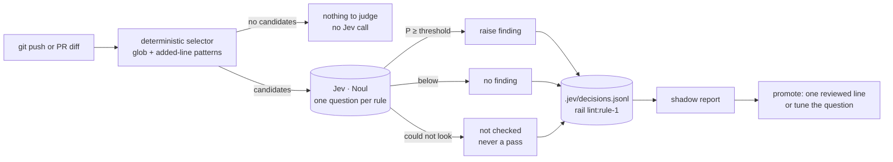

# Seed: Semantic lint: Jev judges what deterministic checks select (v1: AGENTS rule 1, in shadow)

From the [single-product audit](../audits/single-product-and-grooming-2026-09-28.md) §0.4 ("Jev for linters fits as a
second stage behind deterministic checks, raise-only, not a replacement"). Groomed 2026-09-29: **feature ·
fixed-scope lane · appetite S (one builder session) · risk low**. Stage-2.5 bucket: **light enhancement.** Jev's
client, the rail switch, shadow mode with an expiry CI already runs, the decision log and the advisory pre-push hook
all exist. What's new is one rail script, rules as data, and one rule.

**As the product owner, I want** the rules that cost most (starting with AGENTS rule 1: no parallel telemetry
pipeline) checked on every push by a judge that understands paraphrase, **so that** a violation surfaces before review
rather than depending on a reviewer noticing it.

## The ask, as given

> "The rules that cost most have no check: AGENTS.md's cannot-be-violated rules on a diff, paraphrases of banned product
> words (`vocabulary.ts` blocks exact words only), ✅ lines on the poster that the code doesn't enforce, suppression
> comments whose reason has rotted, and CodeQL alerts a human triages by hand." (the portfolio-pass seed, from the audit)

## Flow (what happens on a push)

In **shadow** (v1) the selector and Jev both run and log, and nothing is shown as a finding. That's the same promotion
path the review and prose guards took in `jev-semantic-guards` (shadow report, then one reviewed line).

## What grooming measured (2026-09-29, against `main` @ 93aec48)

- **Rule 1's literal half is already clean and easy to select.** In `apps/web/app` and `apps/web/lib`, the only writes to
  `events`/`features` are `api/v1/track/route.ts` and `api/v1/features/sync/route.ts`; every other `.from('events')` or
  `.from('features')` is a read in the canonical query libs. Test and seed files write directly, and that's allowed
  (AGENTS: "rule #1 governs product code"). So a selector over added lines has a small, known allowlist.
- **The semantic half is what nothing checks:** a new migration that creates a usage-events table under another name, a
  new analytics route, or a vendor SDK call (`posthog.capture`, `analytics.track`) that bypasses `/api/v1/track`. A regex
  can find these candidates; only a judge can say whether each one is a parallel pipeline.
- **The switch exists.** `jev.config.json` (`jev` section) carries `rails.<rail>.mode: off | shadow | jev` with
  `shadowExpires`, and `scripts-guard.yml` fails CI once a shadow rail passes its expiry. But `RAILS` is hard-coded to
  `['review', 'prose']` and unknown rails are refused (`lib/jev.mjs:37,65`), so `lint` must be added deliberately.
- **CI can't call Jev.** No workflow in `.github/` references `TYPESAFE_API_KEY`. The key lives in `.env.local`, where
  the review rail and the pre-push hook run. So v1 runs **locally, in the advisory pre-push hook** (it already never
  blocks) and on demand, not in CI. Putting the key in GitHub secrets is a production-secret decision, left for when
  the rule is promoted.
- **Labels are thin.** `.jev/decisions.jsonl` holds 24 decisions (all `review`). The ReAnchor spike's lesson: one
  statistic per rule from day one, and grow labels before fitting. Two weeks of shadow logs are the labels.
- **Rules as data have a home.** `golden-frijoles.config.json` is read section by section (`lib/config.mjs`), unknown
  sections are ignored, and the registry drives `gf doctor`. A `lint` section + one registry row shows in doctor with
  no CLI change.

## Bill of materials

| What | Why |
|---|---|
| **`semantic-lint.mjs`** in the kit: reads rules, runs each selector over the pushed diff's added lines, asks Jev one Noul per candidate, logs `rail: lint:<id>` | One script is the whole rail; everything it calls already exists. |
| **Rules as data**: a `lint` section (`rules[]`: id, globs, selector patterns, allowlist, question, severity) in `golden-frijoles.config.json` | A new rule is a config edit, not code. |
| **One switch, where the others are**: `jev.rails.lint` gets `mode`, per-rule `threshold` and `shadowExpires`; `RAILS` gains `lint` | Keeps one committed kill-switch file and reuses the expiry CI unchanged. |
| **Rule 1** for this repo, in shadow for two weeks, with 10–20 labelled diffs recorded with `jev-eval --live` | The first rule proves the rail on the rule that matters most here. |
| **Pre-push wiring**: the advisory hook runs it on changed files only | Where the key already is; never blocks a push. |

## Rabbit holes (patched now)

- **"Could not look" is never a pass.** No key, egress off, a timeout or an oversized diff prints "not checked" and logs
  it, the same contract as `askJev`.
- **Raise-only.** The rail can add a finding; it never clears a finding from another check, and it never replaces a
  deterministic rule.
- **Test and seed files are allowed to write directly.** The rule's allowlist names them
  (`apps/web/e2e/**`, `scripts/seed-*`), so they aren't candidates at all.
- **Egress:** only the candidate hunks go to TypeSafe, not the whole diff, under the existing `jev.egress` answer.
- **Question wording is measured, not guessed**, as `REVIEW_QUESTIONS` was (38/76 → 74/76 decided on wording alone).
- **Cost:** most pushes have no candidates and make no Jev call. The audit's measured price is about $0.0001 per PR.

## No-gos

- **No CI secret in v1.** Running in GitHub Actions needs `TYPESAFE_API_KEY` as a repo secret, which is a production
  secret; it's decided at promotion, not here.
- **One rule in v1.** Paraphrased vocabulary, poster ✅ lines, rotted suppression comments and CodeQL triage are later
  rules, each its own config entry once the rail has shadow data.
- Formatting, unused imports, anything a deterministic rule already decides. Jev judges; it doesn't search for
  vulnerabilities.
- No threshold fitting here (that's `compiled-prompts`' `optimize/`), and no blocking mode in v1.

## Slices (one sprint, branch `feat/semantic-lint`)

| Sprint | Stories | Risk | QA stage |
|---|---|---|---|
| **S1: The rail and rule 1, in shadow** | 1.1 `semantic-lint.mjs` + the `lint` config section + `RAILS` gains `lint` (mode, threshold, `shadowExpires`) · 1.2 rule 1 as data, 10–20 labelled diffs, wording measured with `jev-eval --live` · 1.3 the pre-push hook runs it on changed files, in shadow, with `shadowExpires` two weeks out | low | `node --test` with a replay client (no key); `jev-eval` replay in `scripts-guard.yml` covers the new fixtures offline. Owed to Daniel: read the shadow report after two weeks and decide promote / tune / drop. |

**Kill switch (Stage 6b):** not required (`risk: low`). The rail is `off | shadow | jev` in one committed file, and
shadow is advisory by construction. Every change under `skills/` is a plugin release.

## Acceptance (Daniel can check)

- Pushing a branch that adds `analytics.track(...)` to an app route logs a `lint:rule-1` decision with Jev's
  probability, and the push goes through.
- Pushing a branch that only changes a Playwright spec writing to `events` makes no Jev call.
- With no `TYPESAFE_API_KEY`, the hook prints "semantic-lint: not checked (no key)" and the push goes through.
- `scripts-guard.yml` goes red if `jev.rails.lint.shadowExpires` passes without a promotion decision.
- `gf doctor` shows a `lint.rules` line.

## Reuse

`lib/jev.mjs` (`askJev`, `effectiveMode`, `logDecision`, `parseJevConfig`), `lib/config.mjs` + `config-registry.mjs`,
`jev-eval.mjs` + fixtures, `jev-report.mjs` (the shadow report), `scripts-guard.yml`'s expiry step, `.githooks/pre-push`
(already advisory, also in the template), and the `jev-semantic-guards` shadow → promote playbook.
