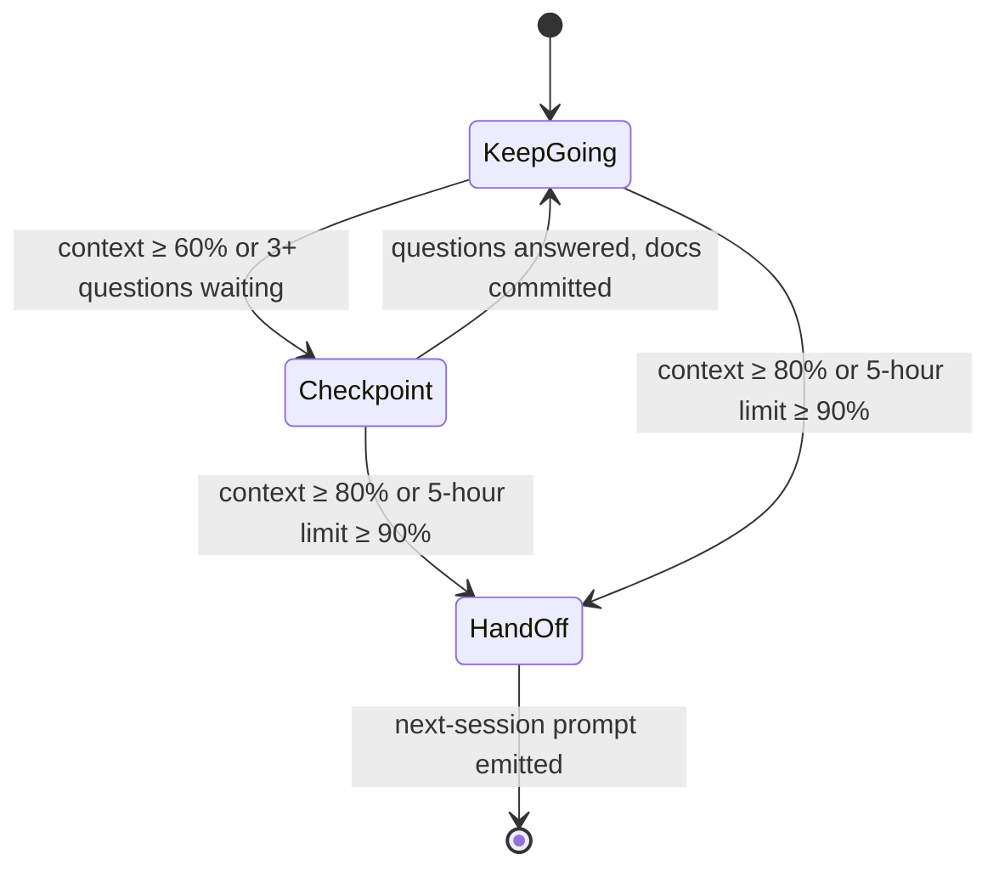

# Seed: Session budget: "one deep ask per approval gate" plus a measured line

From the [single-product audit](../audits/single-product-and-grooming-2026-09-28.md) §0.8. **Decision:** E7 (approved
2026-09-28: "one deep ask per approval gate", plus the measured session-budget line). Groomed 2026-09-29: **chore ·
fixed-scope lane · appetite S (one builder session) · risk low**. Stage-2.5 bucket: **light enhancement.** The engine
already measures the session and hands a mod the figures; the build view is already a mod. The work is a rewording in
four files, one line in the mod, and a plain-text line at each groom gate.

**As the product owner, I want** a session to keep going across approval gates while it's healthy, and to tell me
plainly when to checkpoint or hand off, **so that** my decisions, not an old stamina rule, set the pace.

## The ask, as given

> "Groom's 'one *deep* ask per run' and LEARNINGS' 'fresh session per sprint' were calibrated for earlier models. The
> binding constraint is now the product owner's decision bandwidth, and nothing measures either." (portfolio-pass seed)

**Live evidence, 2026-09-29:** this grooming session ran four deep asks, each to its own pitch and approval, in one
session. It was the rule E7 describes, working, while the written rule still says one per run.

## The line (a state machine, provisional thresholds)

In Claude Code the line reads, for example, `Session 48% · 5h 23% · 2 asks open → keep going`. **Checkpoint** means
commit the docs, answer what's waiting, journal the next step. **Hand off** means emit the next-session prompt
(`backlog-cadence.md`'s template). The thresholds are placeholders, logged so they can be fitted later.

## What grooming measured (2026-09-29, against `main` @ 93aec48)

- **The engine already measures the session for a mod.** This build's mod API has `$.session.usage()` → `{ startedAt,
  context, rateLimits, cost }` "as the status line has them" (`context.percent`, the 5-hour and 7-day windows), and a
  `session.measure` event that fires after each main-thread turn and when a rate-limit window moves a point. The status
  line's own JSON carries the same `context_window.used_percentage` and `rate_limits.*`
  ([docs](https://code.claude.com/docs/en/statusline)). **No OpenTelemetry is needed for the line.**
- **The build view is already that mod.** `skills/plugins/golden-frijoles/hooks/` (`index.ts` + the pure
  `build-view.mjs`) renders `build-state.mjs`'s lines through `$.ui.status`. A session line is one more line from a
  pure function, tested the same way.
- **Planning has no mod.** Grooming runs in Cowork, which has no build view and no `$.session`. The agent can count
  what it can see (asks open, questions waiting, gates passed) but not its own context fill. So in Cowork the line is
  printed by groom at each approval gate, and says "context: not measured here" rather than guess.
- **The old rule is written in four places:** groom `SKILL.md` (lines 51 and 220, plus Stage 9's "the next ask gets
  its own fresh session"), `references/backlog-cadence.md`, `Roadmap/fill-ins.yml` (grooming cadence, which renders
  into WAYS-OF-WORKING), and `LEARNINGS.md:1486` ("consider a fresh session per sprint").
- **The session journal is intent-only by design** (`session-journal.mjs` D2: "one intent line, nothing derived";
  kinds `decision | doing | next | blocked | declined`). Figures don't belong there, so the measured snapshots go to
  a local, gitignored log, and only the verdict you act on is journaled.
- **Overlap:** `finops-actuals` owns token and cost telemetry into the engine (OTLP). This epic reads the local figures
  only and sends nothing anywhere.

## Bill of materials

| What | Why |
|---|---|
| **The rewording**, in all four places: "one deep ask per approval gate; keep going while the budget line says so" | E7. A rule written four ways drifts four ways. |
| **`sessionVerdict()`**: a pure function from `{ contextPct, fiveHourPct, questionsWaiting, asksOpen }` to keep going / checkpoint / hand off, thresholds in one table | One place to tune, testable without a session. |
| **The session line in the build-view mod**: `session.measure` → `$.session.usage()` → the verdict → one status line | The figures are already pushed to the mod each turn; no polling, no telemetry. |
| **The line at each groom gate in Cowork**: asks open, questions waiting, gates passed, "context: not measured here", and the verdict | Planning is where decision bandwidth binds, and it has no mod. |
| **A local snapshot log** (`.golden-frijoles/session-budget.jsonl`, gitignored): figures + verdict + what you chose | So the thresholds can be fitted later from real sessions. |

## Rabbit holes (patched now)

- **Unknown is not zero.** `context.percent` is null early in a session and after `/compact`; `rateLimits` appear only
  for Pro/Max subscribers after the first response. A missing figure is left out of the line and out of the verdict,
  never read as 0%.
- **The verdict advises; it never acts.** No auto-compact and no auto-handoff. `$.session.compact()` exists, and it is
  deliberately not called.
- **Counting questions honestly.** In Claude Code, "questions waiting" is the number of open `AskUserQuestion` prompts
  the mod can see; in Cowork, groom counts the questions it asked and you haven't answered. Neither is guessed.
- **Every change under `skills/` is a plugin release**; the mod reloads on the new version.

## No-gos

- **No drift markers in v1** (contradicting a written decision, repeated re-reads, tool errors). They need labelled
  sessions first; the snapshot log is where those labels start.
- No OpenTelemetry, no engine ingest, no cost reporting (`finops-actuals`).
- No threshold fitting here, and the verdict never compacts, clears or ends a session by itself.

## Slices (one sprint, branch `feat/session-budget`)

| Sprint | Stories | Risk | QA stage |
|---|---|---|---|
| **S1: The rule and the line** | 1.1 the rewording in groom `SKILL.md`, `backlog-cadence.md`, `fill-ins.yml` (re-render WAYS-OF-WORKING) and LEARNINGS · 1.2 `sessionVerdict()` + the session line in the build-view mod + the local snapshot log · 1.3 groom prints the line at each approval gate in Cowork | low | `node --test` for `sessionVerdict()` (every threshold edge, null figures) and the mod's pure half; `render-ways-of-working --check`. Owed to Daniel: watch the line through one real build session and one groom session. |

**Kill switch (Stage 6b):** not required (`risk: low`); the line advises and never acts. Rollback is pinning the
previous plugin version.

## Acceptance (Daniel can check)

- `grep -rn "one \*deep\* ask per run" skills Roadmap` finds nothing; the new wording is in all four places, and
  `node scripts/render-ways-of-working.mjs --check` passes.
- In Claude Code on a `feat/*` branch, the status line shows a `Session …% · 5h …% → keep going` line under the build
  view, and it changes as the session fills.
- Early in a session (no figure yet) the line leaves the missing figure out instead of showing 0%.
- In Cowork, each groom approval gate ends with one line: asks open, questions waiting, "context: not measured here",
  and a verdict.
- `.golden-frijoles/session-budget.jsonl` gains a row per verdict change and is gitignored.

## Reuse

`skills/plugins/golden-frijoles/hooks/{index.ts,build-view.mjs}` + `build-view.test.mjs`, `$.session.usage()` and the
`session.measure` event (mod API), the groom skill + `references/backlog-cadence.md`, `render-ways-of-working.mjs` +
`fill-ins.yml`, `session-journal.mjs` / `session-note.mjs` for the journaled verdict.
