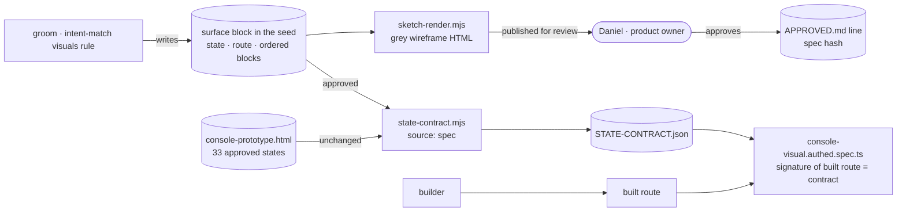

# Seed: Sketch specs: a surface spec renders the grey wireframe and becomes the state contract

From the [single-product audit](../audits/single-product-and-grooming-2026-09-28.md) §0.7. Wave 2 of
[`intent-match`](intent-match.md). Groomed 2026-09-29: **feature · shaped bet · appetite M (down from L) · risk low**.
Stage-2.5 bucket: **light enhancement.** The portfolio seed proposed six spec formats. Five of them already have a
format: `intent-match`'s visuals rule draws flow, state, sequence and architecture in Mermaid (which is text, diffs and
renders on GitHub), and data and copy are tables. The sixth, the screen, already has a structured shape too: a
`STATE-CONTRACT.json` signature. It's only ever extracted after the fact. This epic makes it the thing you write first.

**As the product owner, I want** a screen described once as an ordered list of blocks with the words that matter,
rendered as a grey wireframe for me to approve, **so that** what I approve is exactly what CI checks the built route
against, with no hand-made prototype in between where "mostly matches" can hide.

## The ask, as given

> "Groom … then seeds/sketch-specs.md … check out a recently groomed and scaffolded item named intent-match that might
> cover already some part of the implementation of seeds/sketch-specs.md, possibly we could just supplement the already
> scaffolded one (intent-match) with whatever it is missing or even better from seeds/sketch-specs.md, i think we have
> valuable info in both" (the product owner, 2026-09-29)

## How the two seeds split (the answer to the ask)

| Piece | Where it lives | Why |
|---|---|---|
| When to draw, and what (the visuals rule) | `intent-match` S2.2 (already scaffolded) | Unchanged. |
| Flow, state machine, sequence, container diagram | `intent-match` (Mermaid in the seed) | Mermaid is already a text spec. The seed's `flow.yaml`, `state.yaml` and `arch.yaml` would add a format and a renderer for the same picture. **Cut from sketch-specs.** |
| Data sample, copy deck | `intent-match` (tables in the seed) | Same reason. `data.yaml` and `copy.yaml` **cut.** |
| **Screen: the wireframe row** | **Supplement `intent-match` now:** the row writes a `surface` block (below) instead of "HTML sketch or ASCII" | Free: a text change to intent-match S2.1 and S2.2, no new story, no appetite change. Every wireframe drawn from then on is already a spec this epic can render. |
| States named from the ten-state taxonomy | **Supplement `intent-match` now**, in the state-machine row | The design system already names them (`references/ux-guidelines.md`, `system.css`); a sketch that uses other names can't map to a contract. |
| Rendering a `surface` block as a grey wireframe | **This epic** | New. |
| A `surface` block becoming the route's state contract | **This epic** | New: the arrow reversal. |
| Property tests generated from a state machine | **Neither** (moved to `verify-module`) | That's the verification depth ladder, not sketching. |

**Why not fold this epic into `intent-match`:** it's scaffolded at appetite M with nine stories and cut lines, and
epic mode runs a whole epic in one orchestrated session, so a "wave 2 inside the same epic" can't be re-bet at its
boundary. Adding four stories would grow the appetite in flight, which the betting rules forbid. The free supplement
above gets `intent-match` the part that matters for it (its wireframes become specs); this epic follows it.

## The surface block (the grammar the lock fixed: epic README D8)

```surface
state: ship-features
route: /app/flags/[projectSlug]
- head "Features" action "+ new feature"
- answer "Which features are live, and which are dark?"
- summary count 4
- toolbar
- list columns "feature | state in production | type & risk | on / off"
```

*Amended at the lock (2026-09-30):* the proposal ended with `- empty "No features yet"   when: empty`. A surface is ONE
state, so the parser refuses `when:`; the empty state is its own block (`state: ship-features-empty`). And the block is
now a real fence rather than an example inside one, so `sketch-render.mjs` draws it (Sprint 1 walkthrough, step 1).

One block per line, in order, by kind, with only the facts that survive a change of data: the primary action's words,
a tile or summary count, the list's column words. No values, no row counts, no pixels. That is exactly what a
`STATE-CONTRACT.json` signature records today (`apps/web/design-system/state-contract.mjs`, "What a signature is"),
which is why the two can be one shape. A line format, not YAML, because the kit is zero-dependency and has no YAML
parser; it also reads naturally inside a seed.

## System, actors and data flow



## What grooming measured (2026-09-29, against `main` @ 93aec48)

- **A signature is already a surface spec.** `STATE-CONTRACT.json` stores, per approved state, the ordered blocks by
  kind with data-independent facts (`head` + action label, `summary` + count, `list` + column words). 33 states, 962
  lines, generated by `state-contract.mjs` from `console-prototype.html`, and `--check` fails CI on drift.
- **One extractor, two consumers.** `extractSignature` in `state-contract-core.mjs` runs inside the prototype and
  inside the built route, with the vocabulary passed in. So a spec-sourced state needs no new comparison: it only
  needs to produce the same JSON.
- **The vocabulary is project-specific and large.** `BLOCK_KINDS` has 47 kinds (`head` … `note`, plus door, builder
  and results families), each a pair of selectors (prototype class, product class). A generic kit vocabulary can't be
  those 47; it has to be a small set a project maps onto its own.
- **Approval is a content hash.** `APPROVED.md` records the prototype's SHA-256 and each state's batch; Rail 2 says
  approval is a file with a hash, not a memory. A spec-sourced state needs the same: its approval line carries the
  spec's hash.
- **The kit has no state contract.** `state-contract*` exists only in `apps/web/design-system/`. A plugin user gets
  the format and the renderer; the gate is this project's.
- **No Mermaid, no wireframe rule existed before `intent-match`**, and `intent-match` S2.2 is where "HTML sketch or
  ASCII in the seed" is written. That line is the seam.

## Bill of materials

| What | Why |
|---|---|
| **Supplement `intent-match`** (a text amendment on its branch, now): the wireframe row writes a `surface` block; the state-machine row uses the ten-state taxonomy | Every wireframe from `intent-match` onward is already a spec; costs `intent-match` nothing. |
| **The `surface` format + parser** in the kit (`lib/surface.mjs`): the line grammar, a validator with line-numbered errors | One shape for the sketch, the review and the contract. |
| **A generic vocabulary** of about twelve kinds (head, answer, summary, tiles, toolbar, list, empty, card, steps, field, tabs, note) + a project mapping file (`surface.map.json`: kind → the project's own block kind) | Works in any project; this repo maps onto its 47 as `state-contract-core` already maps prototype to product. |
| **`sketch-render.mjs`** (zero-dependency): surface block → one static grey HTML page, boxes and the words, a state per section | You approve a picture. Deliberately grey, so nobody reviews colour or type in a wireframe. |
| **Spec → contract** in this repo: `state-contract.mjs` also reads approved surface blocks (`source: spec`), and `APPROVED.md` gets a line with the spec's hash | The approved spec is the contract; the existing gate checks built routes against it with no new comparison code. |
| **Parity proof**: three of the 33 approved states re-written as surface blocks produce byte-identical contract entries | Shows the format loses nothing before it's trusted for a new state. |

## Rabbit holes (patched now)

- **Two sources for one state id.** A state comes from the prototype or from a spec, never both; `state-contract.mjs`
  fails on a duplicate id. The 33 prototype states stay prototype-sourced (no migration in this epic).
- **Facts the grammar can't say.** Some kinds carry facts (`kpis`, `results-*`, door forms). The generic vocabulary
  carries only `action`, `count` and `columns`; a kind whose facts need more stays prototype-only for now, and the
  parity proof picks states that the grammar covers. The lock lists which of the 47 map.
- **Approval drift.** Editing an approved surface block changes its hash; `state-contract.mjs --check` fails until
  `APPROVED.md` carries the new hash. Same rule as the prototype today.
- **Where the block lives.** In the seed while it's being shaped; on approval it's copied to
  `apps/web/design-system/surfaces/<state>.surface` so the contract doesn't read `Roadmap/`. The lock confirms the path.
- **The renderer is not the product.** It draws grey boxes from the generic vocabulary; it never imports the design
  system, so it can't drift into a second component library.

## No-gos

- No `flow.yaml`, `data.yaml`, `state.yaml`, `arch.yaml` or `copy.yaml`: Mermaid and tables already do those jobs.
- No property tests from state machines (that's `verify-module`).
- No migration of the 33 approved prototype states; no colour, type or tokens in a sketch; no pixel comparison.
- No kit-side contract gate: plugin users get the format and the renderer, not this repo's Playwright gate.

## Slices (stacked branches `feat/sketch-specs` → `-s2`)

| Sprint | Stories | Risk | QA stage |
|---|---|---|---|
| **S1: The format and the grey wireframe (kit)** | 1.1 `lib/surface.mjs`: grammar, parser, validator · 1.2 generic vocabulary + `surface.map.json` · 1.3 `sketch-render.mjs` + the groom visuals-rule line that renders a seed's surface blocks | low | `node --test` (parser, validator, renderer snapshot). Owed to Daniel: open one rendered wireframe and say whether it reads. |
| **S2: The spec becomes the contract (this repo)** | 2.1 `state-contract.mjs` reads approved surfaces (`source: spec`), refuses duplicate ids, checks the `APPROVED.md` hash · 2.2 parity: three approved states as surfaces, byte-identical entries · 2.3 first real use: the next new console state is approved as a surface and built against it | low | `state-contract.mjs --check` in CI; `console-visual.authed.spec.ts` unchanged and green. |

**Cut line:** 2.3 goes first (it waits for an epic that adds a state). The format, renderer and parity never go.
**Model routing:** 1.1 and 2.1 on the strongest tier (the grammar and the contract seam); the rest to builders.
Risk **low**: planning tooling and a CI gate's input; no runtime seam, so no kill-switch. Changes under `skills/` are a
plugin release.

## Acceptance (Daniel can check)

- A new seed groomed after `intent-match` S2 has a `surface` block where it used to have an ASCII sketch.
- `node scripts/sketch-render.mjs Roadmap/00-ideas/seeds/<seed>.md` writes an HTML file with a grey wireframe per state.
- A malformed line (`- lsit columns …`) fails with the line number and the list of known kinds.
- `node apps/web/design-system/state-contract.mjs --check` passes with three states defined only by surface blocks,
  and fails if one of those blocks is edited without a new `APPROVED.md` hash.

## Reuse

`apps/web/design-system/state-contract.mjs` + `state-contract-core.mjs` (`BLOCK_KINDS`, `extractSignature`),
`STATE-CONTRACT.json`, `APPROVED.md` (hash-as-approval, Rail 2), `approved-states.mjs`, `e2e/console-visual.authed.spec.ts`,
`references/ux-guidelines.md` (the ten-state taxonomy), `intent-match`'s visuals rule and seed template, and
`build-kit`'s `requires_scripts` closure.
