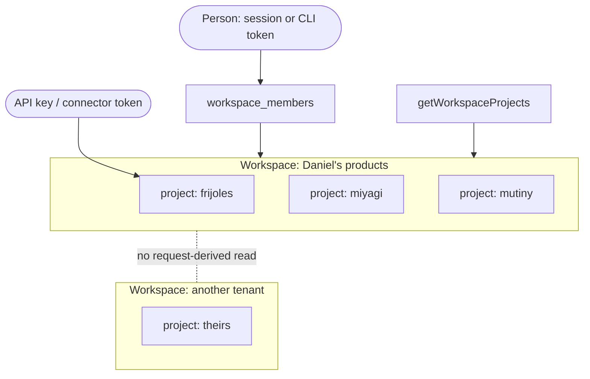
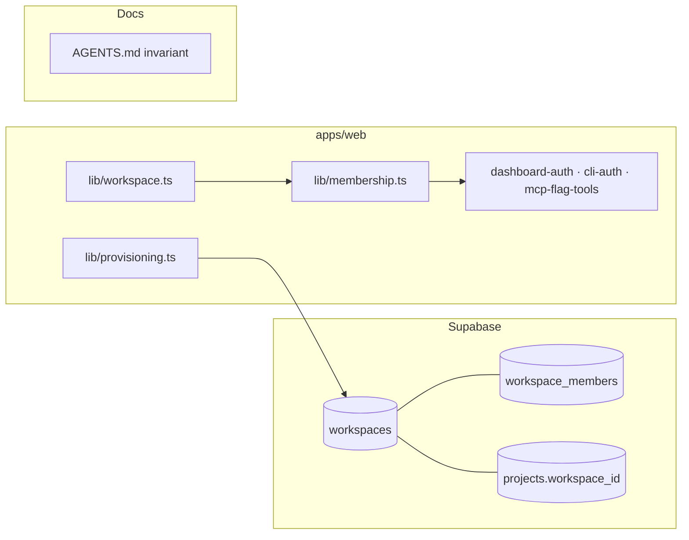

# Pitch — Workspaces become the tenant: one person, many products, one boundary

Seed 7 of the unification audit (§7, decision **D5**: approved 2026-09-23). Deep-groomed 2026-10-01 in the
same session as [`board-sinks-and-scrumban`](board-sinks-and-scrumban.md), which this epic unblocks (its
workspace-wide board, S4). Home repo: **golden-frijoles** (was golden-beans).

## The ask, as given
<!-- proxy: the audit brief that raised this lives in golden-frijoles/internal. What follows is the decision of
     record and the product owner's own words from the 2026-10-01 grooming session, verbatim. -->

> **D5** — **workspaces become the tenant.** This is the explicit either/or the tenancy invariant in `AGENTS.md`
> requires. The rule text itself is amended by the workspaces epic (Seed 7), in the same change that introduces
> the table — not before, and not by this note.

> (2026-10-01) "A: boundary only" · no-gos: "Quotas move, Billing, Moving projects, Workspace invites" ·
> "We are having now a portfolio view right? so that portfolio view would have the board showing initiatives
> from all projects and their statuses, then we could filter by project."

### Claims
1. A workspace exists above projects, and every project belongs to exactly one.
2. The workspace, not the project, is the tenant: no tenant observes another's data.
3. The AGENTS.md invariant is restated at workspace level in the same change that adds the table.
4. Every auth path (session, CLI token, connector token, API key) is re-checked against the workspace.
5. Members of a workspace may read its projects together, which the portfolio view and the board need.
6. Existing owners get one workspace each, with no loss of access.

**Teach-back:** yes — "You want a workspace above projects to become the tenant boundary, so that one person can hold many products and the portfolio view, FinOps budgets and billing get a legal place to read across them, without any tenant ever seeing another's data. Right?"

## Intent match
Could not look: there is no `TYPESAFE_API_KEY` in the 2026-10-01 planning session, so there's no score (advisory, never a gate). Re-run `node scripts/intent-match.mjs Roadmap/00-ideas/seeds/workspaces.md --write` at the architecture lock. The teach-back was answered **yes** and the visuals were reviewed live, which is the signal this session does have.

## Problem
There is no entity above `projects`. The portfolio view, the workspace-wide board, FinOps budgets and future
billing all need one, and AGENTS.md says *no request-derived read path can cross projects*. So today the only
legal portfolio is one page per project. D5 chose to make the workspace the tenant, and a comment can't amend
that rule (LEARNINGS: "A comment cannot amend an architecture rule").

## Appetite
**M** (reshaped from the audit's L at grooming). One wave: an architect session that locks the schema and the
seam, then builder fan-out. It fits M only because of the access model chosen below (**A: boundary only**).
Model B (workspace membership opens every project) is an L and is a no-go here.

## Outcome & signal
After this ships:
- Every project has a `workspace_id`. Daniel's products sit in one workspace, and each self-serve signup gets
  its own.
- The console's project switcher groups projects under the workspace name.
- `gf whoami` prints the workspace.
- One read helper, `getWorkspaceProjects()`, is the only request path allowed to read several projects at
  once. A spec proves a member of workspace A gets nothing from workspace B through it.
- AGENTS.md states the invariant at workspace level.
- **How the product owner tests it:** follow the smoke walkthrough (switcher grouping, `gf whoami`). Then look
  for the cross-workspace denial spec in the PR's green CI run.

## Stage-2.5 bucket
**Genuinely new.** No entity above `projects` exists (`project_members` is the only grouping). It can't be done
with positioning or a config change, because the invariant forbids every lighter shape (audit §7 options B
and C).

## Bill of materials (What / Why)

| What | Why |
|---|---|
| `workspaces` (id, name, created_by, created_at) | the tenant row; budgets and billing attach here later |
| `workspace_members` (workspace_id, user_id, role owner\|member) | who belongs to the tenant; the role is for workspace admin, not for project access |
| `projects.workspace_id` (expand → backfill → NOT NULL) | every project lives in exactly one tenant |
| Backfill: one workspace per project owner | no live tenant loses or gains access |
| `lib/workspace.ts` → `getUserWorkspaces()`, `getWorkspaceProjects(userId, workspaceId)` | the ONE multi-project read on a request path; it intersects *same workspace* with *your project memberships* |
| `lib/membership.ts` re-checks `project.workspace_id` ∈ the user's workspaces | the boundary is enforced at the seam every console, CLI and MCP check already passes through |
| Provisioning creates the workspace with the first project | a new signup is a tenant from row one |
| AGENTS.md rule restated + the scheduler exemption reworded | D5 says the rule changes in the same PR as the table |
| Switcher grouping + `gf whoami` workspace line | the one place a person *sees* the tenant in v1 |
| A semantic-lint rule in shadow: "a request path reads several projects outside `getWorkspaceProjects`" | the invariant gets a guard, not just a sentence |

## Scope
**In v1:** the two tables, the column + backfill, the seam, provisioning, the AGENTS amendment, the switcher
grouping, `gf whoami`, the cross-workspace denial specs, and the shadow lint rule.

**Out of v1 (no-gos, decided 2026-10-01):**
- **Billing.** No billing rail exists. The workspace is where it will attach.
- **Quotas moving to the workspace.** `projects.monthly_event_quota` / `ingest_rate_per_min` stay per project.
  Workspace budgets arrive with FinOps (seeds `finops-actuals`, `finops-quotes`).
- **Moving a project between workspaces.** A project's workspace is fixed at creation.
- **Workspace invites.** Under model A you still invite people per project. `workspace_members` gets rows only
  from backfill and provisioning.
- **Access model B** (workspace membership grants every project).
- Renaming or deleting a workspace through the UI.
- The portfolio view itself (seed `portfolio-view`) and the workspace-wide board (`board-sinks-and-scrumban` S4).
  This epic makes them legal; it doesn't build them.

## Rabbit holes
- **Backfill determinism.** There are three kinds of project:
  - those with `created_by` (self-serve) → one workspace per `created_by`;
  - those with owners but no `created_by` (hand-seeded) → the earliest owner's workspace;
  - those with neither (`demo`, `self`) → one **platform** workspace owned by Daniel's user.
  The architect must **query the live counts at the lock** (LEARNINGS: row counts decide what is safe). A
  project with two owners must not end up in two workspaces. The column is single-valued by construction, so
  the backfill just has to choose deterministically.
- **The rollout order is strict.** Expand migration → backfill → NOT NULL → code that reads it
  (LEARNINGS: "When a migration changes what the CODE READS…"). Code that requires `workspace_id` deployed
  before the backfill 500s every authed request.
- **`getMembership` must still fail closed.** A null workspace lookup is a denial, never a pass-through (the file's
  own contract).
- **Re-created functions lose their REVOKEs.** Any RPC touched must re-REVOKE / re-GRANT (LEARNINGS:
  `DROP FUNCTION` + `CREATE`).
- **The scheduler exemption** stays a project_id-only fan-in; its wording moves to "tenant (workspace)" with
  its six conditions unchanged, and its registry is unchanged.
- **Don't widen rule #2.** `/api/v1/public/*` stays demo-only; the platform workspace must not make `self` or
  `demo` readable together on a public path.
- **Role column ≠ access rule** (LEARNINGS). `workspace_members.role` gates workspace administration only, and
  in v1 nothing reads it except the switcher label. Say so in the migration comment.

## What already exists (reuse, don't rebuild)
- `apps/web/lib/membership.ts`: `getUserProjects`, `getMembership`, `getMembershipByProjectId`. **The single
  seam.** Every console guard (`lib/dashboard-auth.ts`), the CLI (`lib/cli-auth.ts` →
  `requireCliMember/Owner`) and the MCP flag tools (`lib/mcp-flag-tools.ts`) already pass through it.
- `apps/web/lib/auth.ts`: an API key → one `project_id`. A project-scoped credential stays project-scoped; it
  only needs the project to exist inside a workspace.
- `apps/web/lib/connector-tokens.ts`: per-project revocable token, resolved by id (AGENTS #3). Unchanged.
- `apps/web/lib/cli-tokens.ts`: per-**user** PAT. It already resolves across a user's projects via
  `getUserProjects`, so it gains the workspace for free.
- `apps/web/lib/provisioning.ts` → `provisionTenantForUser()`: the one place a tenant is born; the workspace
  insert goes here.
- `apps/web/lib/shell-nav.ts` + `lib/active-project.ts`: the switcher's data. Grouping is a render change over
  the same list.
- `apps/web/lib/report-shares.ts`: per-project share links. Unchanged (a share link stays one project).
- `supabase/migrations/20260720120000_project_members.sql`, `20260721100000_self_serve_tenants.sql`: the
  expand/contract pattern this epic copies.
- `config.lint.rules` in `golden-frijoles.config.json` + `scripts/semantic-lint*` (semantic-lint epic): the
  rail the new tenancy rule rides, in shadow.

## Visuals

System context: who resolves to what after this epic.



Data sample: three real-looking rows after backfill.

| workspaces.id | name | created_by | projects in it |
|---|---|---|---|
| `0b6e…a1` | Golden Frijoles (platform) | daniel | `demo`, `self` |
| `5c2f…9d` | Daniel's products | daniel | `golden-frijoles`, `miyagisanchez` |
| `e81a…40` | Acme | ana@acme.dev | `acme-web` |

Container: where the change lands (one PR per sprint, stacked).



The one screen that changes: the project switcher, grouped.

```surface
state: switcher-grouped
route: /app
- head "Today" action "Switch project"
- list "Daniel's products" columns "Project | Role"
- list "Golden Frijoles (platform)" columns "Project | Role"
- note "Projects are grouped by workspace. A workspace is the boundary your data never crosses."
```

```surface
state: switcher-grouped-empty
route: /app
- head "Today" action "Create your first project"
- empty "Your workspace has no projects yet."
```

**Visual review (approved picture):** https://claude.ai/artifact/A7qv2qeBsmewdCkHXnf2UW — decisions, the stages, the data flow and the `sketch-render.mjs` wireframes of the surface blocks below (private to the product owner; share from the page).

## UX heuristics & rails check
- **CI guards covering this surface:** `design-drift-guard.yml` (the switcher is an approved state),
  the Playwright `api` gate, `scripts-guard.yml`, and semantic-lint (rule-1 today; this epic adds a tenancy
  rule in shadow).
- **Audits-lens findings that apply:** `audits/app-ux-audit-2026-08-01.md`: the switcher is the project
  context, and grouping must not add a click to switch.
- **Design-language debt:** none new. The grouping uses the existing `list` primitive.

## Kill-switch / runtime gate (risk:high only — Stage 6b)
**No flag. Carve-out:** *DB migration + a behaviour-neutral seam change.* Under model A nobody gains or loses
access, so there's no runtime behaviour to kill. Rollback is the migration's own expand/contract (the column
stays nullable until the backfill is verified live) plus `git revert`. The product owner was asked
(2026-10-01) and chose model A, which is what makes the carve-out honest.

## Acceptance criteria
- After the migration, `select count(*) from projects where workspace_id is null` returns 0 in production.
- Every pre-existing project member can still open every project they could open before (spec: re-run the
  existing `*.authed.spec.ts` suite green, plus one spec asserting a pre-existing credential still works).
- A user in workspace A calling any console, CLI or MCP path with a project slug from workspace B gets **404**
  (spec, per path family: dashboard, `/api/v1/cli/*`, MCP connector).
- `getWorkspaceProjects(userId, otherWorkspaceId)` returns an empty list, never another tenant's rows (unit spec
  on the pure intersect + an api spec).
- A brand-new signup gets exactly one workspace with themselves as `owner`, and their first project in it
  (spec on `provisionTenantForUser`).
- AGENTS.md's invariant reads at workspace level, in the same PR as the migration.
- `/app` shows projects grouped under their workspace name; `gf whoami` prints `workspace: <name>`.
- The tenancy lint rule runs in shadow on PRs and reports, without failing, any multi-project read outside
  `getWorkspaceProjects`.

## Open risks / research
- Live row counts (projects by created_by / owner-only / neither) are unknown from planning. **The lock queries
  them**, and the backfill rule may be revised there, out loud.
- Supabase: `ALTER TABLE … ADD COLUMN … REFERENCES` on a small table is fast; the NOT NULL step is a separate
  migration after the backfill verifies (the expand/contract pattern already used in `20260721100000`).

---
_Budget line at the gate (2026-10-01):_ `2 asks open · 0 questions waiting · 1 gate passed · context: not measured here → keep going`
